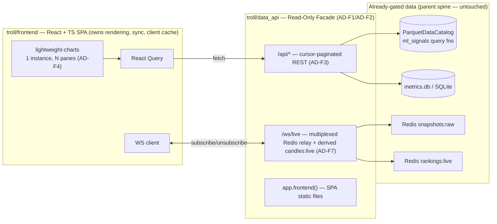

# Architecture Spine — Chart Frontend Rewrite — React/React Query/lightweight-charts

## Design Paradigm

**Read-Only Facade: one backend service (`data_api`) unifies REST history + WebSocket live access to data the parent spine's Gatekeeper/ranking_engine have already validated and published — computing nothing new itself (queries, relays, and persists user config; never derives a signal).** Today `dashboard.py` does three unrelated jobs in one process (render HTML, serve JSON, run a Redis subscriber) and `data_api` does a fourth job partially (thin read-only REST, for remote-dev only). This spine collapses all of it into one facade with two transports. `live_paper`/`bots:*` are deliberately absent from this diagram — `bot_tui` remains their sole web-adjacent client (parent AD-10); this frontend never touches them.



Namespace mapping: `data_api/` = the facade — every route/relay calls an existing pure query function, never computes a new signal; `frontend/` = the only place rendering, chart sync, and client-side request caching live; `ml_signals/` = unchanged pure query/compute functions (`catalog_stats`, `chart_data`, `candles`, `indicators`) called *from* `data_api`, never duplicated into it; `dydx_collector`, `ranking_engine`, `live_paper`, `bot_tui` = unchanged, outside this epic. `dashboard.py` is deleted once its in-scope pages have React equivalents — not kept as a parallel/legacy surface.

## Inherited Invariants

| Inherited | From parent | Binds here |
| --- | --- | --- |
| AD-3 (readers trust the gate completely) | dYdX Collector & ml_signals — Data-Integrity Spine, 2026-07-01 | `data_api` and `frontend` are readers — never re-implement crossed-book/staleness/precision checks |
| AD-4 (module boundary: shared types + pure utilities only) | same | `data_api` may import `ml_signals`/`dydx_collector` data types and pure functions only, never stateful ingestion internals |
| AD-6 (catalog access only through the official API) | same | every `data_api` route reuses `ParquetDataCatalog`-backed query functions already in `ml_signals`; no hand-rolled Parquet reads, no unbounded loads |
| AD-8 (no live-runtime engine in the data path) | same | `data_api`/`frontend` use `nautilus_trader` types as a library only, if at all — never instantiate `TradingNode`/`Strategy`/`DataEngine`; this rewrite is a reader surface, same as the `dashboard`/`chart_data` it replaces |
| AD-9 (ranking_engine: sole computer/publisher of Coin Ranking) — **both halves** | same | *Never-recompute half:* `/api/rankings`, `/ws/live`'s `rankings:live` relay never recompute rank/volatility — pure passthrough. *Staleness half (was dropped in this spine's first draft — restored):* a missed `rankings:live` heartbeat within its configured timeout is surfaced as `stale`/`unknown` in the UI, never rendered as still-current — see AD-F6 |
| Fork boundary convention | same | `nautilus_trader/` and `crates/` untouched; all new code additive under `troll/` |
| Memory convention (MEM-01) | same, + troll/CLAUDE.md | extended by AD-F3 below to the new API surface, not just Python-internal reads |
| SEC-01 (localhost-only ports) | troll/CLAUDE.md | `data_api`'s single port stays `127.0.0.1`-bound; no bare host:container mapping |
| SSOT-01..05 (single source of truth for metrics) | troll/CLAUDE.md | `data_api` relays/queries only; any new metric shown in the SPA must trace to one existing computer (`ranking_engine`, `ml_signals.indicators`) |
| DATA-01 (never flatline a gap; never show stale as live) | troll/CLAUDE.md | **Missing from this spine's first draft, restored as AD-F6** — the chart-rendering path this epic rewrites from scratch is exactly where `dashboard._coin_chart_json`'s gap-flagging discipline currently lives; it must carry forward, not silently drop |

## Invariants & Rules

### AD-F1 — Single backend facade, both transports, replacing dashboard.py's split role

- **Binds:** `data_api` (absorbs every in-scope JSON route and the Redis-subscriber logic currently in `dashboard.py` — rankings, coin chart, metrics history, docs; explicitly not bots/live_paper routes, which `dashboard.py` never had)
- **Prevents:** two backend processes with a partial, overlapping API surface (today's `data_api` + `dashboard.py` split); the frontend needing to know which service handles which route; `dashboard.py`'s HTML-string-building functions surviving as dead code once React replaces what they rendered
- **Rule:** `data_api` is the sole backend service the SPA talks to — REST under `/api/*`, live relay under `/ws/live`, built SPA static files served via FastAPI's native `app.frontend()` (see AD-F1a). `dashboard.py`'s HTML-rendering functions (`_page`, `_build_chart_page_html`, `_render_live_page`, `_render_history_page`, `_history_page_from_rows`, etc.) are deleted, not retained. **"Verbatim relocation" means the underlying business logic (the call into `ml_signals`/`ranking_engine`/`metrics_store`) moves unchanged — it does NOT mean the route's wire contract (URL params, pagination shape, response envelope) is preserved as-is.** Where relocating a route would conflict with AD-F3's pagination contract (e.g. today's `catalog_candles` uses `start_ns`/`end_ns`, not `before_ns`/`limit`), AD-F3 governs and the route signature is upgraded during relocation, not preserved.

### AD-F1a — SPA static serving via FastAPI's native helper

- **Binds:** `data_api/app.py`
- **Prevents:** the classic manual-`StaticFiles`-mount-plus-catch-all-route footgun, where the catch-all must be registered strictly last or it silently swallows `/api/*` requests and returns HTML instead of a 404 JSON error
- **Rule:** use FastAPI's built-in `app.frontend()` SPA-serving API (shipped `fastapi>=0.138.0`; this project already pins `0.141.1`, confirmed current) to serve `frontend`'s built `dist/` output, rather than a hand-rolled `StaticFiles` mount + manual catch-all route. `[VERIFIED fastapi 0.141.1, 2026-09-13]`.

### AD-F2 — Facade computes no new signal; it queries, relays, and persists config only

- **Binds:** every `data_api` REST route and the `/ws/live` relay
- **Prevents:** `data_api` becoming a second, independently-drifting implementation of OFI/OBI/rankings/candle-aggregation logic (an SSOT-01/02/03 violation) as it grows from 4 routes to the full in-scope dashboard surface
- **Rule:** every REST route calls an existing `ml_signals`/`ranking_engine`/`dydx_collector` pure function or query (`catalog_stats`, `chart_data`, `ml_signals.indicators`, `metrics_store`) — the route body only shapes the return value into JSON, never computes a signal or aggregate itself. The one exception is config persistence (`PUT /api/coin/{iid}/indicators` and similar) — writing operator-chosen settings is not "computing a signal" and is explicitly allowed; it is the only write path this facade has. `/ws/live` forwards Redis pub/sub messages (`snapshots:raw`, `rankings:live`) using their existing wire formats verbatim (per parent AD-9), plus the one derived channel AD-F7 defines. It does not reshape or recompute beyond per-connection channel subscription; subscription MAY be filtered per-instrument or per-channel (this is routing, not computation) — a future per-instrument filter to cut relay payload size is compatible with this rule, not foreclosed by it.

### AD-F3 — Cursor-paginated history, never a full-range load

- **Binds:** every chart-history REST route without exception — `/api/candles/{instrument_id}` AND `/api/snapshots/{instrument_id}` (Lines-mode order-book history) AND any future `/api/*` route the frontend adds for scroll-back. Naming only `/api/candles` in an earlier draft of this AD was itself a bug — this list is binding, not illustrative.
- **Prevents:** repeating the ~12MB-per-4-hour-window `/catalog/snapshots` timeout this session's uncommitted fix already solved once for the candles route — recurring for `/api/snapshots` or a new indicator series; an unbounded catalog read reaching the API surface (MEM-01 extended past Python-internal reads to the network boundary)
- **Rule:** every history endpoint bound above accepts `before_ns` (cursor) + `limit` (bounded, server-enforced max), returns at most `limit` rows strictly older than `before_ns`, and the frontend never requests an unbounded or full-history range in one call. **Response envelope is pinned, not left to each route to guess:** `{"items": [...], "has_more": bool}` — `has_more: false` is the only sanctioned way a client learns history is exhausted; a short page (`len(items) < limit`) with `has_more: true` is legal (e.g. a thin-trading window) and must not be misread as exhaustion. This is the only sanctioned loading pattern for chart history — driven by lightweight-charts' `subscribeVisibleLogicalRangeChange` firing the next page as the user scrolls back, exactly mirroring TradingView's own behavior.

### AD-F4 — One chart instance, native multi-pane sync, keyed pane registry

- **Binds:** every React component rendering a coin's chart (candlestick + any indicator sub-panel: OFI, OBI, volume, microprice, spread)
- **Prevents:** reimplementing `dashboard.py`'s custom `_syncChartXRange`/`_SYNCED_CHART_IDS` Plotly-relayout-event sync logic in React; two independently-built panel components drifting out of sync because each owns its own chart instance and its own pan/zoom state; two independently-built indicator-pane features (e.g. an OFI story and an OBI story) colliding on pane identity or going stale when a sibling pane is added/removed
- **Rule:** a coin's chart page is exactly one `lightweight-charts` `createChart()` instance with N panes (`chart.addPane()`) — the candlestick main pane plus one sub-pane per active indicator, each added via `addSeries`/`addCustomSeries` on its own `IPaneApi`. Never multiple separate `createChart()` instances kept in sync by application code — the library's native time-scale sync across panes is the only sync mechanism. **Panes are keyed by indicator id (reusing the existing `_indicator_id(name, params)` scheme from `dashboard.py`, not by array index)**, held in a single `Map<indicatorId, IPaneApi>` owned by the one component that calls `createChart()` — no child component may create or destroy a pane directly. `[VERIFIED lightweight-charts 5.2.1, 2026-09-13]`.

### AD-F5 — Frontend/backend contract types are generated, never hand-duplicated

- **Binds:** the TypeScript API client (`frontend/src/api/`), `data_api`'s route response models
- **Prevents:** the frontend and backend independently guessing field names/shapes for the same JSON payload — the exact drift class the parent spine's AD-9 rationale already flags as a risk for `rankings:live`, now extended to the whole REST surface
- **Rule:** `data_api` route handlers declare Pydantic response models (FastAPI already generates an OpenAPI schema from these for free); the frontend's TypeScript request/response types are generated from that schema at build time, never hand-written to match. The `/ws/live` message shapes are the one exception — no OpenAPI coverage for WebSocket frames — so those TypeScript types are hand-written but must cite the exact Redis wire format (or, for `candles:live`, the exact `ml_signals.candles` function) they mirror in a comment, so drift there is at least traceable to a single documented source. Exact codegen tool is Deferred.

### AD-F6 — Live data staleness: never flatline a gap, never show stale as live

- **Binds:** every chart pane rendering time-series data (candlestick, OFI/OBI, volume, microprice), the rankings list, the metrics-history page
- **Prevents:** repeating `DATA-01`'s named failure mode (a misleading flat line papering over a real data gap) in a from-scratch chart-rendering rewrite; a `rankings:live` heartbeat miss rendering as "last known value is still current" instead of visibly stale
- **Rule:** (1) **Gap rendering** — where the backend's queried range has a genuine gap (the collector skipped emission per `_STALE_BOOK_NS`, or a scroll-back page has no data for part of its range), the API returns an explicit gap marker (a `null`/whitespace-data point at the gap boundary, matching lightweight-charts' native whitespace-data support) rather than omitting the row — the frontend renders it as a visible break, never an interpolated or flat line across it. This carries forward `dashboard._coin_chart_json`'s existing `_CHART_GAP_THRESHOLD_MS` discipline into the new API/frontend. (2) **Staleness** — every live-pushed channel (`rankings:live` today; any future one) carries `updated_at`; the frontend treats a value whose `updated_at` exceeds a configurable timeout as `stale`/`unknown` in its own right (a visible UI state, e.g. dimmed/badge), never as "the last known value, silently kept as if current" — mirroring the parent spine's existing `bots:status`/`rankings:live` heartbeat convention (Inherited Invariants, AD-9).

### AD-F7 — The forming/latest candle bar has one sanctioned live path

- **Binds:** the candlestick pane's live (right-edge, currently-forming) bar
- **Prevents:** two independently-built paths for "what does the live edge of the candlestick chart show" — one engineer polling REST on an interval, another having `frontend/` itself aggregate raw `snapshots:raw` ticks into a bar client-side (which would silently reimplement `ml_signals.candles`' aggregation logic in TypeScript, an AD-F2/SSOT violation, and could visibly desync from the REST-paginated history feeding the rest of the same chart)
- **Rule:** `data_api` computes the forming bar server-side by calling the existing `ml_signals.candles` aggregation function (the same one `/api/candles` already uses for history) against incoming `snapshots:raw` ticks, and publishes it on a derived `/ws/live` sub-channel, `candles:{instrument_id}:{bar_seconds}` — one bar per message, on tick and on bar-close. The frontend subscribes to this channel for the live edge only; it never aggregates a candle itself from raw snapshot data. This is a "call an existing pure function on live input," not a new computation — consistent with AD-F2.

## Consistency Conventions

| Concern | Convention |
| --- | --- |
| API namespacing | `/api/*` REST, `/ws/live` WebSocket, everything else falls through to the SPA via `app.frontend()` (AD-F1a) — a route can never exist under both regimes, and an unmatched `/api/*` path returns a JSON 404, never SPA HTML |
| Timestamps | Nanosecond UNIX ints everywhere on the wire (`ts_ns`, `before_ns`, `updated_at`), matching the parent spine's existing `rankings:live`/`bots:history:*` convention — never ms or ISO8601 |
| Pagination cursor + envelope | `before_ns` + `limit` request; `{"items": [...], "has_more": bool}` response — see AD-F3 |
| Gap/staleness rendering | explicit gap markers in paginated history; `updated_at`-timeout-driven stale/unknown UI state on every live channel — see AD-F6 |
| Chart sync + pane identity | one `lightweight-charts` instance, N panes, native time-scale sync, panes keyed by indicator id — see AD-F4 |
| Live candle edge | `candles:{iid}:{bar_seconds}` derived WS sub-channel, server-aggregated — see AD-F7 |
| Contract types | generated from `data_api`'s OpenAPI schema for REST; hand-written-but-source-commented for `/ws/live` frames — see AD-F5 |
| Language | TypeScript on the frontend (strict mode), matching the repo's existing mypy `disallow_incomplete_defs` discipline |
| State | React Query owns all server state; no client-global-state library (Redux/Zustand) — component state + React Query is sufficient (YAGNI/DESIGN-01) |
| Indicator/config persistence | stays a server-side REST resource under `/api/coin/{iid}/indicators` (today's `save_coin_indicator_config_handler`, relocated per AD-F1) — the one sanctioned write path, per AD-F2 |
| Live-refreshing list identity | a live-updating list (rankings, metrics-history rows) must key its rendered rows by a stable id (`instrument_id`, row id) — never by an index or a value that changes every refresh tick (e.g. a fresh timestamp/UUID per poll). React's reconciliation already avoids urwid's TUI-01 failure class *if* keys are stable; an unstable key forces a full remount and silently loses scroll position/focus/in-progress interaction the same way TUI-01 did |
| Initial page-load speed | route-based code-splitting (each page is a separate lazy-loaded chunk — rankings/history/docs never block the chart page's bundle and vice versa); Vite's content-hashed static filenames get far-future `Cache-Control` headers from `data_api`; response compression (`GZipMiddleware` or equivalent) enabled on `data_api` for both the SPA bundle and JSON payloads |
| Module dependencies | `data_api` → `ml_signals`, `ranking_engine`, `dydx_collector` (data types + pure functions only, per inherited AD-4); `frontend` → `data_api` only, via HTTP/WS, never a direct import of any Python module |
| Fork boundary | `nautilus_trader/` and `crates/` untouched; all new code additive under `troll/data_api/` and `troll/frontend/` |

## Stack

| Name | Version |
| --- | --- |
| TypeScript | latest stable (5.x, pinned at implementation time to whatever `vite create` scaffolds) |
| React | 19.3.0 (verified 2026-09-13) |
| Vite | 8.3.0 + `@vitejs/plugin-react` v6 / 6.1.1 (verified 2026-09-13) |
| @tanstack/react-query | 5.102.8 (verified 2026-09-13) |
| lightweight-charts | 5.2.1 (verified 2026-09-13 — native multi-pane API, stable since 5.0) |
| Vitest + React Testing Library | ships with Vite scaffold, latest stable — confirmed still the standard 2026 pairing, no tooling-consensus shift |
| FastAPI | 0.141.1, already pinned (verified current on PyPI 2026-09-13) — `app.frontend()` SPA-serving helper available since 0.138.0, see AD-F1a |
| Node.js | LTS current at implementation time, build-stage only — never a runtime dependency of the deployed image (build output is static files) |

## Structural Seed

```text
troll/
  data_api/                  # collapsed backend facade — REST (/api/*) + WS (/ws/live) + static SPA serving
    app.py                     # FastAPI app assembly, app.frontend() mount (AD-F1a)
    routes/
      candles.py                # /api/candles/{iid} — cursor-paginated, {items, has_more} (AD-F3)
      snapshots.py               # /api/snapshots/{iid} — Lines-mode history, SAME cursor contract as candles.py (AD-F3)
      rankings.py                 # /api/rankings, /api/watchlist, /api/rank-history
      indicators.py                # /api/indicators/catalog, /api/coin/{iid}/indicators (GET/PUT config — the one write path)
      metrics.py                    # /api/metrics/history/{symbol}, /api/metrics/nearest/{symbol} — 31-day history page
    ws/
      live.py                    # /ws/live — multiplexed Redis relay (snapshots:raw, rankings:live) + candles:{iid}:{bar_seconds} (AD-F2/F7)
    data_api.dockerfile        # OWN dockerfile (not troll/collector.dockerfile) — see Deployment & Environments
  frontend/                   # React + TypeScript + Vite source — built into data_api's served static/, never shipped standalone
    src/
      pages/                     # RankingsPage (coin list IS the rankings page), ChartPage, HistoryPage, DocsPage
      components/
        chart/                     # LightweightChart wrapper — 1 instance, pane-per-indicator, keyed registry (AD-F4)
        rankings/
      api/                        # generated REST client types (AD-F5) + hand-written /ws/live client
      hooks/                      # useCandles (React Query + cursor pagination), useLiveChannel (WS subscribe hook)
    vite.config.ts
    package.json
    tsconfig.json
  ml_signals/                 # unchanged pure query/compute functions — dashboard.py DELETED (AD-F1)
    catalog_stats.py, chart_data.py, candles.py, indicators.py, metrics_computer.py
  dydx_collector/, ranking_engine/, live_paper/, bot_tui/   # unchanged, outside this epic — bots stay bot_tui-only
```

### Deployment & Environments

`docker-compose.yml`'s `dashboard` service is removed; `data_api` absorbs its role (still `network_mode: host`, still binding `127.0.0.1` only — SEC-01 unchanged). **`data_api` gets its own dockerfile (`troll/data_api.dockerfile`), not a Node build stage bolted onto the shared `troll/collector.dockerfile`** — verified today all of `collector`/`dashboard`/`ranking_engine`/`data_api`/`bot_tui` build from that one shared file (`docker-compose.yml`); adding a `node:`-based `vite build` stage there would force every one of those unrelated services to pay a Node build cost they don't need. `data_api.dockerfile` is still layered on `nautilus-trader-base` (same base, same rebuild-order discipline as the existing two-image split) with its own added Node build stage: `vite build` runs against `troll/frontend/`, `dist/` is `COPY`'d into the final image, `node_modules`/build tooling do not appear in the runtime layer. `troll/collector.dockerfile` is untouched by this epic and keeps serving `collector`/`ranking_engine`/`bot_tui` exactly as today.

**"Decoupled from the backend" is an API/dev-workflow property, not a deployment-topology one — named explicitly here since it's a real tradeoff, not silent:** the frontend has zero server-rendering dependency and a clean generated-types contract (AD-F5) — it can be developed with Vite's dev server proxying `/api`/`/ws` to a running `data_api` instance, entirely independent of backend release cadence. In production, `data_api` serves the built SPA itself (AD-F1a) rather than a separate static-hosting service — chosen over a second container/nginx because it keeps SEC-01's single-port-localhost-only posture trivial (no CORS, no second port to bind/tunnel) for a personal single-user tool; this is a deliberate simplicity choice, not an oversight, and is reversible later (splitting static hosting out is a Deployment-only change, no API contract changes needed) if it ever stops fitting.

The existing SSH-tunnel remote-dev flow (`troll/CLAUDE.md`'s "Desktop ↔ VPS Connection") simplifies from tunneling two logical surfaces (dashboard's HTML/live + data_api's REST) to one — `data_api`'s single port now serves everything the desktop-side tooling needs.

## Deferred

- **Exact 1:1 mapping of every in-scope `dashboard.py` JSON route into `data_api/routes/*.py`.** The route-file grouping above is a reasonable seed, not a mandate — implementation-owned during the epics/stories pass.
- **OpenAPI→TypeScript codegen tool choice** (e.g. `openapi-typescript`). AD-F5 fixes the requirement (generated, never hand-duplicated); the specific tool is implementation-owned.
- **Auth/access control.** None added — this stays a personal, single-user tool reachable only via SSH tunnel (SEC-01), matching today's posture. Revisit only if multi-user access is ever wanted.
- **epic-14's disposition.** 14.1/14.2 (done) and 14.3 (ready-for-dev, root-caused this session) become moot once `dashboard.py`'s chart page is deleted under AD-F1. This spine does not itself close or delete that story — flagging it for the sprint-status/epics pass, not resolving it here.
- **`bot_tui` cross-check (SSOT-04/05).** Any new rankings-page column or per-coin metric the React app ships must also land in `bot_tui`, backed by the same shared source — a per-story concern for the epics/stories breakdown, not a structural change this spine needs to make. Note the reverse is now also true and worth flagging: `bot_tui`'s existing bots/live_paper surface has no web equivalent under this spine (by explicit user decision) — SSOT-04/05 parity applies to rankings/coin-detail metrics only, not to bots.
- **Exact epics/stories breakdown.** This spine fixes the invariants; `bmad-create-epics-and-stories` is the next step, scoped against this Structural Seed and these ADs.
