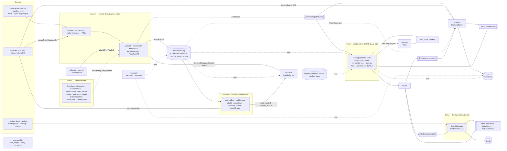
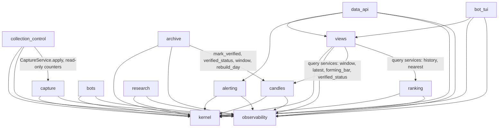
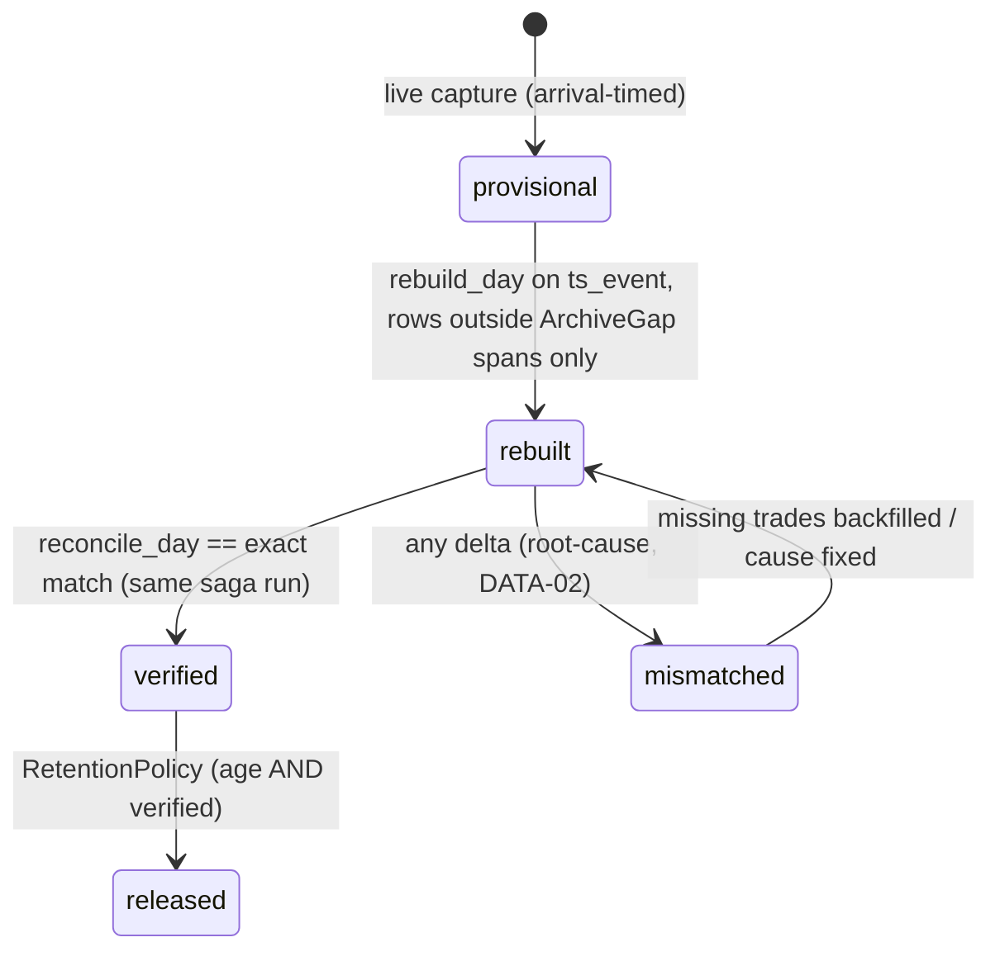

# Architecture Spine — platform/ — Domain-Driven Design Spine

## Design Paradigm

**Gatekeeper expressed as bounded contexts.** The parent spine's fail-closed single-writer
rule is unchanged; this spine gives it a domain shape. The gate becomes one aggregate
(`LiveBook`) plus one domain service (`SecondSampler`) inside one bounded context, and every
other package becomes a named context with a named relationship to it. Inside every context
the layering is hexagonal: `domain/` (pure) → `application/` (ports as `typing.Protocol`,
services, asyncio process managers) → `infrastructure/` (adapters). `data_api/`, `bot_tui/`
and `frontend/` are interface adapters, not contexts.

Eleven contexts, one shared kernel. A tactical DDD pattern is admitted **only where it names
an invariant** (AD-D4); `CLAUDE.md` DESIGN-01 now states the same rule (amended 2026-09-21). New
decisions are numbered `AD-D1…` so they never collide with the parent's `AD-1..AD-11` or the
frontend sibling's `AD-F…`. A rule marked `[ADOPTED]` is today's code restated; `[TARGET]`
names today's deviation next to it. `troll/...` citations refer to the tree before
step 0; the same files live under `platform/` after it (done 2026-09-21).



## Inherited Invariants

All eleven parent decisions and its Consistency Conventions bind here unchanged. Rows name
what each constrains in the DDD shape; none is re-derived.

| Inherited | From parent | Binds here |
| --- | --- | --- |
| AD-1 Single write gate, both sinks | 2026-07-01 spine | `SecondSampler` is the one gate; Parquet and `snapshots:raw` fan out from the same approved `DydxSecondSnapshot` inside `CaptureService`. Venue variance enters as policy *values* (AD-D6), so no subclass can override the gate |
| AD-2 Fail-closed, never fail-open | 2026-07-01 spine | `SampleVerdict.Rejected(reason)` is dropped, logged, ledgered; no validity flag on any kernel type |
| AD-3 Readers trust the gate | 2026-07-01 spine | `views/`, `research/`, `data_api`, `bot_tui` carry no data-quality check; the surviving reader-side crossed-book skip is a debt the `views/` move retires (AD-D11) |
| AD-4 Module boundary: shared types + pure utils only | 2026-07-01 spine | Generalised to the context dependency graph in AD-D2; the writer→reader imports the parent deferred are resolved by AD-D3/AD-D8/AD-D16 |
| AD-5 Precision re-stamped exactly | 2026-07-01 spine | Kernel value construction and every venue ACL: `_at_fixed_precision` (dYdX mark/index, `dydx_collector/client.py:50`), `trade_backfill.exact_text` (REST trades, `:130`), the Hyperliquid `ts_event` exact-millisecond re-stamp (`hyperliquid_collector/client.py:75`, audit D-62) |
| AD-6 Catalog only through the official API | 2026-07-01 spine | On the live path `ArchiveWriter` (capture) is the only `write_data()` caller; archive's `backfill_bars`/`repair_catalog` call it offline; `CatalogFiles` (archive) is the only in-place rewriter (AD-D9) |
| AD-7 Liquidity classification USD-denominated | 2026-07-01 spine | `collection_control.classify_liquidity` (today `dydx_collector/open_interest.py:40`), `LiquidityTier` (new) |
| AD-8 No live-runtime engine in the data path | 2026-07-01 spine | Only `bots/infrastructure/nautilus_host.py` touches `TradingNode`; the boundary test (AD-D2) fails any other import of it |
| AD-9 Ranking engine sole computer/publisher | 2026-07-01 spine | `RankingBoard` aggregate root, `rankings:live` published language (AD-D10) |
| AD-10 `live_paper` control-plane isolation | 2026-07-01 spine | `bots/` Open Host Service over `bots:status`/`bots:history:*`/`bots:incidents:*`, command channel `bots:control` never carrying a mode |
| AD-11 One node, many bots | 2026-07-01 spine | `NautilusHost` builds one node; `Bot.id == order_id_tag` (`live_paper/node.py:190`); `CacheReader` is `strategy_id`-scoped |
| Consistency Conventions (Redis channels, ns timestamps, rejected-data logging, paired versions, memory) | 2026-07-01 spine | Published-language freeze (AD-D12) pins every listed channel/key payload for the whole migration; `bots:incidents:<bot_id>` (`live_paper/bot_status.py:33,78`, read by `bot_tui/bot_incidents_state.py:92`) is added to the parent's channel row by amendment |

## Invariants & Rules

### AD-D1 — Bounded contexts and single ownership

- **Binds:** all of `platform/`
- **Prevents:** a module with no owning context; two contexts writing one store; a context reaching into another's aggregate state
- **Rule:** Every module belongs to exactly one of the contexts in the table below. Each store has exactly one writing context; every other context reads it only through that context's application service or the published language. The one store with two named writers is the `_archive_gaps/` marker file (AD-D18). A new module that fits no row is a new context decision, not a "utils" file. `[TARGET]` — today's deviations, retired by the named moves: the collector writes `candles_<venue>.db` directly (`collector_core/collector.py:1113`; candles move), `compare_klines` opens the candle store rw itself (`:489`; archive move), `data_api` routes write two preference TOMLs through `ml_signals` (views move).

| Context | Subdomain | Owns (aggregates) | Writes | Today |
| --- | --- | --- | --- | --- |
| `capture/` | core | `LiveBook`, `TradeIntake`, `FeedGroup`; `SecondSampler`, `TradeBackfill` (services) | Parquet catalog live path incl. `trade_tick/`; `write_failed`/`quarantined` markers under `<catalog>/_archive_gaps/`; `snapshots:raw` | `collector_core/{collector,feed,book_check,integrity}.py`, `trade_backfill.py` (scheduling half), `dydx_collector/collector.py:265-355` (book hooks), `dydx_collector/{client,uncross}.py`, `dydx_collector/open_interest.py:97-129` (OI poll), `bybit_collector/{client,collector,open_interest}.py`, `hyperliquid_collector/{client,collector,book_snapshot}.py` |
| `collection_control/` | supporting | `CollectionPlan` | that venue's plan file; `collector:status` | `dydx_collector/collector.py:369-625` (subscribe/unsubscribe, config reload, status/control loops, pin-top-liquid, prune trigger), `dydx_collector/config.py`, `dydx_collector/open_interest.py:40-96` (`classify_liquidity`) |
| `archive/` | supporting | `ArchiveDay` | catalog files in place (rewrite/consolidate/prune); `pruned` markers; catalog `Bar`s and cleared rows via `write_data()` (`backfill_bars.py:519`, `repair_catalog.py:83`) | `collector_core/{rebuild_seconds,consolidate_catalog,prune_catalog,repair_catalog,compare_klines,nightly,backfill_bars,migrate_open_interest,measure_lag}.py`, `dydx_collector/normalize_snapshot_schema.py`; `catalog_stats` diagnostics half (`data_file_ranges`, `find_gaps`, `likely_outages`, `coverage`) |
| `candles/` | supporting | `CandleSeries` | `candles_<venue>.db` including `verified_days` (written for `archive` through `mark_verified`) | `ml_signals/candle_store.py`, `collector_core/build_candles.py`, `ml_signals/candles.py` (retired by the candles move, AD-D8), the collector's `_candle_prune_loop` (`collector.py:1163`) |
| `ranking/` | core | `RankingBoard` | `rankings:live`; `metrics.db` | `ranking_engine/*`, `ml_signals/{metrics_computer,rank_history}.py`; `catalog_stats.price_series`/`price_stats_from_series`/`price_stats` (the pct/volatility math, AD-D10) |
| `bots/` | core | `Bot`, `FillLedger` | `bots:status`, `bots:history:*`, `bots:incidents:*`; `fills.db`; Nautilus `Cache` (Redis) | `live_paper/*` |
| `alerting/` | supporting | `Alert` | `alerts.toml`; outbound notifications via `observability.notify` | `data_api/alerts.py`, `data_api/routes/alerts.py` |
| `research/` | supporting | none (consumer) | throwaway backtest catalogs only | `ml_signals/strategies/*`, `ml_signals/{run_backtest,watchlist}.py`, notebooks |
| `views/` | supporting | none (read models) | `chart_indicators.toml`, `screener_columns.toml` (UI preference stores, full-rewrite TOML, one loader each, no data-integrity content) | `ml_signals/{ranking_columns,screener_columns_config,chart_indicators,chart_indicator_config,custom_indicators,book_features,footprint,chart_data}.py`, `data_api/{live_candles,redis_bus}.py`; `catalog_stats` series reads (`query_second_snapshots`, `query_second_ohlc`, `second_ohlc_arrays`, `overview_table`) |
| `observability/` | generic | none | error-ledger counters (in-process), outbound operator notifications, incident reports | `ml_signals/error_ledger.py`, `collector_core/collector.py` `_notify` (`:388`) and `_watchdog_transition` (`:353`, module functions), `dydx_collector/collector.py:648-843` (`[WS_RAW]` flush, incident-report handler) |
| `kernel/` | shared kernel | value objects only | nothing | `collector_core/{second_snapshot,open_interest,fold,venue_http}.py`, `common/venues.py`, `ml_signals/{venue,indicators,performance_metrics}.py`, `collector_core/archive_gaps.py` (marker format + `ARRIVAL_MARGIN_NS`), `catalog_stats.SecondOHLC`/`_stamp_to_ns`, the zstd `write_table` patch (`collector.py:231-243`, duplicated at `backfill_bars.py:137-148`) |
| `data_api/`, `bot_tui/`, `frontend/` | interface | none | nothing | unchanged names |
| `platform/scripts/`, `platform/docs/` | operator surfaces | none | nothing | `scripts/{capture_hl_ws.py,bench_candles.py,wipe_data.sh,open_listener.go}`, `docs/*.md`. `capture_hl_ws.py` is the mandatory raw-frame harness of "Adding a venue" step 1 and must gain a per-venue branch before a fourth venue (parent Deferred) |

### AD-D2 — Layering and dependency direction

- **Binds:** every context; the interface adapters; `platform/tests/test_boundaries.py`
- **Prevents:** domain code that needs a socket or an event loop to test; an interface adapter computing a metric; a context importing another's internals; `TradingNode` leaking out of `bots/`; a moved context importing a legacy module's private name
- **Rule:** Inside a context, `domain/` imports only the standard library, `kernel/`, and `nautilus_trader.model`/`nautilus_trader.core` types — never I/O, asyncio, Redis, SQLite, Parquet or the Nautilus runtime. A venue **policy** file (`capture/venues/<v>/policies.py`) is domain code wherever it lives and is bound by the same rule. `application/` declares ports as `typing.Protocol`, holds the services and the asyncio loops (process managers), and imports `domain/` + `kernel/` + `observability/`. `infrastructure/` implements the ports and is imported only by the composition root (the context's `__main__`/entrypoint). Interface adapters (`data_api`, `bot_tui`) import `views/`, `kernel/` (types and pure helpers), `observability/` (the ledger for `/api/errors`) and the application services named in the graph — nothing else. `kernel/` imports nothing from any context; `observability/` imports nothing but the standard library. Across contexts, only the arrows below are legal. Enforcement is a plain pytest walking `ast` imports over `platform/` (no new dependency) that ships in the **first** migration story with a static `LEGACY_MODULE_TO_CONTEXT` map (every current module → its AD-D1 row): an import is judged by the *target* contexts of both ends even while a module still lives at its old path; an import of a `_private` name across any two rows fails from day one; only edges *within* an unmoved package are exempt. Nothing under `platform/` is ever imported with a `platform.` prefix — contexts are top-level packages with `platform/` on `sys.path` (`platform` is the stdlib module, AD-D13). `research`'s use of `/api/rankings` is HTTP, not an import, and the test asserts `research` imports no `data_api` symbol.



`capture` depends on nothing but `kernel`/`observability`: its `SecondSink` port is the only
place candles enter, *implemented* by `candles/` and injected at the venue entrypoint (AD-D8).
`alerting` never imports `views`: `views` declares a `BarObserver` port (today
`LiveCandleBus.observers`), `alerting` implements it, and the interface adapter's composition
root (`data_api/app.py`) does the wiring with a kernel type as the observer's input.

### AD-D3 — Shared kernel membership

- **Binds:** `kernel/`; every context that imports it
- **Prevents:** two contexts holding two folds, two snapshot schemas, two venue-id parsers, two REST transports that produce different bytes, two skew margins, two Parquet compression patches; the kernel growing into the next grab-bag
- **Rule:** `kernel/` holds exactly:
  - `second_snapshot.py`: `DydxSecondSnapshot` and `SecondOHLC` (the seven-column second row every fold and reader passes around, today `catalog_stats.py:74`). `DydxSecondSnapshot.from_dict` is the only parser of a `snapshots:raw` entry in every consumer; indexing the raw dict outside kernel is a boundary-test failure. `DydxSecondSnapshot` and `OpenInterest` keep their class names: the catalog directory is derived from `__name__` by `nautilus_trader.persistence.funcs.class_to_filename` (`custom_dydx_second_snapshot`, `custom_open_interest`); the ubiquitous term is "Second Snapshot" and the class name is a persistence identifier `[ADOPTED]`.
  - `open_interest.py`, `fold.py` (`fold_trades` + `SecondTradeFields`), `indicators.py` (pure `Indicator` classes and stateless snapshot functions), `performance_metrics.py` (pure PnL/return arithmetic).
  - `venues.py`: the only module that parses an `InstrumentId` string — `venue_of`, `venue_kind`, `market_kind`, `bybit_category` (defined over `market_kind`), `MalformedInstrumentId`; every venue dispatch uses it.
  - `clocks.py`: ns helpers, `TwoClocks`, `CatalogFileSpan` (stem parse — the former `catalog_stats._stamp_to_ns`, imported today by six `collector_core` modules — and `covers(ts_event)`), and the single `MAX_TS_INIT_SKEW_NS` (= today's `ARRIVAL_MARGIN_NS`, 300 s): the largest `ts_init − ts_event` any writer may produce for a row and the only margin any reader widens a file span by. `_FILE_MARGIN_NS` (60 s), `_TS_INIT_MARGIN_NS`, `_MAX_CATCH_UP_SECONDS` (30 s), `hold_back_seconds + _VENUE_AHEAD_NS` and the backfill refusal are all expressed as ≤ this constant, asserted by `kernel/tests`.
  - `archive_markers.py`: the `ArchiveGap(iid, from_ns, to_ns, reason, count)` value object and the pure encode/decode of `<catalog>/_archive_gaps/<iid>.jsonl` (AD-D18).
  - `venue_http.py`: the stdlib REST transport, venue URL maps, `USER_AGENT`, timeouts. Every stdlib REST request to a venue, in any context, is built through it; a literal venue URL outside kernel is a boundary-test failure (today `ranking_engine/engine.py:146-162` duplicates it).
  - `catalog_files.py`: the read twin of `venue_http` — pure file-span/leaf listing and column-projected Parquet reads over the catalog root (`data_file_ranges`, `second_ohlc_arrays`, `query_second_ohlc`, `files_by_day`); no writes, no catalog object construction.
  - `parquet_compat.py`: the zstd `pq.write_table` patch, applied by capture's `ArchiveWriter` and archive's `CatalogFiles`/`backfill_bars` `[TARGET]` (today duplicated).
  Nothing with module-level or shared mutable state, nothing with a store, no config loader, no ledger call enters. A kernel change lands with every consumer's tests in the same story (the Capture ↔ Archive partnership: a fold, schema, marker or `venue_http` change ships with both contexts' tests).

### AD-D4 — A tactical pattern must name its invariant

- **Binds:** every aggregate, value object, domain event, port, repository, application service in `platform/`
- **Prevents:** DDD ceremony for its own sake (DESIGN-01, which now carries this rule); abstractions with no divergence to prevent; a DI container or event-bus dependency
- **Rule:** Each aggregate declares, in its module docstring, the invariant(s) it protects and the commands that can violate them; each port names the adapter it decouples and why the domain must not know it. A class that cannot state one is a plain function or dataclass. Ports are `typing.Protocol`; wiring is explicit in composition roots; there is no DI container, no service locator, no event-bus library. Domain events are frozen dataclasses returned or passed to the caller inside a context; **across contexts the only event transports are the existing Redis published language and the kernel-defined file markers under the catalog root (AD-D18), each with exactly one writing context per reason.** `RankChanged`/`ModeSwitched` from the seed are deliberately not modelled: nothing inside `ranking` consumes them.

### AD-D5 — Hot path: no additional per-message allocation or latency

- **Binds:** `capture/` ingest path (`on_data` → queue → `_process_data` → `LiveBook.apply` / `TradeIntake.accept`)
- **Prevents:** the DDD refactor adding a wrapper, event or verdict object per delta or per trade and regressing the 24/7 collectors under load (the OOM history behind AD-8)
- **Rule:** `on_data(data, feed)` stays an O(1) enqueue. `LiveBook` holds the Nautilus `OrderBook` by reference and applies deltas into it; no copy, no per-delta event. `TradeIntake` mutates counters and bounded windows in place. Domain events exist only per sampled second (`SecondSampled`, `SampleRejected`) and per state transition (`BookCrossed`, `BookUncrossed`, `BookResynced`, `SequenceBroken`, `FeedReconnected`, `FeedSilent`, `BackfillAbandoned`). Acceptance: a replay test in `capture/tests/` pushes a recorded burst (existing fixtures) through `_process_data` and asserts `tracemalloc` allocations per message ≤ baseline and `time.perf_counter_ns` wall time per message ≤ 2× baseline. The baseline is recorded against today's `collector_core` in the **first** migration story (observability, which touches `error_ledger.record` on the replay path) into `platform/tests/fixtures/hotpath_baseline.json` and `docs/DATA_INTEGRITY_AUDIT.md`; every later story runs the comparison. Rationale for stdlib tooling: `pytest-benchmark` is not in the collector image (`troll-requirements.txt`) and `.benchmarks/` is empty.

### AD-D6 — Capture aggregates and venue variance as policy values

- **Binds:** `capture/domain/`, `capture/venues/{dydx,bybit,hyperliquid}/`
- **Prevents:** a venue subclass overriding the gate (parent AD-1's residual risk); crossed/sequence/time-source behaviour drifting per venue without a named object; a policy that logs or resyncs from inside the sampler; a fourth venue re-deriving the contract from a docstring
- **Rule:**
  - `LiveBook` (one per instrument) owns: the `OrderBook`, last-delta ns (per side on dYdX), crossed-since, resync-pending, per-level message-id tags, last `u`, and under `book_time_source = "venue"` the `ts_event`-ordered pending deltas (`_hold_deltas`/`_drain_pending_deltas`, `collector.py:811,838`) bounded to `hold_back_seconds + _VENUE_AHEAD_NS` (`:857`; overflow = drop + ledger `collector.pending_deltas` + resync, MEM-02). Invariants: `snapshot_top(depth, now, policies)` returns `SampleVerdict.Rejected` while the book is missing, empty-topped, crossed or stale; a delta applies at most once and only after a snapshot baseline; `resync()` clears state and emits `BookResynced` — the fallback, never the first response (DATA-03). A `LiveBook` exists only for an applied instrument (AD-D17).
  - `TradeIntake` (one per instrument) owns: the bounded `seen_trade_ids` window, the stale-history age filter (DATA-06), per-feed first-copy arbitration (22.14: an id already delivered by the *same* feed is a replay, `duplicate`, and after the startup grace a reconnect signal; by another feed or by the REST backfill it is `duplicate_feed`; the first copy is archived once; a live copy whose first copy came from REST is folded into the live second, the REST copy never is — `collector.py:923-945`), and the late/ahead counters (22.12: a trade after its second closed or ahead of arrival is archived, counted, excluded from the live second, never dropped — `:824-835`). All counters are aggregate state reported at flush; none is silent (DATA-05).
  - `FeedGroup` (one per venue) owns: `Feed` value objects (`name`, `group`, `trades_only`), per-feed `FeedLiveness`, reconnect detection (silence gap then messages), the one-sided-outage comparison inside the group, and `BackfillRequest` scheduling with abandonment ledgering. `trades_only` feeds never count toward book-feed staleness; REST-sourced rows carry `REST_FEED_NAME` and never stamp WS liveness `[ADOPTED]` (`dydx_collector/collector.py:356-366` since 22.14).
  - `SecondSampler` is a pure function of (`LiveBook`s, `TradeIntake`s, policies, `now_ns`, `HoldBack`) → accepted `DydxSecondSnapshot`s + `SampleRejected`s + requested actions; it is the parent's gate and the only place the four checks live. Under `"venue"` time it closes second `S` at wall `S + 1 + hold_back_seconds` (`_venue_second_loop`, `:1367`).
  - `TradeBackfill` (domain service): given a `BackfillRequest` and a `VenueTradeHistory` port, returns exact `TradeTick`s (`Price.from_str` of proven-exact text, never float) for `TradeIntake` to dedup and the archive to append with `ts_init = now`; a trade older than `MAX_TS_INIT_SKEW_NS` is refused and reported (AD-D7).
  - Venue variance is supplied as **policy values**, pure and synchronous, returning a verdict or event, never logging, ledgering or awaiting: `CrossedBookPolicy.step(book, tags, now_ns) → Uncrossed | StillCrossed(since) | ResyncRequested` (dYdX: the per-level uncross ladder from `uncross.py`; Bybit/HL: core default), `LevelTagger` (dYdX), `SequenceCanary` (Bybit `u`), `BookTimeSource` (`arrival` | `venue`), `BackfillCapability` (dYdX recoverable/paged; Bybit last 1000 linear / 60 spot; Hyperliquid last 10). `CaptureService` executes `ResyncRequested` after the sample through `VenueFeed.resync_orderbook` and then `LiveBook.resync()`, and is the only ledger caller in capture — one site per event type, listed in `capture/application/sites.py`.
  - A venue package contributes: `client.py` (the `VenueFeed` ACL; `resync_orderbook` only where the book can drift, `feed_states` where a twin socket exists), `trade_history.py` (the `VenueTradeHistory` adapter: fetcher + pure fixture-tested parser + `BackfillCapability`, today the fetch/parse half of `trade_backfill.py`), `policies.py`, optional `open_interest.py`/`book_snapshot.py`, `config.py` and `__main__.py` — never a `Collector` subclass with hook overrides. The client contract (`fetch_instruments`, `connect`, `disconnect`, `subscribe`, `unsubscribe`, optional `subscribe_global`, `fetch_book_levels`, `resync_orderbook`, `feed_states`) becomes the `VenueFeed` `Protocol`.

### AD-D7 — Trade truth: archive, one fold, arbitration, rebuild

- **Binds:** `capture/`, `archive/`, `candles/`, `kernel/{fold,archive_markers,clocks}.py`; any strategy feature code that folds trades
- **Prevents:** a second fold anywhere; a live second treated as final; a backfilled or second-feed trade counted twice or stamped with the wrong clock; a rebuild zeroing rows whose trades the archive never received; a reconciliation that passes by tolerance
- **Rule:** `[ADOPTED]` (stories 22.13/22.14/22.12). Every accepted `TradeTick` is archived raw under `trade_tick/<iid>/` with both clocks untouched (`ts_event` venue, `ts_init` arrival). The one fold `kernel.fold.fold_trades` (integer `raw` sums, OHLC by `raw` compare) is used by the live sampler, `archive.rebuild_day` and any strategy code. The live second is provisional; a closed day is authoritative only after `rebuild_day` re-buckets its trades by `ts_event` into `[S, S+1)` and `reconcile_day` proves the 1 m bars against the venue's klines in integer units — a mismatch is root-caused, never absorbed. Two invariants make the rebuild safe: (1) `FlushBatch` (capture value object): a flush never writes a snapshot row whose trades may still be in the ingest queue — the newest `ts_init` group of trades is carried while younger than `_TRADE_CARRY_NS` (5 s) and that instrument's later snapshot rows are carried with it, so a crash loses both together as an honest gap (`collector.py:1074-1102`); (2) `ArchiveGap` markers (kernel value object): every path that loses archived trades records one (`write_failed`, `quarantined` by capture; `pruned` by archive), and `rebuild_day` keeps the live values of any row inside a marker span. Backfilled trades carry `ts_event` from the venue and `ts_init = now`, enter through `TradeIntake` dedup, are counted at `collector.trade_backfill`, and are refused past `MAX_TS_INIT_SKEW_NS` because rebuild and prune locate trades by `ts_init` within that margin. With `trade_feeds = 2` both sockets pass through the same `TradeIntake`; the union by `trade_id` is exact because WS ids equal REST ids on every venue (wire-verified 2026-09-21, `trade_backfill.py:40-48`). Raw trades are released only when the day is older than the retention window **and** verified.

### AD-D8 — Candles are a downstream context behind a port; exactly two folds exist

- **Binds:** `capture/application/ports.py` (`SecondSink`), `candles/`, `views/`, `alerting/`, every venue entrypoint, the nightly entrypoint
- **Prevents:** the writer→reader import the parent deferred (`collector_core` → `ml_signals.candle_store`); a second candle writer; a candle that cannot be rebuilt from seconds; a store ahead of the archive; a third or fourth seconds→bars fold in views or alerting
- **Rule:** `capture` defines `SecondSink.apply(iid, seconds)`; `candles/application` implements it over the `CandleStore` repository; the venue entrypoint constructs the adapter and injects it. `SecondSink.apply` is called with the **flushed** batch, never the sampled one — the store is never ahead of the archive `[ADOPTED]` (`collector.py:1063-1073`). `CandleSeries` applies each second exactly once (per-instrument watermark) and records `seconds_observed`/`partial`; every bar is recomputable from raw seconds by `rebuild_day`; the retention prune of the store (`_candle_prune_loop`, `collector.py:1163`) is a candles process manager. Exactly two folds exist in `platform/`: `kernel.fold.fold_trades` (trades → second) and `candles.domain.fold_arrays` (seconds → bars of any width, closed or forming). `ml_signals/candles.py`'s `aggregate_ohlc`, `candle_dicts_from_snapshots` and `PARTIAL_OBSERVED_FRACTION` are retired in the candles story; the forming bar is the query service `candles.application.forming_bar(rows: Sequence[SecondOHLC], bar_seconds) -> Bar | None`. `CandleStore` is the only code that opens `candles_<venue>.db` rw; `archive` receives a `VerifiedDays` port (`mark_verified`, `verified_status`) implemented by candles and injected by the nightly entrypoint. Because views and alerting consume `forming_bar`, the candles story precedes the views story (AD-D12).

### AD-D9 — Archive maintenance: the `ArchiveDay` state machine, one deleter, one rewriter

- **Binds:** `archive/`; the nightly cron; every prune of any catalog file; `repair_catalog`
- **Prevents:** pruning unverified raw trades; two records of one day's verdict; reconciling a day that was never rebuilt; consolidating a day the collectors still write; two tools rewriting one file with different metadata rules; a control loop deleting catalog files outside archive's lock; a maintenance step continuing past a failed predecessor
- **Rule:** `ArchiveDay(venue, instrument, day)` moves only along the machine below. Its only persisted state is the `verified_days` row in `candles_<venue>.db`, written by `candles.mark_verified` on archive's command and read back through `candles.verified_status`; no second store of day status may exist. `rebuilt` is not persisted: `reconcile_day` runs only inside a saga run in which `rebuild_day` for the same (venue, day) returned success (`StepResult` carried in-process, `nightly.py:60-68`), and refuses — ledgered `reconcile.not_rebuilt` — when invoked standalone. `provisional → rebuilt` changes only rows not covered by an `ArchiveGap` marker (AD-D7). The nightly chain is a saga that stops at the first failure and ledgers it. `archive.RetentionPolicy` is the only code that deletes a catalog file, for every reason: verified-and-aged `trade_tick/`, dropped-instrument retention (`non_config_retain_hours`), per-instrument `order_book_deltas` retention — control expresses retention as plan attributes archive's nightly reads (AD-D17); no venue package or control loop holds a prune loop. `CatalogFiles` replaces the four in-place rewrite sites (`rebuild_seconds.py:329`, `consolidate_catalog.py:219`, `migrate_open_interest.py:98`, `normalize_snapshot_schema.py:77`) with one temp-then-rename, metadata-preserving adapter — AD-6's named exception, one implementation; `consolidate_day` never touches today's files. `backfill_bars` (22.9) and `compare_klines` (22.13) share the `VenueKlines` ACL. One writer process per catalog leaf (AD-D18).



### AD-D10 — Ranking is one aggregate root; no module-level mutable state anywhere

- **Binds:** `ranking/`; every context's `domain/` and `application/`; `views/`, `research/`
- **Prevents:** `ranking_engine/engine.py`'s twelve mutable module globals (`_LAST_SEEN`, `_VOLATILITY`, `_OFI_INDS`, `_OFI_RAW_INDS`, `_OBI_INDS`, `_LAST_FED`, `_SECOND_ROLLING`, `_SLOW_METRICS`, `_PRICE_SERIES`, `_BACKFILLED`, `_ACTIVE_MODE`, `_VENUE_VOLUMES`, `engine.py:117-196`) recurring in any context; two processes computing one rolling metric (SSOT-02); an untestable engine
- **Rule:** `RankingBoard` owns `mode`, per-instrument `InstrumentMetrics` (indicator instances, rolling windows, price series, last-seen, `VolumeReading(value_usd, observed_ns)`), and the `RankingsPublisher`. Invariants (AD-9 + 22.10): both scores always present; a row without a fresh USD volume is absent from volume mode and present in volatility mode, ledgered once per poll at `ranking_engine.volume24h`; stale instruments age out; mode is global; publish on change and on heartbeat. The pct-change/volatility math (`price_series`, `price_stats_from_series`, `PriceSeriesStore`, `metrics_computer`) is `ranking/domain` — the sole computer; `views` and `research` read those values from `rankings:live`/`metrics.db`, never recompute. Ports: one `VolumeSource` per venue (its `parse_*_volume_24h` stays pure and fixture-tested; adapters use `kernel.venue_http`), `PriceHistory` (startup backfill from the catalog through ranking's own adapter over `kernel.catalog_files`), `RankingHistory` (`metrics.db`), `LivePublisher`. Generally: mutable state lives in aggregates or application-service instances constructed at the composition root — a module-level dict/set/deque holding runtime state is a boundary-test failure (module constants and frozen tables stay).

### AD-D11 — Read models are the only thing the interfaces see

- **Binds:** `views/`, `data_api/`, `bot_tui/`, `frontend/`, `alerting/`
- **Prevents:** SSOT-01..05 violations (a metric computed twice, once per UI); a route handler that queries the catalog directly; the reader-side crossed-book skip surviving another move; a second `snapshots:raw` parser
- **Rule:** Every value shown by both UIs is produced by one function in `views/` from one input (snapshot, ranking message, candle row); `data_api` routes and `bot_tui` state modules format and transport, never compute. `views/` may read stores read-only, call `candles`/`ranking` query services, and owns the two UI preference TOMLs. It parses `snapshots:raw` only through `DydxSecondSnapshot.from_dict` (AD-D3). The empty-top-of-book and `bp >= ap` skips in `data_api/routes/snapshots.py:129-133` do not move into `views/`; the gap-marker insertion (`_SNAPSHOT_GAP_THRESHOLD_MS`, `:75,137-138`) does, as a rendering rule. `alerting` reaches the forming bar only as a `BarObserver` (AD-D2).

### AD-D12 — Published-language freeze and strangler migration

- **Binds:** every migration story; the three dockerfiles; `docker-compose.yml`; `Makefile`; env defaults; `platform/tests/{test_boundaries,test_images,test_namespace}.py`
- **Prevents:** a context move that changes a wire, file or mount contract and forces a coordinated redeploy of three 24/7 writers; a dockerfile whose `COPY` set no longer covers its entrypoint's import closure (already live for `data_api` and `live_paper`); shims that never die or silently duplicate a class; docs citing dead paths
- **Rule:** For the whole migration the following are frozen: every Parquet schema and catalog directory name; the `snapshots:raw`, `rankings:live`, `ranking:control`, `bots:status`, `bots:control`, `bots:history:*`, `bots:incidents:*`, `collector:status`, `collector:control` payloads; the `candles_<venue>.db`, `metrics.db`, `fills.db` schemas and the `alerts.toml`, `chart_indicators.toml`, `screener_columns.toml`, venue `config.toml` key sets; compose service names; the host bind-mount paths under `platform/data/` (AD-D13); every env var any service reads (e.g. `CATALOG_PATH`, `CANDLES_DB_PATH`, `REDIS_URL`, `BYBIT_COLLECTOR_CONFIG`, `HYPERLIQUID_COLLECTOR_CONFIG`, `METRICS_DB_PATH`, `DYDX_NETWORK`, `BYBIT_ENVIRONMENT`, `HYPERLIQUID_ENVIRONMENT`, `WATCHDOG_NTFY_URL`, `TELEGRAM_*`, `LIVE_PAPER_REAL_MONEY_CONFIG`, `DATA_API_PORT`, `REDIS_PORT`) and the dYdX config contract, which is a bind mount (`/app/dydx_collector/config.toml:rw`, `docker-compose.yml:50`), not an env var. One context moves per story, in the order `observability → kernel → candles → views → alerting → research → archive → ranking → bots → collection_control → capture` (capture last, behind AD-D5's test). A shim at the old import path is exactly `from <new> import <names>` plus `warnings.warn(DeprecationWarning)` and a module constant `REMOVE_AFTER = "<story key>"`; it defines nothing (a copied class body would register a second Arrow class and break `is` dispatch); `test_namespace.py` asserts `old.X is new.X` for every shim name, that `_SCHEMAS` holds one key per kernel class `__name__`, and fails when a shim's `REMOVE_AFTER` story is `done` in `sprint-status.yaml`. `test_images.py` walks `ast` imports from every compose `command:` entrypoint and every `-m` module in the `Makefile`/cron, computes the top-level-package closure, and asserts each package is in that service's dockerfile `COPY` set (a shim counts as its target); the existing `data_api`/`live_paper` gaps close in the first story. Every move is deployable alone and updates, in the same commit: `platform/CLAUDE.md` citations, `ARCHITECTURE.md`, `docs/DATA_DICTIONARY.md`, the three dockerfiles' `COPY` sets, compose `command:` lines, and both `Makefile` test lists (`test`, `test-live-paper`).

### AD-D13 — Rename `troll/` → `platform/` and move the stores is migration step 0

- **Binds:** the rename story; `platform/tests/test_namespace.py`; operators of `nifelheim`
- **Prevents:** the dir/branch ambiguity (`troll` is also the branch) breaking bmad-loop merges again; `platform/` shadowing the stdlib `platform` module; durable stores living under package directories that later moves rename (a coordinated redeploy AD-D12 forbids); the VPS data directories orphaned under the old path
- **Rule:** The rename ships alone, with no behaviour change; its precondition (story 22.12 merged, bmad-loop idle) is satisfied as of 2026-09-21 (`70847351c8`). `platform/` is a namespace directory — `platform/__init__.py` must never exist; a namespace portion never shadows a regular stdlib module (verified: `find_spec("platform").origin` stays the stdlib file with the repo root on `sys.path`; ruff and isort classify the stdlib name before source-directory detection, so `nautilus_trader`'s own `import platform` is unaffected) — guarded by `test_namespace.py`, which runs with the repo root on `sys.path`. Corollary: no `platform.`-prefixed import anywhere (AD-D2). Step 0 also moves every durable store out of package directories into `platform/data/{catalog,candles,metrics,incident_reports,live_paper,bot_tui_logs}` and the dYdX plan file to `platform/data/dydx_config.toml`: compose mounts (`docker-compose.yml:49-58,81-82,104-105,137-138,163-170,219,278`), `.gitignore:178-186`, the two `CATALOG_PATH` defaults (`data_api/settings.py:16`, `ranking_engine/engine.py:6`), `ml_signals/custom_indicators.py:52`, `ALERTS_PATH` and `docs/DEPLOY_CHECKLIST.md` change in that one commit. Historical planning artifacts keep their `troll/` citations; live docs, code, compose, dockerfiles, `.gitignore`, `.dockerignore`, pre-commit hooks, the `Makefile` test lists and `project-context.md` are updated. The git branch stays `troll`. Operator actions (VPS data move into `platform/data/`, cron working dir, `~/.zshrc` helpers) are listed in `docs/DEPLOY_CHECKLIST.md`.

### AD-D14 — Ubiquitous language

- **Binds:** all code, docs, log lines and UI copy in `platform/`
- **Prevents:** the same concept under three names ("stale", "watchlist", "coin"/"instrument"), and one name for three concepts
- **Rule:** The glossary below is normative; a retired synonym in new code is a review finding.

| Term | Meaning | Identifier | Retired synonyms |
| --- | --- | --- | --- |
| Venue | dYdX / Bybit / Hyperliquid, uppercase Nautilus token | `Venue` | "exchange", package names |
| Instrument | one tradable id `SYMBOL-QUOTE-KIND.VENUE` | `InstrumentId` | "coin" (UI copy only, in `views`/`frontend`) |
| Feed / Feed Group | one WebSocket connection / a primary plus its trades-only twin | `Feed`, `FeedGroup` | "socket", "connection" |
| Live Book | the local L2 replica for one instrument | `LiveBook` | `_live_books[iid]` |
| Second Snapshot | the 1 s sampled record: top-20 levels + folded trades | `DydxSecondSnapshot` (pinned, AD-D3) | "tick", "row" |
| Sample Tick | the once-per-second gate pass | `SecondSampler.sample()` | `_sample_tick` |
| Verdict | Accepted / Rejected(reason) from the gate | `SampleVerdict` | ad-hoc `continue` |
| Fold | the exact trades→second aggregation | `fold_trades` | "aggregate" (reserved for DDD) |
| Two clocks | `ts_event` venue time, `ts_init` arrival time | `TwoClocks` | bare "timestamp" |
| Provisional / Rebuilt / Verified day | `ArchiveDay` states | `DayStatus` | — |
| Archive Gap | a marker naming trades the archive lost, by reason | `ArchiveGap` | "hole" |
| Backfill | REST recovery of trades (22.14) or bars (22.9) | `TradeBackfill`, `backfill_bars` | "replay" (reserved for venue subscribe-time history) |
| Trade outcome counters | `duplicate` (same-feed replay), `duplicate_feed` (other feed / REST), `late`, `ahead`, `orphan`, `refused`, `unrecoverable` — each a named, flush-reported count, never a silent drop | `TradeIntake` counters | "dropped" without a reason |
| Collection Plan / Applied set | which instruments a venue *intends* to collect / which the feed has actually applied | `CollectionPlan`, `FeedGroup.applied` | "config instruments", "watchlist" |
| Coin Ranking / Ranking Mode | the ordered universe and the volume/volatility switch | `RankingBoard`, `RankingMode` | "watchlist" (research-side name for the consumed ranking only) |
| Bot | one strategy instance with a stable `bot_id` | `Bot` | "strategy" (reserved for Nautilus `Strategy`) |
| Feed-stale / Instrument-stale / Heartbeat-stale | three distinct staleness kinds | `FeedLiveness`, `BookStaleness`, `HeartbeatStaleness` | bare "stale" |
| Error-ledger site | a named continue-past-failure point | `error_ledger.record(site)` | — |

### AD-D15 — Paper and non-paper execution are distinct types

- **Binds:** `bots/domain`, `bots/infrastructure/config`
- **Prevents:** a paper config promoting to real money through a key, a message or a list reorder (FR-15 / AD-10 / AD-11 restated as a type invariant)
- **Rule:** `[ADOPTED]` for the paper/non-paper split: `PaperFleet` (many `Bot`s, one shared pool per venue; `PaperConfig` has no mode field and its loader rejects one, `live_paper/config.py:227-229`) and `ExecBot` (one bot, one subaccount; `ExecConfig`) are distinct aggregate types built by distinct loaders from distinct files. `ExecConfig.mode` (`:132`) selects between the two *non-Sandbox* modes (`exchange_demo` → `demo`/`testnet`, `real_money` → `mainnet`, validated `:261-273`) and can never select paper. Known limit: within `ExecConfig` the demo/real distinction is a validated value, not a type; upgrade path = split into `ExchangeDemoBot`/`RealMoneyBot` with the value as the loader's discriminator only. `Bot.id` equals the Nautilus `order_id_tag`; `Bot` carries the bounded `Incident` list (`bots:incidents:*`, max 50) and heartbeat state; `FillLedger` per bot keeps per-fill realized PnL and rolling day/week/month/all buckets exactly as AD-10 specifies.

### AD-D16 — Observability is a generic subdomain that imports nothing

- **Binds:** `observability/`; every continue-past-failure site in every context; every outbound operator notification
- **Prevents:** the error ledger living in a reader package and pulling readers into writers; a second error path per venue; a silent skip; two outbound notification transports; a venue token in the generic subdomain
- **Rule:** `[ADOPTED]` (DATA-07) `observability/` holds `error_ledger`, `notify`, the generic watchdog transition (`(down_since, reminder)` over a boolean — the "what counts as silent" verdict stays capture's `FeedLiveness` and bots' `HeartbeatStaleness`) and the incident-report handler (taking its instrument-id pattern from the venue entrypoint), and imports only the standard library. Every site that continues past a failure calls `error_ledger.record(site, detail, exc)`. Known limit: the ledger is per process (`ml_signals/error_ledger.py:18-31`) — `GET /api/errors` and the frontend `ErrorBar` show the `data_api` process's sites; every other process's sites are visible in its log only; upgrade path = `observability/infrastructure/redis_ledger.py` publishing an `errors:ledger` channel (added to AD-D12's list when built) so `/api/errors` aggregates every process. `observability.notify(channel, title, body)` is the one outbound transport (ntfy, Telegram, generic webhook as adapters chosen by env); `alerting`'s `Deliverer` port and the capture watchdog call it; an `Alert` names a channel, never a transport. The empty-top-of-book skip the parent lists as silent gains a rate-limited warning plus a ledger site when `SecondSampler` is written.

### AD-D17 — Collection plan is one aggregate with a venue cap; the sampled set is the applied plan

- **Binds:** `collection_control/`; `capture/application` (`CaptureService.apply`); `collector:status`; `capture/venues/dydx/__main__.py` (wiring)
- **Prevents:** subscribing past a venue's per-connection limit (a self-inflicted ban inside `run_forever`'s restart loop); a pinned instrument classified by token-denominated OI (AD-7); the plan and the feed disagreeing silently — a subscribed instrument no context owns, or an unsubscribed one still archived; a control message that can reach the gate; a second catalog pruner
- **Rule:** `CollectionPlan(venue)` owns `instruments` (with per-instrument delta-storage and retention entries), `exclude`, pins and `cap` (`[ADOPTED]` dYdX = 30, `dydx_collector/collector.py:106`, against the venue's 32-per-channel limit). Invariants: `exclude ∩ collected = ∅`; `|collected| ≤ cap`; a pin is admitted only by `classify_liquidity` on USD volume. Commands `add`, `remove`, `pin`, `unpin`, `exclude`, `reload` yield a plan diff. **The plan is the intent; `FeedGroup.applied` is the fact:** `CaptureService.apply(plan_diff)` returns `Applied(subscribed, unsubscribed, failed)`; the sampler iterates `applied ∩ plan`; a `failed` instrument is `pending` on `collector:status`, ledgered `collector.subscribe_failed` once per attempt, retried by capture, never assumed by control; a `LiveBook` is created only on `subscribed` and disposed on `unsubscribed`; an unsolicited message for a non-applied instrument is counted (`collector.unplanned_message`), not booked. `InstrumentRemoved` sets the retention attributes archive's nightly `RetentionPolicy` reads (AD-D9); control holds no prune loop. `ControlService` consumes `collector:control` `{action, iid}`; `StatusPublisher` publishes `collector:status` (payload frozen, AD-D12) from the plan plus capture's read-only counters (feed states, backfill counts). The venue `config.toml` has one loader (`capture/infrastructure/config.py`, returning `(CoreConfig, CollectionPlan)`); control validates through it before `CollectionPlanStore.save` (full rewrite; comments are lost — Known limit) and the file's key set is frozen until the plan moves to `platform/data/dydx_config.toml` at step 0. Known limit: only dYdX has a live plan; Bybit/Hyperliquid plans are static tuples applied once at start through the same `apply`.

### AD-D18 — One writer per catalog leaf; archive markers are kernel-defined

- **Binds:** `capture/` (`ArchiveWriter`), `archive/` (`CatalogFiles`, `RetentionPolicy`, `repair_catalog`), `kernel/archive_markers.py`
- **Prevents:** `write_data`'s `ts_init` non-overlap refusal turning a second writer into silent loss of a whole flush batch (`collector.py:207-211`); a repair or a second collector writing into an open-day leaf; two definitions of the arrival window; a gap the rebuild never sees
- **Rule:** A leaf `data/<type>/<iid>/` has one writer process at a time: the venue's capture process for the current UTC day (it holds `<catalog>/.capture-<venue>.lock` for its whole run), archive tools for closed days under the maintenance lock. No archive tool writes a file whose `ts_init` span intersects the current UTC day; `repair_catalog` refuses (`repair.capture_running`) while the venue's capture lock is held. A second capture process for a venue partitions instruments and never shares a leaf. The `_archive_gaps/<iid>.jsonl` marker file is append-only JSON lines of the kernel `ArchiveGap` shape: capture is the only writer of `write_failed`/`quarantined` markers for its instruments, archive the only writer of `pruned` markers and the only reader; any third reason is an archive write. The window constant is `kernel.clocks.MAX_TS_INIT_SKEW_NS` (AD-D3), never a second literal.

## Consistency Conventions

| Concern | Convention |
| --- | --- |
| Naming | contexts are lowercase nouns (`capture`, `ranking`); aggregates and value objects `PascalCase` nouns; domain events past-tense (`SecondSampled`, `FeedReconnected`); ports are `Protocol` nouns naming the capability (`VenueFeed`, `ArchiveWriter`, `SecondSink`, `BarObserver`); adapters are named by technology (`parquet_writer.py`, `redis_stream.py`); policies end in `Policy` or name the mechanism (`LevelTagger`, `SequenceCanary`) |
| Files | one aggregate per module in `domain/`; `ports.py` and `sites.py` (ledger sites) per context; `__main__.py`/entrypoint is the only composition root; tests live in `<context>/tests/`, cross-cutting ones in `platform/tests/`; a shim carries `REMOVE_AFTER` |
| Data & formats | timestamps are UNIX nanoseconds `int`; `TwoClocks` everywhere both exist; `InstrumentId` string form on every wire and in every store key; prices/quantities are Nautilus `Price`/`Quantity` inside the pipeline, `float` only at the `DydxSecondSnapshot` boundary and in read models; Redis payloads are JSON with the shapes in the parent's channel table (+ `bots:incidents:*`) |
| Stores & locks | one writing context per store (AD-D1), one writer process per catalog leaf (AD-D18); durable stores live under `platform/data/` (AD-D13); every venue REST request through `kernel.venue_http`, every catalog read helper through `kernel.catalog_files` |
| State & cross-cutting | no module-level mutable runtime state (AD-D10); config via TOML loaders that reject unknown keys (`core_config_from_dict` pattern), one loader per file; logging via `logging.getLogger(__name__)`; `error_ledger` for every tolerated failure, one site per event type; the DATA-01..08, OBS-01..03, MEM-01..03, NAUT-01..03, SSOT-01..05 rules in `platform/CLAUDE.md` bind unchanged |
| Tests | TEST-01..04 unchanged; every aggregate ships an invariant test per command; every port ships a contract test its adapters run; `test_boundaries`, `test_images`, `test_namespace` and the hot-path replay run in `make test` |
| Known limits | a deliberate simplification is a `Known limit:` comment naming the ceiling and the upgrade path (project standard) |

## Stack

Brownfield: every row is the pin or floor already in the repo (`troll/troll-requirements.txt`,
`troll/frontend/package.json`, the dockerfiles, `pyproject.toml`), reality-checked
2026-09-21 by the Reviewer Gate. This spine binds no new technology.

| Name | Version |
| --- | --- |
| Python (supported range / deployed interpreter) | 3.12–3.14 / 3.13 (`python:3.13-slim`, digest-pinned in `.docker/nautilus_trader.dockerfile`) |
| nautilus_trader (base image `nautilus-trader-base`) | 1.229.0 |
| fastapi | 0.141.1 |
| uvicorn[standard] | 0.52.4 |
| httpx | 0.28.1 |
| redis (client, floor) | >=8.0.1 |
| redis (broker image) | redis:8-alpine |
| aiohttp (floor) | >=3.14.1 |
| urwid | 4.0.6 |
| pandas | 3.0.4 |
| plotly | 6.8.0 |
| tomli_w (floor) | >=1.0.0 |
| pytest / pytest-asyncio | >=7.4.4,<8.0.0 / 0.23.8 |
| React / react-dom | 19.3.0 |
| react-router | 8.3.1 |
| @tanstack/react-query | 5.102.8 |
| lightweight-charts | 5.2.1 |
| Vite / TypeScript | 8.3.0 / ~6.0.2 |
| Node (frontend build stage) | node:24-slim |
| Dozzle (log viewer) | amir20/dozzle:latest |

## Structural Seed

Target tree after the full migration. Only `capture/` and `ranking/` are expanded to file
level; the others follow the same three-layer shape.

```text
platform/                      # namespace dir, never an __init__.py (AD-D13)
  data/                        # every durable store, bind-mounted (AD-D13): catalog/ candles/ metrics/ incident_reports/ live_paper/ bot_tui_logs/ dydx_config.toml
  kernel/                      # AD-D3: second_snapshot.py open_interest.py fold.py venues.py indicators.py performance_metrics.py
                               #        clocks.py archive_markers.py venue_http.py catalog_files.py parquet_compat.py
  observability/               # error_ledger.py notify.py watchdog.py incidents.py
  capture/
    domain/                    # live_book.py trade_intake.py feed_group.py sampler.py verdicts.py events.py flush_batch.py
    application/               # ports.py (VenueFeed, VenueTradeHistory, ArchiveWriter, LiveStream, SecondSink, Notifier) sites.py
                               # capture_service.py (loops: ingest, sample, flush, crosscheck, watchdog, feed_state, trade_backfill)
                               # trade_backfill.py (BackfillRequest scheduling + report only)
    infrastructure/            # parquet_writer.py (ArchiveWriter: quarantine, instrument defs, capture lock) redis_stream.py config.py
    venues/
      dydx/                    # client.py trade_history.py policies.py (LevelTagger, uncross ladder) open_interest.py config.py __main__.py
      bybit/                   # client.py trade_history.py policies.py (SequenceCanary) open_interest.py config.py __main__.py
      hyperliquid/             # client.py (twin trades socket) trade_history.py book_snapshot.py config.py __main__.py
    tests/                     # invariant tests per aggregate, port contract tests, hot-path replay (AD-D5)
  collection_control/          # domain/ (CollectionPlan, LiquidityTier, classify_liquidity) application/ (ControlService, StatusPublisher) infrastructure/ (plan store, redis)
  archive/                     # domain/ (ArchiveDay, RetentionPolicy, ReconciliationResult) application/ (rebuild_day, consolidate_day, reconcile_day, prune, backfill_bars, nightly saga)
                               # infrastructure/ (catalog_files.py, klines_<venue>.py) tools/ (measure_lag.py, migrate_*, normalize_*)
  candles/                     # domain/ (CandleSeries, fold_arrays) application/ (apply_seconds = SecondSink, forming_bar, rebuild_day, prune, queries, VerifiedDays) infrastructure/ (sqlite store)
  ranking/
    domain/                    # board.py (RankingBoard, InstrumentMetrics) mode.py volatility.py price_series.py metrics.py publisher.py
    application/               # ports.py (VolumeSource, PriceHistory, RankingHistory, LivePublisher) engine.py (ingest, switch_mode, volume_cycle, slow_loop, heartbeat)
    infrastructure/            # redis.py metrics_store.py catalog_prices.py volume_<venue>.py
  bots/                        # domain/ (Bot, FillLedger, PaperFleet, ExecBot) application/ (supervise, history) infrastructure/ (nautilus_host.py, cache_reader.py, fills_store.py, redis, config.py) strategies/
  alerting/                    # domain/ (Alert, FiringPolicy, RunState, evaluate) application/ (AlertEngine = BarObserver) infrastructure/ (toml store, Deliverer over observability.notify)
  research/                    # strategies/ run_backtest.py watchlist.py notebooks/
  views/                       # ranking_columns.py coin_detail.py chart_series.py indicator_picker.py live_candles.py (BarObserver port) rankings_bus.py preferences.py
  data_api/  bot_tui/  frontend/   # interface adapters, names unchanged
  scripts/  docs/              # operator harnesses (capture_ws.py) and documentation
  tests/                       # test_boundaries.py (AD-D2) test_images.py (AD-D12) test_namespace.py (AD-D13) fixtures/hotpath_baseline.json
  docker-compose.yml  collector.dockerfile  data_api.dockerfile  live_paper.dockerfile  Makefile  requirements.txt
```

Deployment and environments are unchanged by this spine and stay as the parent records
them: one base image plus three thin layers, nine compose services on `127.0.0.1`/host
network, three collector writers sharing one catalog root, `data_api`/`ranking_engine`
read-only mounts, `live-paper` and `bot_tui` profile-gated, Dozzle for logs, nightly cron
running the archive saga. The deployment effects of the migration are: at step 0 the
directory rename and the store move into `platform/data/` on the VPS (AD-D13); per moved
context the `COPY` set and `command:` line changes AD-D12 pins with `test_images.py`.

## Capability → Architecture Map

Epic 22, story by story, and the parent's open Deferred items.

| Capability / Area | Lives in | Governed by |
| --- | --- | --- |
| 22.1 collector core extracted | `capture/application/capture_service.py`, `ports.VenueFeed` | AD-1, AD-D1, AD-D6 |
| 22.2 dYdX onto the core (uncross, control plane as loops) | `capture/venues/dydx/policies.py`, `collection_control/` | AD-D6, AD-D17 |
| 22.3 shared types, one `OpenInterest` | `kernel/second_snapshot.py`, `kernel/open_interest.py` | AD-D3 |
| 22.4 Bybit spot, perp/spot explicit | `kernel/venues.py` (`market_kind`, `bybit_category`), `views/ranking_columns.py` | AD-D3, AD-D11 |
| 22.5 order-book validation per venue (`u` canary, HL full snapshot, REST cross-check, feed liveness; `capture_hl_ws.py` harness) | `capture/domain/policies`, `feed_group.py`, `book_check` in `capture/application`, `venues/hyperliquid/book_snapshot.py`, `platform/scripts/capture_ws.py` | AD-2, AD-D6 |
| 22.6 `live_paper` multi-venue paper | `bots/infrastructure/nautilus_host.py` (today `live_paper/venues.py:90` `VENUES`) | AD-11, AD-D15 |
| 22.7 exchange demo/testnet + real money | `bots/domain` (`ExecBot`), `bots/infrastructure/config.py` | AD-10, AD-D15 |
| 22.8 spine, rules, docs | parent spine | inherited |
| 22.9 historical bar backfill Bybit/HL | `archive/application/backfill_bars.py`, `archive/infrastructure/klines_<venue>.py` | AD-6, AD-D9 |
| 22.10 rankings across venues, exchange filter | `ranking/infrastructure/volume_<venue>.py`, `RankingBoard`, `views/ranking_columns.py` | AD-9, AD-D10, AD-D11 |
| 22.11 nightly consolidation, backup | `archive/application/consolidate_day.py`, `infrastructure/catalog_files.py`, `make consolidate`/`backup-catalog` | AD-6, AD-D9 |
| 22.12 exchange-time bucketing, venue-ordered book, optional hold-back `[ADOPTED]` (`70847351c8`) | `CoreConfig.book_time_source`/`hold_back_seconds` (`collector_core/config.py:53,57`); `LiveBook` pending deltas = `_hold_deltas`/`_drain_pending_deltas` (`collector.py:811,838`) with the `hold_back + 5 s` overflow bound (`:857`); `TradeIntake` late/ahead counters (`:824-835`); `SecondSampler(HoldBack)` = `_venue_second_loop` (`:1367`); `archive/tools/measure_lag.py` | AD-D6, AD-D7 |
| 22.13 raw trade archive, exact fold, rebuild, kline reconciliation, verification-gated prune, nightly, archive-gap markers | `kernel/fold.py`, `kernel/archive_markers.py`, `capture` (`trade_tick/` archive, `FlushBatch`), `archive/` (`ArchiveDay`, saga), `candles.mark_verified` | AD-D7, AD-D8, AD-D9, AD-D18 |
| 22.14 trade gap closure: REST backfill after reconnect, dual feeds | `capture/domain/feed_group.py`, `trade_intake.py` (arbitration), `application/trade_backfill.py` (scheduling), `venues/<v>/trade_history.py` (fetch + parse + `BackfillCapability`), `ports.VenueTradeHistory`, `kernel/venue_http.py` | AD-D5, AD-D6, AD-D7 |
| Parent Deferred: writer→reader imports contradict AD-4 | resolved by `observability/` (ledger), `SecondSink` (candle store), `kernel/clocks.py` (`_stamp_to_ns`, imported today by six `collector_core` modules), `kernel/catalog_files.py`, and each context owning the `catalog_stats` functions it uses (three-way split in AD-D1) | AD-D2, AD-D3, AD-D8, AD-D16 |
| Parent Deferred: dYdX OI poll stamps WS feed liveness | already closed in code by 22.14 (`dydx_collector/collector.py:356-366` writes to `_buffer`); the parent's entry needs a strike-through amendment | AD-D6 |
| Parent Deferred: empty top-of-book skip is silent | still open (`collector.py:1209-1210`); `SecondSampler` ledgers it | AD-D16 |
| Parent Deferred: `data_api` image lacks `collector_core`/`common` | still open (`data_api.dockerfile:27-30`); closed by `test_images.py` in the first story | AD-D12 |
| Parent Deferred: reader-side crossed-book skip in `data_api` | removed in the `views/` move | AD-D11 |
| Parent Deferred: `capture_hl_ws.py` cannot capture a fourth venue | `platform/scripts/capture_ws.py` gains a per-venue branch before a fourth venue's step-1 investigation | AD-D1 |
| Parent Deferred: `open_interest` vs `volume24h` polls in different namespaces | resolved by ownership: OI rows are capture (catalog input), volume is ranking (ranking input), both over `kernel.venue_http` | AD-D3, AD-D10 |
| Parent Deferred: buffer durability, gate-version skew, rejection-rate observability, ranking history retention, `bots:history` TTL, Beta pin | unchanged, still deferred | parent |

## Deferred

- ~~**DESIGN-01 wording.**~~ Resolved 2026-09-21: `platform/CLAUDE.md` DESIGN-01 was rewritten to "no abstraction without a named invariant" (AD-D4's rule); the YAGNI wording is gone.
- **Per-context Docker packaging.** The three thin images keep their current package sets; a per-context image split is not decided until the migration is complete and image size or rebuild time becomes a measured problem.
- **Renaming `DydxSecondSnapshot`/`OpenInterest` catalog directories.** Requires a one-off catalog directory migration under backup (a legacy `custom_dydx_open_interest` directory still exists locally); recommended never. Revisit only if a second custom snapshot type appears.
- **`ExchangeDemoBot`/`RealMoneyBot` as separate types** (AD-D15's upgrade path): revisit when the real-money path is first exercised.
- **Control loops for Bybit/Hyperliquid.** `CollectionPlan` allows a live plan per venue; only dYdX has one. Add when an operator needs pin/unpin on another venue.
- **Cross-process error ledger** (`errors:ledger`, AD-D16's upgrade path): build when an operator needs `/api/errors` to cover the writers without Dozzle.
- **Story-file headers** for 22.12, 22.13 and 22.14 still read `Status: ready-for-dev` while `sprint-status.yaml:292-294` says `awaiting-operator`; fix with the next operator-confirm pass.
- **Cross-context event transport.** Redis pub/sub and kernel file markers stay the only inter-context transports; a durable stream (Redis Streams) is not decided until a consumer needs replay.
- **Parent Deferred items left open** (buffer durability, gate-version skew, rejection-rate observability for research, ranking-history vs catalog retention, `bots:history:*` TTL, `nautilus_trader` Beta pin): unchanged; their revisit conditions stand.
