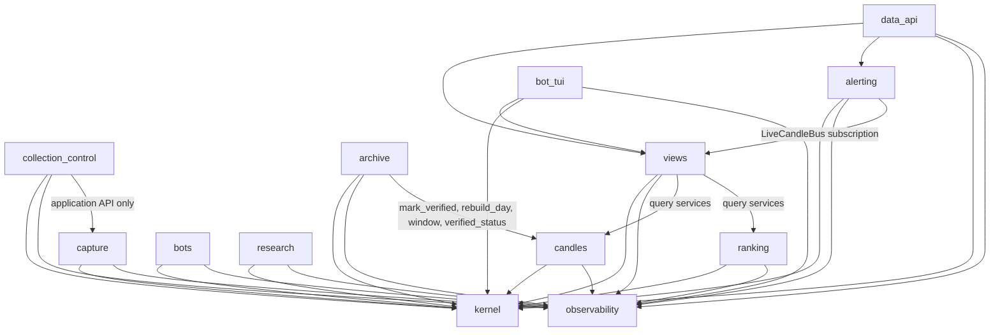

# Rubric review — platform/ DDD spine

## What was read

- The spine (all 426 lines), its `.memlog.md`, the seed (`ddd-redesign-seed-2026-09-21.md`), the
  parent spine (all 306 lines, AD-1..AD-11 + Deferred), Epic 22 (`epics.md:2209-2530`), story files
  22-12/22-13/22-14 in full and the other eleven for status/file lists, `troll/CLAUDE.md`,
  `troll/ARCHITECTURE.md`.
- Code: `collector_core/{collector,feed,trade_backfill,venue_http,fold,config,archive_gaps,
  compare_klines,nightly}.py`, `dydx_collector/{collector,open_interest}.py`,
  `bybit_collector/collector.py`, `hyperliquid_collector/client.py`, `ranking_engine/engine.py:54-237`,
  `live_paper/{config,node}.py`, `ml_signals/{candle_store,error_ledger,chart_indicator_config,
  screener_columns_config}.py`, `data_api/{alerts.py,app.py,routes/snapshots.py:120-140}`,
  `troll/{docker-compose.yml,collector.dockerfile,data_api.dockerfile,live_paper.dockerfile,
  troll-requirements.txt,frontend/package.json,Makefile}`, `nautilus_trader/persistence/funcs.py:39-53`,
  root `pyproject.toml` (ruff/isort), `.gitignore`, `git log` (22.12 merge state).

Line numbers below are from the working tree at `ed15aea026`.

---

## Findings

### CRITICAL

#### C1 — AD-D2's dependency graph is the enforcement, and it forbids imports the codebase needs

**Section:** AD-D2 (lines 142-184), Design Paradigm diagram (lines 39-97).

**Evidence.** AD-D2 says "Enforcement is a plain pytest walking `ast` imports … that fails on any edge
not in this graph — review is not the enforcement." The graph at lines 148-179 has no edge for any of
these legitimate, current dependencies once modules land in the contexts AD-D1 assigns them to:

| Missing edge | Real import today | AD-D1 context of the target |
| --- | --- | --- |
| `data_api → kernel` | `data_api/app.py:50` `collector_core.second_snapshot`; `routes/snapshots.py:45,50` `common.venues`, `ml_signals.venue`; `routes/indicators.py` `ml_signals.indicators` | kernel |
| `data_api → observability` | `data_api/app.py:53`, `routes/candles.py:42` `ml_signals.error_ledger` (`/api/errors`) | observability |
| `bot_tui → kernel` | `bot_tui/coin_detail_state.py` `ml_signals.indicators.mid_price` | kernel |
| `bot_tui → observability` | any continue-past-failure site (DATA-07) | observability |
| `alerting → views` | `data_api/alerts.py:19-21` — "The engine is a server-side observer of `LiveCandleBus`", `redis_bus` imports at `:47-48` | views (`data_api/{live_candles,redis_bus}.py` are views per AD-D1) |
| `bots → research` (or kernel) | `live_paper` imports `ml_signals.performance_metrics` | research (AD-D1 line 136) |
| `ranking → (owner of `catalog_stats`)` | `ranking_engine/engine.py` imports `ml_signals.catalog_stats` | split between research/views/archive (AD-D1 lines 131,136,137) — none of which ranking may import |
| `capture → archive` | `collector_core/collector.py:145-146` `archive_gaps.{ARRIVAL_MARGIN_NS,record_gap}`; `_mark_lost_trades` at `:1104-1111` writes a gap marker on a failed trade flush | archive (AD-D1 line 131 lists `archive_gaps` there) |
| `archive → candles` label | `compare_klines.py:24,89` reads `candle_store.window`; `prune_catalog.py:215` reads `verified_status` | the edge exists but is labelled "mark_verified, rebuild_day" only |

The Design-Paradigm diagram at line 87 does draw `AL --> V`, so the two diagrams in the document
disagree with each other, and the one that binds (AD-D2) is the incomplete one.

**Why critical.** With the graph as written, the first move (`observability`, per AD-D12) already
makes `data_api/app.py:53` a boundary-test failure, because `API → OBS` is not an edge. The story
builder then either loosens the test (the AD stops preventing anything) or routes the ledger
through `views` (an interface adapter computing/holding runtime state, which AD-D11 forbids). Either
way the rule does not prevent its stated divergence.

**Proposed fix.** Replace the graph and add one sentence to the Rule.

Rule addition: "Interface adapters (`data_api`, `bot_tui`) may import `kernel` (types and pure
helpers) and `observability` (the ledger) directly, plus `views` and the application services named
in the graph — nothing else. `kernel` imports nothing from any context (drop the `K --> OBS` edge;
see M5). `research`'s use of `/api/rankings` is HTTP, not an import, and is not an edge."

And resolve the three dependencies that no edge should legitimise:

- `archive_gaps`: the marker **format** (`ArchiveGap` frozen dataclass, `ARRIVAL_MARGIN_NS`,
  `GAPS_DIRNAME`) moves to `kernel/`; capture writes `write_failed`/`quarantined` markers through
  its `ArchiveWriter` port; archive writes `pruned` markers and reads all of them through
  `CatalogFiles`. (See H2 for the two-writer consequence and H5 for the dropped invariant.)
- `performance_metrics`: pure PnL/return arithmetic → `kernel/` (or `bots/domain` if it is
  bot-only); never `bots → research`.
- `ranking_engine`'s `catalog_stats` use (startup price-series backfill from the catalog): give
  `ranking/application/ports.py` a `PriceHistory` port implemented in `ranking/infrastructure`
  over the catalog, so ranking reads the catalog through its own adapter and does not import the
  reader packages.

---

### HIGH

#### H1 — AD-D15 carries `[ADOPTED]` over a clause the code contradicts

**Section:** AD-D15 (lines 293-297).

**Evidence.** Rule text: "`PaperFleet` … and `RealMoneyBot` (one bot, one subaccount,
`exchange_demo` or real) are distinct aggregate types … **no field on either carries a mode**."
`troll/live_paper/config.py:124-132` — `class ExecConfig` with `mode: str`; `:66-71`
`_MODE_ENVIRONMENTS = {"real_money": ("mainnet",), "exchange_demo": ("demo","testnet")}`;
`:261-273` the loader reads `raw.get("mode")` and requires it to agree with `environment`. So the
real-money aggregate does carry a mode *value*, and the AD's own parenthesis ("`exchange_demo` or
real") admits it while its title says "Execution mode is a type, never a value". The parent spine
(AD-3/AD-4 amendments) names exactly this — an `[ADOPTED]` marker over a false clause — as the
failure the document exists to prevent.

**Proposed fix.** Either model what the title promises or narrow the claim to what is true:

- (a) Type-per-mode: "`PaperFleet`, `ExchangeDemoBot` and `RealMoneyBot` are three aggregate
  types built by three loaders; `ExchangeDemoBot` admits only `demo`/`testnet` environments,
  `RealMoneyBot` only `mainnet`. The current `ExecConfig.mode` string (`config.py:132`) becomes
  the discriminator the loader uses to pick the type and is not a field on the aggregate." Mark
  `[TARGET]`, not `[ADOPTED]`.
- (b) Or keep two types and state: "`[ADOPTED]` for the paper/non-paper split: `PaperConfig`
  has no mode field and its loader rejects one (`config.py:227-229`). `ExecConfig.mode`
  (`:132`) selects between the two *non-Sandbox* modes and must agree with `environment`
  (`:261-273`); it can never select paper. Known limit: within `ExecConfig` the demo/real
  distinction is a validated value, not a type; upgrade path = (a)."

#### H2 — AD-D1's store-ownership table breaks AD-D1's own rule, and is marked `[ADOPTED]`

**Section:** AD-D1 (lines 121-140), AD-D8 (line 226), AD-D11 (line 254).

**Evidence.**
1. `verified_days` is listed as a write of `archive/` (line 131: "`verified_days` rows") while
   `candles/` owns `candles_<venue>.db` (line 132), where the table lives
   (`ml_signals/candle_store.py:47`). AD-D8 (line 226) says the write goes through
   `candles.mark_verified` — consistent with the code (`compare_klines.py:491`) — so the table row
   for `archive/` is wrong: two contexts are listed as writers of one SQLite file.
2. `_archive_gaps/<iid>.jsonl` has two writers today: the collector (`collector.py:1104-1111`,
   `write_failed`; `quarantine_corrupt_parquet` → `quarantined`) and `prune_catalog.py:54`
   (`pruned`). The table lists `archive_gaps.py` under archive only and names no store.
3. `views/` "Writes: nothing durable" (line 137) — but `ml_signals/chart_indicator_config.py:61`
   and `screener_columns_config.py:60` are `save_config` (full TOML rewrite via `tomli_w`), called
   from `data_api` routes (`routes/indicators.py` imports `save_config`), with `rw` compose mounts
   at `docker-compose.yml:167,170`. Two operator-persisted files have no owner in the table and are
   absent from AD-D12's freeze list.
4. `[ADOPTED]` "(it is today's writer set, restated)" — today the collector (capture) writes
   `candles_<venue>.db` directly (`collector.py:1113-1128`, `1163-1170` prune), so it is not
   today's writer set either.

**Proposed fix.**
- Line 131 archive "Writes" → "catalog files in place (rewrite/consolidate/prune); `pruned`
  archive-gap markers; catalog `Bar`s via `write_data()` (`backfill_bars.py:519`) and cleared rows
  (`repair_catalog.py:83`)". Remove "`verified_days` rows".
- Line 132 candles "Writes" → "`candles_<venue>.db` including `verified_days` (written for
  `archive` through `mark_verified`)".
- Line 129 capture "Writes" → add "`write_failed`/`quarantined` archive-gap markers under
  `<catalog>/_archive_gaps/`". Add to the Rule: "The `_archive_gaps` marker file is the one store
  with two named writers (capture: `write_failed`, `quarantined`; archive: `pruned`); both write
  append-only JSON lines of the kernel `ArchiveGap` shape, under the maintenance lock, and archive
  is the only reader. Any third reason is an archive write."
- Line 137 views "Writes" → "`chart_indicators.toml`, `screener_columns.toml` (presentation
  config, full-rewrite TOML)". Add both files to AD-D12's frozen list.
- Replace `[ADOPTED]` with "`[TARGET]` — today's deviations: the collector writes
  `candles_<venue>.db` directly (`collector.py:1113`), `compare_klines` writes `verified_days`
  through `candle_store` (`:491`), and `data_api` writes two TOML files; the candles move (AD-D12
  order 4) and the views move (order 3) retire them."

#### H3 — Story 22.12 is merged; the spine still models it as unmerged `[ASSUMPTION]`

**Section:** Capability map line 407, Deferred line 421, AD-D13 line 266, AD-D6/AD-D7.

**Evidence.** `git log`: `50ac0cd20b` (22.12 implemented+reviewed), `51e684b713`, `70847351c8`
(merged into `troll`), `ed15aea026` (its operator actions). `sprint-status.yaml:294` =
`awaiting-operator`. The spine's own `.memlog.md` records: "story 22.12 merged into troll as
70847351c8 during the run; code matches its story … → 22.12 rows become [ADOPTED]; bmad-loop idle,
rename gate open" — but the spine text (updated 13:29) was not brought in line. The merged code also
differs from the story file in ways AD-D6 does not model: `_ahead_trades` (venue clock ahead of
arrival, `collector.py:606,833`), `_late_deltas` (`:818`), the `collector.pending_deltas` overflow
ledger + resync bound `_VENUE_AHEAD_NS` (`:857-877`, MEM-02), `_venue_second_loop` (`:1367`), and
`config.py:361-363` refusing `venue` mode unless `snapshot_interval_seconds == 1.0`.

**Proposed fix.** Line 407 → "22.12 exchange-time bucketing, venue-ordered book, optional
hold-back `[ADOPTED]` (`70847351c8`): `CoreConfig.book_time_source`/`hold_back_seconds`
(`config.py:272,276`, validated `:348-363`); `LiveBook` pending deltas = `_hold_deltas`/
`_drain_pending_deltas` (`collector.py:811,838`) with the `hold_back + 5 s` overflow bound
(`:857`); `TradeIntake` late/ahead counters (`:824-835`); `SecondSampler(HoldBack)` =
`_venue_second_loop` (`:1367`); `measure_lag.py`." Delete Deferred line 421. In AD-D6, add
`ahead-trade counting` and the pending-delta overflow (`BookTimeSource` policy carries the bound
and the "drop + ledger + resync" response) to `LiveBook`/`TradeIntake`. AD-D13's precondition is
now satisfied — say so.

#### H4 — `collection_control` has no AD; its invariants exist only in the seed

**Section:** Invariants & Rules (no AD binds `collection_control/`), AD-D1 line 130.

**Evidence.** Every other context has an AD naming its aggregate's invariants. The seed (§4,
lines 195-203) lists `CollectionPlan`'s: excluded ⟂ collected; every listed id collected; cap
never exceeded (`_MAX_COLLECTED_INSTRUMENTS = 30`, the operating cap against dYdX's 32-per-channel
server limit — `troll/CLAUDE.md` "Adding a venue" step 2); a pin is liquid by USD (AD-7/OBS-03);
`CollectionPlanStore` TOML with the comment-loss Known limit; prune on `InstrumentRemoved`
(`dydx_collector/collector.py:595-625` `_prune_loop`, `_known_markets` `:225`). None of that is in
the spine. `collector:status`/`collector:control` are frozen (AD-D12) but their producer's rules
are not stated; the `trade_backfill: {iid: n}` status field 22.14 added is a capture counter that
control's `StatusPublisher` must read (the `CC → CAP` "application API only" edge) — unnamed.

**Proposed fix.** Add:

> ### AD-D17 — Collection plan is one aggregate with a venue cap
> - **Binds:** `collection_control/`; `capture/venues/dydx/__main__.py` (wiring)
> - **Prevents:** subscribing past a venue's per-connection limit (a self-inflicted ban inside
>   `run_forever`'s restart loop); a pinned instrument classified by token-denominated OI (the
>   BTC incident, AD-7); a removed instrument's catalog leaves surviving unpruned; a control
>   message that can reach the gate
> - **Rule:** `CollectionPlan(venue)` owns `instruments` (with per-instrument delta-storage and
>   retention entries), `exclude`, pins and `cap` (`[ADOPTED]` dYdX = 30 against the venue's
>   32/channel limit). Invariants: `exclude ∩ collected = ∅`; `|collected| ≤ cap`; a pin is
>   admitted only by `classify_liquidity` on USD volume (AD-7). Commands `add`, `remove`,
>   `pin`, `unpin`, `exclude`, `reload` return `InstrumentAdded/Removed/Excluded` events that
>   `CaptureService` turns into `subscribe`/`unsubscribe`, and `InstrumentRemoved` schedules the
>   catalog prune. `ControlService` consumes `collector:control` `{action, iid}` and
>   `StatusPublisher` publishes `collector:status` (payload frozen, AD-D12) from the plan plus
>   capture's read-only counters (feed states, backfill counts). `CollectionPlanStore` persists
>   to the venue's `config.toml` (full rewrite; `Known limit:` comments are lost). Known limit:
>   only dYdX has a live plan; Bybit/Hyperliquid plans are static tuples.

#### H5 — Two seed value objects that carry rebuild-safety invariants were dropped: `FlushBatch` and `ArchiveGap`

**Section:** AD-D7 (line 220), AD-D9 (line 232); seed §4 lines 181-183, 209-210.

**Evidence.** AD-D7 says a closed day is authoritative "only after `rebuild_day` re-buckets its
trades", but the code makes that safe with two invariants the spine never names:
- `_TRADE_CARRY_NS` (`collector.py:211`, `_take_batches` `:1074-1102`): a `TradeTick` batch keeps
  back the newest `ts_init` group while it is younger than 5 s, **and the same instrument's
  snapshot rows sampled after it are carried with it**, "so a crash before the next flush loses
  both together — an honest gap — instead of leaving rows whose trades the archive never received
  (the rebuild would zero them)". The seed modelled this as the `FlushBatch` VO; the spine dropped
  it.
- Gap markers (`archive_gaps.py:15-35`): `rebuild_seconds` keeps a row's live values when its
  `ts_event` falls in a marker span, and every path that can lose archived trades (`write_failed`,
  `quarantined`, `pruned`) must record one. The seed's `ArchiveGap` VO; also dropped. AD-D9's
  `ArchiveDay` machine (`provisional → rebuilt`) has no "not covered" input, so a builder reading
  the spine would rebuild over a gap and zero correct data — the exact loss `archive_gaps` exists
  to prevent.
- `ARRIVAL_MARGIN_NS` (300 s, `archive_gaps.py:49`): backfilled trades older than this are
  refused (`collector.py:1636-1639`) because the rebuild/prune find trades by `ts_init` within
  that margin; AD-D7 omits it although DATA-06 states it.

**Proposed fix.** In AD-D7 Rule add: "Two invariants make the rebuild safe and belong to the
`FlushBatch` value object (capture) and the `ArchiveGap` value object (kernel): (1) a flush never
writes a snapshot row whose trades may still be in the ingest queue — the newest `ts_init` group of
trades is carried while younger than `_TRADE_CARRY_NS`, and that instrument's later snapshot rows
are carried with it (`collector.py:1074-1102`); (2) every path that loses archived trades records
an `ArchiveGap(iid, from_ns, to_ns, reason, count)` marker (`write_failed`, `quarantined`,
`pruned`), and `rebuild_day` keeps the live values of any row inside a marker span. A backfilled
trade older than `ARRIVAL_MARGIN_NS` (300 s) is refused and reported, never archived, because the
rebuild and prune locate trades by `ts_init` within that margin." In AD-D9's state machine add a
guard on `provisional → rebuilt`: "only rows not covered by an `ArchiveGap` change".

---

### MEDIUM

#### M1 — 22.14's `trade_backfill.py` and several real modules have no named home

**Section:** AD-D1 table, Structural Seed (lines 349-378), Capability map 22.14 (line 406).

**Evidence.** `trade_backfill.py` (414 lines) is mostly per-venue wire parsing + `urllib` fetching
(`:63-65` `urllib`, `:83` `nautilus_pyo3.get_dydx_http_url`, `fetch_trades`, `parse_*_trades`,
`_DYDX_MAX_PAGES`, `_BYBIT_FULL`, `_HYPERLIQUID_FULL`). AD-D2 forbids I/O in `application/`, yet
the seed places `trade_backfill.py` in `capture/application/` and the spine names only the
domain-service half. Also unplaced anywhere in AD-D1 or the seed tree: `measure_lag.py` (22.12),
`hyperliquid_collector/book_snapshot.py` (22.5, REST book for the cross-check),
`bybit_collector/open_interest.py` (REST OI rows → catalog), `troll/scripts/capture_hl_ws.py`
(22.5's raw-frame harness, mandatory per CLAUDE.md "Adding a venue" step 1 and a parent Deferred
item), `scripts/{bench_candles.py,wipe_data.sh,open_listener.go}`, `docs/`, `notebooks/`,
`incident_reports/`.

**Proposed fix.** Structural seed: `capture/venues/<v>/trade_history.py` (the `VenueTradeHistory`
adapter: fetcher + pure parser + `BackfillCapability`, fixture-tested), `capture/venues/bybit/
open_interest.py`, `capture/venues/hyperliquid/book_snapshot.py`; `capture/application/
trade_backfill.py` keeps only `BackfillRequest` scheduling and the report; `archive/tools/
measure_lag.py` (or `capture/tools/`); a `platform/scripts/` row ("operator harnesses:
`capture_ws.py` — must gain a per-venue branch before a fourth venue, parent Deferred") and a
`platform/docs/` row. AD-D1 table: add these files to the "Today" column of their context.

#### M2 — `dydx_collector/open_interest.py` is assigned to two contexts

**Section:** AD-D1 line 130 vs Structural Seed line 360.

**Evidence.** AD-D1 puts `dydx_collector/{config,open_interest}.py` under `collection_control`;
the seed tree puts `open_interest.py` under `capture/venues/dydx/`. The module has two halves:
`classify_liquidity` (`open_interest.py:40`, AD-7 — control) and `fetch_open_interest`/
`parse_open_interest` (`:108,114`) producing `OpenInterest` catalog rows (capture; and the poll is
what the parent Deferred says wrongly stamps WS liveness).

**Proposed fix.** Split: `capture/venues/dydx/open_interest.py` (poll → `OpenInterest` rows, fed
to the buffer as `REST_FEED_NAME`, never `_on_data`) and `collection_control/domain/liquidity.py`
(`classify_liquidity`, `LiquidityTier`). Update both tables.

#### M3 — AD-D6's arbitration language contradicts the code and DATA-06

**Section:** AD-D6 `TradeIntake` (line 210), AD-D7 (line 220), AD-D14.

**Evidence.** Spine: "first copy wins, the second is counted `duplicate`". Code and rules: a repeat
from the *same* feed is `duplicate` (replay, `collector.py:940-945`); from another feed or from
`rest` it is `duplicate_feed` (`:923`, `_duplicate_feed_dropped`; `troll/CLAUDE.md` DATA-06). And
"backfilled trades … leave the live second alone" is only half true: when the REST copy arrived
first, the later live copy *is* folded live (`:926-929`, "or the live second misses a trade the
live feed delivered"). AD-D14's glossary has none of the counter vocabulary the audit and DATA-06
already use (`duplicate`, `duplicate_feed`, `late`, `ahead`, `orphan`, `unrecoverable`, `refused`,
`no_baseline`).

**Proposed fix.** AD-D6: "per-feed first-copy arbitration: an id already delivered by the same
feed is a replay (`duplicate`, and after the startup grace a reconnect signal); by another feed or
by the REST backfill it is `duplicate_feed`; the first copy is archived once, and a live copy whose
first copy came from REST is folded into the live second (the REST copy never is)". Add a glossary
row "Trade outcome counters: `duplicate` / `duplicate_feed` / `late` / `ahead` / `orphan` /
`refused` / `unrecoverable` — each a named, flush-reported count (DATA-05), never a silent drop".

#### M4 — Data directories: the migration decides nothing about where the stores live

**Section:** AD-D12 (line 260), AD-D13 (line 266), Structural Seed, Deployment paragraph (380-386).

**Evidence.** Every durable store is mounted from under a *package* directory that the migration
renames: `docker-compose.yml:50,54,58` `./dydx_collector/{catalog,candles,incident_reports}`,
`:81-82,104-105,137-138,163-165` the same for the other services, `:49` the dYdX control-plane
config at `./config.toml`, `:278` `./live_paper/data`, `:219` `./bot_tui_logs`; `.gitignore:178-186`
lists them; `data_api/settings.py:16` and `ranking_engine/engine.py:6` default `CATALOG_PATH` to
`troll/dydx_collector/catalog`. AD-D13 mentions "the VPS data-dir move" and AD-D12 freezes
"compose service names and env vars", but no target path is decided and host mount paths are not
frozen. When `dydx_collector/` becomes `capture/venues/dydx/`, every mount and default changes —
that is a coordinated redeploy of three 24/7 writers, exactly what AD-D12 says it prevents.

**Proposed fix.** In AD-D13's Rule: "Step 0 also moves every durable store out of package
directories into `platform/data/{catalog,candles,metrics,incident_reports,live_paper,bot_tui_logs}`
and the dYdX plan file to `platform/data/dydx_config.toml`; compose mounts, `.gitignore`, the two
`CATALOG_PATH` defaults and `DEPLOY_CHECKLIST.md` change in that one commit." In AD-D12's frozen
list add "host bind-mount paths under `platform/data/`" so no later context move touches them.

#### M5 — AD-D3 kernel wording and the `K --> OBS` edge

**Section:** AD-D3 (line 190), AD-D2 graph line 178.

**Evidence.** "Nothing stateful … enters" — but the `Indicator` classes it admits are stateful
per instance (rolling windows); the intent is *no module-level or shared state*. The graph draws
`kernel → observability`; nothing in the listed kernel members needs the ledger (`fold.py`,
`second_snapshot.py`, `venue_http.py`, `venues.py`, `indicators.py` import none of it today) — and
AD-D16 says observability "imports nothing", so the reverse must also hold or the kernel is not a
leaf. Separately, `ranking_engine/engine.py:146-162` carries its own `_USER_AGENT`, `_BYBIT_URLS`,
`_HYPERLIQUID_URLS`: the "two REST transports that produce different bytes" divergence AD-D3 says
it prevents already exists between ranking and `venue_http`.

**Proposed fix.** "Nothing with module-level or shared mutable state, nothing with a store, no
config loader" ; delete the `K --> OBS` edge; add to AD-D10: "`VolumeSource` adapters use
`kernel.venue_http`'s URL maps, `USER_AGENT` and `http_json`; `engine.py:146-162` is retired in the
ranking move."

#### M6 — AD-D16 implies a cross-process error ledger that does not exist

**Section:** AD-D16 (line 303), AD-D1 line 138.

**Evidence.** `ml_signals/error_ledger.py:18-31` is an in-process `Counter` behind a lock;
`data_api/app.py:157` — "Every failure **this process** carried on past". So `GET /api/errors`
and the `ErrorBar` show `data_api`'s own sites only; collector, ranking, nightly and `live_paper`
ledger entries are visible only in Dozzle. AD-D16 says "Every site … calls `error_ledger.record`;
`GET /api/errors` and the frontend `ErrorBar` read the counters" — true per process, misleading
as written; DATA-07's "visible without reading Dozzle" is not met for the writers. Also two
notifiers exist: `collector.py:388` `_notify` (ntfy.sh via `WATCHDOG_NTFY_URL`) and
`data_api/alerts.py:224` `post_telegram`; the spine puts `notify` in observability and `telegram`
in alerting without saying whether they share one sender.

**Proposed fix.** AD-D16 Rule: "Known limit: the ledger is per process — `/api/errors` shows the
`data_api` process's sites; every other process's sites are visible in its log only. Upgrade path:
`observability/infrastructure/redis_ledger.py` publishing `errors:ledger` (a new published-language
channel, added to AD-D12's list when built) so `/api/errors` aggregates every process." And: "One
outbound notifier (`observability/notify.py`, stdlib `urllib`, ntfy/Telegram/webhook targets);
`alerting`'s `Deliverer` port is implemented over it."

#### M7 — AD-D5's acceptance test measures allocations, not the latency the seed asked for

**Section:** AD-D5 (line 202); seed §1 lines 77-82; memlog last line.

**Evidence.** Seed: "a benchmark acceptance test (existing `.benchmarks/` harness) so the refactor
cannot silently regress latency". Spine: a `tracemalloc` allocations-per-message ceiling. The
memlog explains why (pytest-benchmark only in root dev deps; `.benchmarks/` empty) — the spine
does not, and an allocation count cannot catch a latency regression from, e.g., `Protocol`
dispatch or an extra `await` per message.

**Proposed fix.** Add to AD-D5: "Rationale: `pytest-benchmark` is not in the collector image
(`troll-requirements.txt`) and `.benchmarks/` is empty, so the ceiling is stdlib `tracemalloc`.
The same replay also asserts wall time per message (`time.perf_counter_ns`) ≤ 2× the baseline
recorded with it; both numbers are recorded in `docs/DATA_INTEGRITY_AUDIT.md` at the start of the
capture story."

#### M8 — Migration order and the boundary-test exemption can let moved contexts diverge

**Section:** AD-D12 (line 260), Deferred "Boundary-test scope during migration" (line 424).

**Evidence.** Order: `views` (3rd) before `candles` (4th) and `ranking` (8th), yet views calls
their query services; `alerting` (5th) before `views`… no — after, fine — but `bots` (9th) after
`research` (6th) while `bots` imports `performance_metrics` (C1). The Deferred bullet exempts
"old packages … until their story lands", without saying in which direction: a moved `views` may
import legacy `ml_signals.candle_store`, but may legacy `collector_core` import moved `kernel`?
(It must, or the kernel move is not deployable alone.) Also lock-step surfaces the seed §7 named
and the spine dropped: compose `command:` lines (`docker-compose.yml:69,93,116,149` change with
every entrypoint move) and `live_paper.dockerfile:17-18`, which copies only `ml_signals` and
`live_paper` — the `kernel` move must add a `COPY` there or `live_paper` stops importing
`venue_of`/indicators.

**Proposed fix.** Replace the Deferred bullet with a rule in AD-D12: "The boundary test maps every
legacy module to its target context from the first move (a table in `test_boundaries.py`), so an
edge is judged by target contexts even while the module still lives at the old path; a legacy
module may import a moved context, and a moved context may import a legacy module only along an
edge that is legal between their target contexts." Add "compose `command:` lines and every
dockerfile `COPY` set (three images)" to the same-commit list.

#### M9 — AD-D9/AD-6: the in-place rewriter set and the zstd patch are not one adapter today

**Section:** AD-D9 (line 232), Inherited AD-6 row (line 111), Structural Seed line 358.

**Evidence.** In-place `pq.write_table` sites: `rebuild_seconds.py:329`, `consolidate_catalog.py:219`,
`migrate_open_interest.py:98`, `dydx_collector/normalize_snapshot_schema.py:77` — four
implementations of temp-then-rename, not one. The zstd `pq.write_table` monkeypatch is duplicated
in `collector.py:231-243` and `backfill_bars.py:137-148` (both "workaround: `write_data()` has no
compression passthrough"); the seed tree puts it in `capture/infrastructure/parquet_writer.py`,
which `archive` may not import. Archive-side `write_data()` callers (`backfill_bars.py:519`,
`repair_catalog.py:83`) are not listed in archive's Writes.

**Proposed fix.** AD-D9: "`CatalogFiles` replaces the four rewrite sites; the zstd
`write_table` patch lives in `kernel/parquet_compat.py` (a pure pyarrow shim, no I/O of its own) and
is applied by both `ArchiveWriter` (capture) and `CatalogFiles`/`backfill_bars` (archive) —
`[TARGET]`, today duplicated at `collector.py:231-243` and `backfill_bars.py:137-148`." Update
AD-D1 archive Writes (see H2).

#### M10 — Line citations in AD-D1 span the wrong code

**Section:** AD-D1 lines 130, 138.

**Evidence.** `collection_control` cites `dydx_collector/collector.py:194-625`; that range contains
the capture hooks `_apply_deltas` (`:283`), `_handle_crossed_book` (`:331`), `_resync_book` (`:346`)
and the OI poll (`:356`). `observability` cites `:677-843`; the incident subsystem starts at
`:648-651` (`_WS_RAW_LOG_DIR`, `_INCIDENT_DIR`) and `_IncidentHandler` is at `:806`.

**Proposed fix.** `collection_control` → "`dydx_collector/collector.py:369-625` (subscribe/
unsubscribe, config reload, status/control loops, pin-top-liquid, prune)"; `capture` gains
"`dydx_collector/collector.py:265-355` (hooks)"; `observability` → "`:648-843` (`[WS_RAW]` flush,
incident report handler)".

---

### LOW

- **L1** Deferred line 422 names only 22.14's stale `Status: ready-for-dev` header; 22-12 and
  22-13 story files carry the same header (`22-12…md:3`, `22-13…md:3`) while `sprint-status.yaml:292-294`
  says `awaiting-operator`. Name all three.
- **L2** AD-D10 "twenty module globals": `ranking_engine/engine.py:54-176` has 23 module-level
  names, 12 of them mutable runtime state (`_LAST_SEEN`, `_VOLATILITY`, `_OFI_INDS`,
  `_OFI_RAW_INDS`, `_OBI_INDS`, `_LAST_FED`, `_SECOND_ROLLING`, `_SLOW_METRICS`, `_PRICE_SERIES`,
  `_BACKFILLED`, `_ACTIVE_MODE`, `_VENUE_VOLUMES`). Cite the twelve; the constants stay (the AD says
  so).
- **L3** AD-D12's env-var parenthetical reads as exhaustive. Services also read `METRICS_DB_PATH`,
  `DYDX_NETWORK`, `BYBIT_ENVIRONMENT`, `HYPERLIQUID_ENVIRONMENT`, `RANKING_HEARTBEAT_SECONDS`,
  `WATCHDOG_NTFY_URL`, `TELEGRAM_BOT_TOKEN`/`TELEGRAM_CHAT_ID`, `LIVE_PAPER_REAL_MONEY_CONFIG`,
  `DATA_API_PORT`, `REDIS_PORT`. Write "every env var any service reads, e.g. …".
- **L4** AD-D13 verified: `platform` is imported by `nautilus_trader/system/kernel.py` and
  `nautilus_trader/persistence/catalog/parquet.py`; both ruff (`categorize`: known-modules →
  stdlib list → `src` match) and isort (`known_patterns` before `_src_path`) classify the stdlib
  name before source-directory detection, so a repo-root `platform/` does not re-sort those
  imports. Add that sentence to the rationale, and add `.gitignore:178-186`,
  `data_api/settings.py:16`, `ranking_engine/engine.py:6` and the Makefile `test` list
  (`Makefile:145`) to the rename's touch list.
- **L5** Stack: the parent's Dozzle row (`amir20/dozzle:latest`, `docker-compose.yml:289`) was
  dropped; everything else verified against `troll-requirements.txt`, `frontend/package.json`, the
  three dockerfiles (`nautilus-trader-base:1.229.0`, `node:24-slim`) and `pyproject.toml:25`
  (`>=3.12,<3.15`). Note that the *parent* Stack table (plotly 6.9.0 / pandas 3.0.5) is the stale
  one; this spine's 6.8.0 / 3.0.4 match the repo.
- **L6** AD-D8: the ordering invariant that makes the store safe — only seconds whose `write_data`
  succeeded are applied (`collector.py:1063-1073`, "the store is never ahead of the archive") — is
  not in the Rule; `SecondSink.apply` must be called with the flushed batch, never the sampled one.
- **L7** Design-Paradigm diagram: `candles` reads the catalog (`_catch_up_candle_store`
  `collector.py:1130`, `build_candles`, `rebuild`) — no `PQ -.read.-> CAN` arrow.
- **L8** AD-D2 graph edge `RS -->|watchlist over HTTP only| API`: an HTTP call is not an import;
  the boundary test cannot see it. Footnote it, do not draw it as an edge.
- **L9** Inherited AD-5 row: the Hyperliquid `ts_event` exact-millisecond re-stamp (audit D-62,
  `hyperliquid_collector/client.py:75`) is a third ACL re-stamp site; name it beside
  `_at_fixed_precision` and `exact_text`.
- **L10** AD-D12 shim expiry ("no later than two stories") has no mechanism. Give each shim a
  module constant `REMOVE_AFTER = "<story>"`; `test_namespace.py` fails when a shim names a story
  already `done` in `sprint-status.yaml`.
- **L11** Seed §3 "Capture ↔ Archive: Partnership (changed only together)" — the spine states the
  shared-kernel half (AD-D3) but not the partnership discipline (a fold/schema/`venue_http` change
  lands with both contexts' tests in one story). One sentence in AD-D7.
- **L12** AD-D1 `research` "Today" lists `catalog_stats` "query half" and `views` lists "series
  reads", `archive` lists nothing from `catalog_stats` although the seed assigns it the
  diagnostics half (`data_file_ranges`); `compare_klines.py:93` also imports
  `collector_core.build_candles._parse_date_ns` (a private helper of a candles module). Name the
  three-way split by function.

---

## Checklist walk

| Good-spine criterion | Verdict | Findings |
| --- | --- | --- |
| Fixes the real divergence points for the level below, misses none | Partial | H4 (no `collection_control` AD), H5 (rebuild-safety VOs dropped), M1 (unplaced 22.14/22.5/22.12 modules) |
| Every AD's Rule is enforceable and prevents its divergence | Fail on AD-D2 | C1; M8 (exemption direction); L10 (shim expiry) — AD-D4/AD-D14 are review-enforced by design, acceptable |
| Nothing under Deferred could let two units diverge | Partial | M8 ("Boundary-test scope during migration"); Deferred line 421 is stale (H3) |
| Named tech verified-current | Pass | L5 (Dozzle row dropped; parent's table is the stale one) |
| Ratifies rather than contradicts the brownfield code | Partial | H1 (`ExecConfig.mode`), H2 (writer set), H3 (22.12), M3 (`duplicate_feed`), M5 (ranking URL maps), M6 (per-process ledger), M9 (four rewriters), M10 (cites) |
| Every Epic 22 story covered; new code lands in a named context | Partial | 22.1–22.11, 22.13 ✓; 22.12 stale (H3); 22.14 fetch/parse half unplaced (M1); 22.13's `archive_gaps` mis-homed (C1/H2/H5); 22.5's `book_snapshot.py`/`capture_hl_ws.py` unplaced (M1) |
| No AD-D weakens/contradicts AD-1..AD-11 | Pass | AD-D6 makes AD-1 structural; AD-D9 keeps AD-6's exception as one adapter; AD-D15 vs AD-10 only mis-states (H1), does not weaken |
| Every altitude dimension decided/deferred/open | Partial | Deployment ✓; operations ✓ (nightly, backup, cron); data ownership: H2, M4 (store locations undecided); migration: M8 |
| Reconciliation (seed / parent Deferred / Epic 22 quietly dropped) | See table below | |

## Reconciliation — what did not land

| Source | Item | Landed? | Finding |
| --- | --- | --- | --- |
| Seed §1 | benchmark acceptance on `.benchmarks/` harness | changed to tracemalloc, rationale only in memlog | M7 |
| Seed §4 capture | `FlushBatch` VO (`_TRADE_CARRY_NS` carry rule) | dropped | H5 |
| Seed §4 archive | `ArchiveGap` VO | dropped | H5, C1 |
| Seed §4 capture | `candle_prune` loop in `CaptureService` | absent from the spine's loop list (line 356); `collector.py:1163` — must move to `candles/` (a candles process manager or the sink adapter), or `candles_<venue>.db` grows unbounded | add to AD-D8 |
| Seed §4 collection_control | `CollectionPlan` invariants, cap 30, `CollectionPlanStore`, prune on `InstrumentRemoved` | dropped | H4 |
| Seed §4 bots | `Incident` entities, heartbeat | not mentioned (`bot_tui/bot_incidents_state.py` exists) | low; add to AD-D15 or note as `bots:status` payload only |
| Seed §4 ranking | `RankChanged`/`ModeSwitched` events | dropped — consistent with AD-D4; say so | none |
| Seed §3 | Capture ↔ Archive Partnership ("changed only together") | half-stated | L11 |
| Seed §7 | compose `command:` lines as a lock-step surface | dropped | M8 |
| Seed §8 | order/exemption direction | ambiguous | M8 |
| Parent Deferred | `capture_hl_ws.py` cannot capture a fourth venue | not mentioned; `scripts/` unplaced | M1 |
| Parent Deferred | `open_interest` vs `volume24h` polls in different namespaces | implicitly resolved (capture vs ranking), not stated | low; one line in the Capability map |
| Parent Deferred | all others | present in Capability map lines 408-413 | none |
| Epic 22 22.12 | merged code | modelled as unmerged | H3 |
| Epic 22 22.14 | `trade_backfill.py` fetch/parse; `collector:status` `trade_backfill` field | half-placed; status field unowned | M1, H4 |
| Epic 22 22.13 | `archive_gaps.py`, `_TRADE_CARRY_NS`, `ARRIVAL_MARGIN_NS` | mis-homed / dropped | C1, H2, H5 |
| Epic 22 22.5 | `hyperliquid_collector/book_snapshot.py`, `troll/scripts/capture_hl_ws.py` | unplaced | M1 |
| Epic 22 22.7 | `ExecConfig.mode = "exchange_demo"` | contradicted by AD-D15 | H1 |
| troll/CLAUDE.md | DATA-07 "visible without reading Dozzle" | AD-D16 overstates | M6 |
| troll/CLAUDE.md | "Adding a venue" step 1 harness | unplaced | M1 |

## Verified correct (no action)

- `class_to_filename` derives the catalog directory from `cls.__name__` only
  (`nautilus_trader/persistence/funcs.py:48`), and `snapshots:raw` payloads are `to_dict` without a
  module path (`second_snapshot.py:129`, `collector.py` `_publish_snapshot_batch`) — so the
  `kernel` move is wire-safe as AD-D3 claims.
- `venue_http` is genuinely shared by capture (`trade_backfill.py:76-82`) and archive
  (`compare_klines.py:94-100`), justifying its kernel admission.
- `on_data(data, feed)` (`collector.py:764`), `Feed`/`MAIN_FEED`/`REST_FEED_NAME` (`feed.py:33-42`),
  `feed_states()` (`hyperliquid_collector/client.py:130`), `BackfillCapability` numbers
  (`trade_backfill.py:96-97`: linear 1000 / spot 60 / HL 10), "WS id == REST id, wire-verified
  2026-09-21" (`trade_backfill.py:44-48`) all match AD-D6/AD-D7.
- `nightly.py:60-68` has `Step`/`StepResult`; `compare_klines` has no tolerance and writes
  `verified_days` only from the venue source (`:49-50`); `prune_catalog.py:215` gates on
  `verified_status` — AD-D9's saga and "age AND verified" are ratified.
- `live_paper/node.py:158-159` wires `CacheConfig(database=DatabaseConfig(...))`; `fills_store.py`
  exists — AD-D1's bots row is right.
- Nine compose services; `data_api`/`ranking_engine` read-only mounts; `profiles` for
  `bot_tui`/`live-paper` — the Deployment paragraph is accurate.
- `snapshots.py:129-133` is exactly the empty-top and `bp >= ap` skip AD-D11 cites, with the gap
  marker at `:137-138`.
