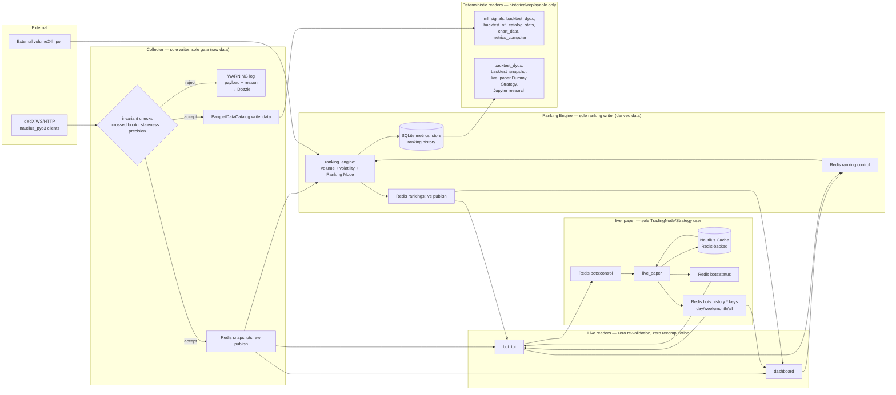

# Architecture Spine — dYdX Collector & ml_signals — Data-Integrity Spine

## Design Paradigm

**Gatekeeper: fail-closed single-writer ingestion — applied twice, one layer apart.**

`dydx_collector/collector.py` is the only component in `troll/` that writes *raw* market data anywhere — to the `ParquetDataCatalog` and to the live Redis `snapshots:raw` channel. It is also the only place raw-data invariants (crossed book, staleness, precision) are checked. `ranking_engine` repeats the same pattern one layer up for *derived* data: it is the sole computer and sole publisher of Coin Ranking, over `rankings:live`. `live_paper` is the sole sanctioned `TradingNode`/`Strategy` runtime, exposed to the rest of `troll/` only through its own Redis control plane (`bots:status`/`bots:control`). Every other module — `ml_signals/dashboard.py`, `backtest_dydx.py`, `backtest_ofi.py`, `catalog_stats.py`, `metrics_computer.py`, `chart_data.py`, and the new `bot_tui` — is a trusting reader: it consumes what the relevant gate already approved and performs no defensive re-validation or recomputation of its own.



Namespace mapping: `dydx_collector/` = the gate for raw market data (ingest, validate, write); `ranking_engine/` = a second, narrower gate one layer up — sole computer/publisher of derived Coin Ranking data; `live_paper/` = the sole sanctioned `TradingNode`/`Strategy` runtime, reachable only through its own Redis control plane; `ml_signals/`, `dashboard.py`, `bot_tui/` = readers (signals, backtests, dashboard, TUI). No namespace imports another's internals — only shared data types and pure utilities cross a boundary.

## Invariants & Rules

### AD-1 — Single write gate, both sinks

- **Binds:** `dydx_collector.collector`, and any writer ever added inside `dydx_collector` (e.g. a future backfill script) — not just the current module
- **Prevents:** a second writer (or a new sink) bypassing invariant checks; the two existing sinks (Parquet, Redis) drifting to different validation logic; the two sinks disagreeing about which items were approved
- **Rule:** Both the `ParquetDataCatalog.write_data()` call and the `snapshots:raw` Redis publish for a given item happen from the same already-validated object, synchronously, before control returns to the ingestion loop — not fanned out to independent async consumers (a queue-plus-two-workers split can let one sink receive an item the other hasn't yet, or ever, persisted). `[ADOPTED]` — confirmed (re-verified 2026-07-24, citations corrected — code moved since original 2026-07-01 grounding): `collector._second_loop` (`collector.py:643`) validates each book then appends to `batch`, publishing via `_publish_snapshot_batch` (`collector.py:735`) and writing via `self._catalog.write_data(items)` (`collector.py:549`) within the same synchronous per-instrument iteration. Any new writer or new sink must route through this same gate before either sink sees it — never a parallel, independently-checked path. There is currently no compiler/lint-level mechanism forcing this (see Deferred: shared validator extraction) — it holds by there being exactly one writer today, not by structural enforcement.

### AD-2 — Fail-closed, never fail-open

- **Binds:** `dydx_collector.collector` (all invariant checks: non-empty top-of-book, crossed book, staleness, precision, and any added later)
- **Prevents:** wrongful/corrupt data reaching Parquet or the live stream; a validity-flag field spreading the "is this trustworthy?" decision downstream to every reader
- **Rule:** On any invariant violation, the offending item is dropped — not written, not published, not clamped, not averaged. A `logging.WARNING` line records the full offending payload and the specific reason (crossed price pair, staleness duration, precision mismatch, etc.). No schema carries a validity/flag field; the log stream (visible via the existing Dozzle container) is the sole audit trail for rejected data. `[ADOPTED]` — confirmed (re-verified 2026-07-24, citations corrected): `collector.py:660` skips a snapshot when either `best_bid_price()` or `best_ask_price()` is `None` (empty top-of-book); `collector.py:662-671` skips + logs a crossed book (with a separate steady-state-crossed escalation path for a book that stays crossed past `_CROSSED_RESYNC_NS`); staleness handling lives in the watchdog state tracked from `collector.py:288-302` onward. A book with fewer than `BOOK_DEPTH` (20) levels per side but a valid top-of-book is not a gate violation — see Consistency Conventions.

### AD-3 — Readers trust the gate completely

- **Binds:** all of `ml_signals` — every current and future reader module (e.g. `dashboard`, `backtest_dydx`, `backtest_ofi`, `backtest_snapshot`, `catalog_stats`, `metrics_computer`, `chart_data`, `watchlist`, `ofi_strategy`, and any module added later), not an enumerated subset — a module being unlisted is not license to re-validate `[amended 2026-07-24: was a 6-item enumerated list stale against `ml_signals`'s actual ~15 modules, confirmed by code check — closed to an open binding to prevent that gap recurring]`
- **Prevents:** duplicated, independently-drifting validation logic in readers (already occurred once — see Deferred)
- **Rule:** No reader may re-implement a data-quality check (crossed-book detection, staleness thresholds, precision guards) against catalog or stream data. If a reader appears to need one, that is a signal the check belongs in the collector's gate, not a reason to add reader-side validation.

### AD-4 — Module boundary: shared types and pure utilities only

- **Binds:** `dydx_collector`, `ml_signals`, `live_paper`, `ranking_engine`, `bot_tui`
- **Prevents:** a reader depending on collector internals (buffer shape, flush timing, subscription state) and breaking silently when the collector's implementation changes; readers reimplementing collector logic instead of importing it (the exact drift AD-7 exists to prevent for liquidity tiering)
- **Rule:** Cross-namespace imports are limited to (a) shared data types (`DydxMinuteBar`, `DydxSecondSnapshot`, and similar) and (b) pure, side-effect-free utility functions/classes with no I/O and no shared mutable state (e.g. `classify_liquidity`, and `ml_signals.indicators`'s Indicator classes — OFI/OBI/microprice). Stateful/ingestion logic — the buffer, the gate, subscription/connection state, `Portfolio`/`Trader`/`Strategy` state — may never be imported across namespaces; `dydx_collector` never imports from `ml_signals`. `bot_tui` imports `ml_signals.indicators` directly for its per-coin live-indicator view rather than reimplementing OFI/OBI/microprice, consistent with dashboard's existing usage. `[ADOPTED]` — confirmed (re-verified 2026-07-24, citation corrected — `catalog_stats.py`/`chart_data.py` no longer import `dydx_collector` types directly as of this check): `ml_signals/backtest_snapshot.py` and `snapshot_strategy.py` import only `DydxSecondSnapshot` from `dydx_collector.second_snapshot`; no reverse imports exist. `live_paper` was a pre-existing gap in this rule (built after the spine's original 2026-07-01 run, never folded in) — closed now while touching this AD for the new modules anyway.

### AD-5 — Precision is re-stamped exactly, never inferred or float-tripped

- **Binds:** any code in `troll/` constructing or re-stamping a `Price`/`Quantity` — not only `dydx_collector`; the underlying `nautilus_trader` bug doesn't care which namespace calls the buggy constructor, and `ml_signals` (e.g. cross-instrument precision alignment in signal work) is equally exposed
- **Prevents:** silent value corruption from `Price(decimal, precision)`'s float64 round-trip bug, and precision-label mismatches from inferring precision off an incoming value's trailing-zero count (dYdX's mark/index feed strips zeros inconsistently per tick, which `ParquetDataCatalog` correctly refuses to merge)
- **Rule:** Never call `Price(decimal, precision)` / `Quantity(decimal, precision)` to change precision. Always `Decimal.scaleb(new_precision)` + `Price.from_raw()` / `Quantity.from_raw()`. Never derive precision from `Decimal.normalize()` on an incoming value. Never round-trip a market value through `float` before it is inside a `Price`/`Quantity`. `[ADOPTED]` — reference: `dydx_collector/client.py:_at_fixed_precision()`.

### AD-6 — Catalog access only through the official API

- **Binds:** all writers and readers
- **Prevents:** a hand-rolled Parquet schema/partitioning drifting from what `ParquetDataCatalog` expects, and unbounded in-memory catalog loads
- **Rule:** All writes go through `ParquetDataCatalog.write_data()`; no hand-rolled schema. All backtests use `BacktestNode` + `BacktestDataConfig` (time-bounded streaming); never a custom simulation loop or an unbounded `catalog.trade_ticks()` call. Strategies are referenced via `ImportableStrategyConfig` by string path. `[ADOPTED]` — confirmed (re-verified 2026-07-24, citations corrected): `collector.py:549,792` are the only production `write_data()` call sites in `troll/` (test fixtures also call it, expected); `ml_signals/backtest_dydx.py:67-72,99` uses `BacktestNode`/`BacktestDataConfig`/`ImportableStrategyConfig`.

### AD-7 — Liquidity classification is USD-denominated

- **Binds:** `dydx_collector.open_interest.classify_liquidity`
- **Prevents:** repeating the production incident where raw `openInterest` (base-token units) was compared against a USD threshold, misclassifying BTC as illiquid
- **Rule:** Liquidity tiering uses `volume24H` (already USD) or `openInterest × oraclePrice` — never raw `openInterest` alone. `[ADOPTED]` — reference: `dydx_collector/open_interest.py:109` (`classify_liquidity`).

### AD-8 — No live-runtime engine in the data-collection path; `TradingNode` is for trading, not collecting

- **Binds:** `dydx_collector`, `ml_signals` (data collection, storage, and read paths only), `ranking_engine`, `bot_tui`
- **Prevents:** repeating the OOM/shutdown-wedge failure of the earlier `Strategy`/`TradingNode`-based *recorder* (`gg` branch) — where `TradingNode`/`DataEngine` was misused as a data-capture mechanism
- **Rule:** `dydx_collector` and `ml_signals`'s reader modules (`dashboard`, `catalog_stats`, `chart_data`, `metrics_computer`, `backtest_dydx`, `backtest_ofi`), plus `ranking_engine` and `bot_tui`, use `nautilus_trader` as a library only — never instantiate `TradingNode`, `Strategy`, or `DataEngine`. The collector owns its own asyncio loop, in-memory buffer, and flush timer, driving `nautilus_pyo3.DydxHttpClient`/`DydxWebSocketClient` directly. `bot_tui`'s only path to the trading runtime is `live_paper`'s Redis control/status channels (see AD-10) — never a direct import of `live_paper` internals. `[ADOPTED]` — reference: `collector.py:17-18` (module docstring), `collector.py:369` (`asyncio.create_task(self._flush_loop())`, the collector's own loop, no `TradingNode`).
- **Explicitly not banned:** `TradingNode`/`Strategy` used for their intended purpose — running an actual (paper or live) trading strategy — is in scope for `live_paper`, the one sanctioned module for this outside the data path (see AD-10). The prior incident was `TradingNode` misused as a recorder, not `TradingNode` used to trade; this distinction is load-bearing and must not collapse back into a blanket ban.

### AD-9 — Ranking Engine: sole computer/publisher of derived Coin Ranking

- **Binds:** `ranking_engine` (writer); `ml_signals.dashboard`, `bot_tui` (live readers); `ml_signals.backtest_dydx`, `ml_signals.backtest_snapshot`, `live_paper`'s Dummy Strategy, Jupyter research (historical/deterministic readers)
- **Prevents:** Coin Ranking (volume + volatility) and Ranking Mode being computed independently in more than one surface (dashboard's inline `_volume_loop_task`/`_rankings_json`/`_watchlist_ids`/`_current_ranks` was the de facto engine with zero shared abstraction); a wire-format free-for-all on `rankings:live` where each implementer guesses field names/shape independently; a deterministic backtest/Jupyter run trying to depend on a live-only pub/sub channel it can't replay
- **Rule:** `troll/ranking_engine/` is the sole computer and sole publisher of Coin Ranking. Two distinct consumption paths, because live UI and deterministic research have different needs:
  - **Live path** — `ranking_engine` polls `volume24h`, computes volatility (stddev, configurable lookback, default 1h) from `snapshots:raw`, holds the single active Ranking Mode (volume vs. volatility) as shared state, and publishes on Redis channel `rankings:live`: a JSON message with `mode` (`"volume"` | `"volatility"`), `updated_at` (ns timestamp), and `ranks` — an ordered list of `{instrument_id, rank, volume24h, volatility_score}` objects (both score fields present regardless of active mode, so readers never need mode-specific parsing branches). `dashboard` and `bot_tui` are pure readers of `rankings:live`, never recomputing ranks/volatility/mode.
  - **Mode switching** is a publish to Redis channel `ranking:control` (from `dashboard` or `bot_tui` → `ranking_engine`); `ranking_engine` is the sole writer of the mode value and applies a switch atomically. Ranking Mode is GLOBAL shared state — switching from either surface changes what every `rankings:live` reader sees. Last-write-wins on a near-simultaneous double-switch is acceptable (a UI convenience toggle, not a financial value — not worth solving further here).
  - **Historical path** — `ml_signals.backtest_dydx`/`backtest_snapshot`, `live_paper`'s Dummy Strategy, and Jupyter research consume ranking history from `ranking_engine`'s relocated SQLite `metrics_store` (queryable by timestamp), never from `rankings:live` — a deterministic run cannot depend on a live-only pub/sub stream. This is how FR-13's "backtest accepts the Watchlist's current output" and FR-8's historical-ranking view are satisfied post-extraction.
  - **Staleness:** `ranking_engine` publishes on `rankings:live` on both rank-change and a fixed heartbeat interval — same discipline as AD-10's `bots:status`. `dashboard` and `bot_tui` treat absence of a heartbeat within a configurable timeout as `unknown/stale`, never as "last known ranking is still current" — a `ranking_engine` crash or restart must show up as visibly stale, not silently frozen.
  - This extends the Gatekeeper paradigm one layer up, from raw market data (AD-1/AD-2) to derived/computed ranking data. Relocates `dashboard.py:900-976` (inline ranking logic) plus the existing SQLite `metrics_store` history persistence into `ranking_engine`.

### AD-10 — `live_paper` control-plane isolation (status, control, and durable trade/PnL history)

- **Binds:** `live_paper` (writer/owner of `bots:status`, the `bots:history:*` keys, and its own Nautilus `Cache`; sole subscriber of `bots:control`); `bot_tui`, `ml_signals.dashboard` (readers/clients)
- **Prevents:** `bot_tui`/dashboard importing `live_paper`'s `Portfolio`/`Trader`/`Strategy` state directly, coupling a UI process to live-trading runtime internals; a second IPC mechanism growing up alongside the Redis bus already used for raw data and ranking; a `bots:control` message being able to select paper-vs-live mode and bypass FR-15's config gate; ambiguous addressing once more than one bot is running; `bot_tui` silently showing a frozen last-known status after `live_paper` crashes or restarts; `bot_tui`/dashboard reaching into Nautilus's internal Cache Redis encoding directly and coupling to an implementation detail that isn't a stable contract; a bespoke new trade-history store being built when Nautilus's own `Cache` already provides the query surface
- **Rule:**
  - `live_paper` (the sole sanctioned `TradingNode`/`Strategy` user, per AD-8) exposes bot PnL/status via Redis publish on `bots:status` and consumes start/stop commands via Redis subscribe on `bots:control` as its ONLY external interface for live state/control. `bot_tui`/dashboard are Redis clients of `live_paper` and never import `live_paper` internals directly — the same boundary discipline as AD-4, applied to this module pair.
  - **Addressing:** both channels are shared across all running bots (not one channel per bot); every message on either carries a `bot_id` field, matching FR-18's "list of running bots."
  - **`bots:control` messages carry ONLY `{bot_id, action: "start" | "stop"}`** — never a mode or paper/live parameter. Whether a "start" runs paper or real-money is determined solely by `live_paper`'s own local config gate (FR-15's existing separate-config-file mechanism), entirely independent of and unreachable from the control channel. This is the load-bearing rule that keeps `bot_tui`'s control surface from ever becoming a path to bypass FR-15/FR-23's isolation.
  - **Staleness (status):** `live_paper` publishes on `bots:status` on both state-change and a fixed heartbeat interval — a live bot keeps publishing even with unchanged PnL. `bot_tui` treats absence of a heartbeat within a configurable timeout as `unknown/stale`, never as "last known value is still current" — a `live_paper` crash or restart must show up as visibly stale in `bot_tui`, mirroring the project's existing never-show-stale-as-live discipline for market data (`_STALE_BOOK_NS`).
  - **Durable trade/PnL history (FR27):** `live_paper`'s `TradingNodeConfig` enables `CacheConfig(database=DatabaseConfig(type="redis", ...))` against the existing Redis instance — Nautilus's own `Cache` becomes the durable store for orders/positions/fills, not a bespoke new one; `cache.orders_closed()`/`cache.positions_closed()` (returning closed `Position` objects, whose `.events`/`.realized_pnl` already carry full fill history — sufficient on their own, so `cache.position_snapshots()` is deliberately **not** used: it returns empty unless `ExecEngineConfig(snapshot_positions=True)` is also set and even then only fires on NETTING-mode reopen/flip, not the Dummy Strategy's simple open-close shape `[ADOPTED — verified against nautilus_trader 1.229.0 source: cache/cache.pyx, execution/config.py, execution/engine.pyx]`) are the query surface `live_paper` reads to build it.
  - `live_paper` computes and refreshes four well-known Redis keys per bot — `bots:history:{bot_id}:day`, `:week`, `:month`, `:all` — each a JSON blob `{bot_id, range, updated_at, trades: [...], pnl_series: [...]}`, refreshed on a timer (~30–60s) and on each fill. Wire contract, pinned to the same rigor as AD-9's `rankings:live`:
    - **Timestamps**: `trades[].ts` and `pnl_series[].period_start` are UNIX nanoseconds, matching `rankings:live`'s `updated_at` convention and the project's existing ns-timestamp discipline throughout — never ms or ISO8601.
    - **PnL semantics**: `trades[].realized_pnl` is that single fill's own realized PnL (not cumulative). `pnl_series[].pnl` is the net realized PnL for that bucket alone (not a running cumulative total) — summing every `pnl_series` entry in a range must equal that range's total realized PnL. Any reader that instead treats either field as cumulative renders a structurally wrong chart.
    - **Bucket windows**: rolling from "now" (UTC, ns-precision) — `day` = trailing 24h, `week` = trailing 7d, `month` = trailing 30d, `all` = full Cache-retained history — never calendar-aligned, avoiding timezone ambiguity entirely (consistent with this project's existing rolling-window convention, e.g. OFI's rolling stats).
    - **Bounded size**: `trades` is capped at the most recent 500 fills regardless of range (never unbounded, never re-serializing a bot's entire lifetime history into one Redis value); `all`'s `pnl_series` is daily-bucketed (one entry per day, not per fill) so it stays bounded regardless of a bot's total runtime. A bot needing deeper history than these caps provide is a web-dashboard concern (which can query the Cache/its own store more richly), not this read surface's job.
    - **Cross-key atomicity**: the four sibling keys for one `bot_id` are refreshed independently, not as one atomic transaction — a reader could observe `day` slightly fresher than `month` at the same instant. Accepted: each individual key is always internally consistent (a reader never sees a half-written blob), and a few seconds of cross-key skew during the refresh window is immaterial for a monitoring tool, not a financial value.
  - **`bot_id` uniqueness across paper/live is a hard requirement, not assumed.** FR-15/FR-23 already require a paper→live mode change to go through a distinct, separate config file — that new config **must** assign a distinct `bot_id` from its paper counterpart. A copied config file that keeps the same `bot_id` would silently merge that bot's `bots:status`/`bots:control`/`bots:history:*` between real-money and paper trading, reopening the exact isolation gap FR-15 exists to close, just via addressing instead of payload. No automated uniqueness check exists (same documentation-and-discipline posture as the Paired dependency versions convention) — this is an operator responsibility to get right when cloning a config.
  - `bot_tui`/dashboard are pure `GET` clients of the `bots:history:*` keys — never request/response, never a direct read of Nautilus's internal Cache encoding (that would cross this same AD's internals boundary, since the Cache's on-wire format is Nautilus-internal, not a stable external contract).
  - **Staleness (history):** each `bots:history:*` blob's `updated_at` follows the identical staleness discipline as `bots:status` and `rankings:live` — a reader treats a stale `updated_at` beyond a configurable timeout as `unknown/stale`, never as still-current.
  - **Chosen over** a request/response pub/sub pattern for history queries (rejected: correlation IDs and reply routing add protocol complexity — timeouts, in-flight request state — this single-user personal tool doesn't need; the four fixed time-range buckets already cover every range the UX design's day/week/month/all preset toggle ever requests, so no arbitrary-range query capability is needed).

### AD-11 — `live_paper`: one node, many bots (shared connection, shared balance pool, per-bot isolation via Cache filtering)

- **Binds:** `live_paper/node.py` (builds one `TradingNode` hosting every paper bot), `live_paper/strategy.py` (one `DummyStrategy` instance per bot, explicit identity), `live_paper/bot_status.py` (per-bot live status, must read Cache scoped by `strategy_id`), `live_paper/trade_history.py` (already scoped this way), `live_paper/config.py` (multi-bot paper config shape), `docker-compose.yml`'s `live-paper` service (collapses to one container)
- **Prevents:** N containers each opening an independent live dYdX WebSocket connection and an independent full instrument-provider REST load merely to run N paper bots (~450MB RAM and one redundant dYdX connection per bot — doesn't fit a 4GB VPS past 1–2 bots); a future implementer assuming multiple `SandboxExecutionClientConfig` accounts can coexist in one node (Nautilus's `ExecutionEngine` hard-errors registering two exec clients for the same venue); `bot_status.py` silently blending two bots' `net_exposure`/`realized_pnl`/`unrealized_pnl` together the moment they share an instrument; a bot's identity (and therefore its Cache/Redis history) silently shifting to another bot's data because of config-file reordering; real-money config inheriting the shared-pool multi-bot shape and diluting FR-15's single-subaccount isolation discipline
- **Rule:**
  - **One `TradingNode` per `live_paper` process, one `DydxDataClientConfig` (one live dYdX WS connection, one instrument-provider load), one `SandboxExecutionClientConfig` (one simulated account/balance pool) — no matter how many bots are configured.** This is the load-bearing trade-off this AD exists to pin: full tick-level fill fidelity (real `QuoteTick`/`OrderBookDeltas`/internally-aggregated `Bar`s feeding the Sandbox matching engine, exactly as today) was chosen over reusing `dydx_collector`'s already-open connection, because `dydx_collector`'s `snapshots:raw` feed is 1-second-sampled top-of-book (per AD-9's `DydxSecondSnapshot`) — coarser than what `DummyStrategy` consumes today — and this project's paper bots need tick fidelity, not RAM savings, per explicit user choice.
  - **`[VERIFIED]` Per-bot simulated-balance isolation is structurally unavailable once bots share a node.** `nautilus_trader`'s `ExecutionEngine.register_client` raises if two exec clients claim the same venue (`nautilus_trader/execution/engine.pyx:455-462`) — one node can only ever run one `DYDX` exec client. Every bot in one `live_paper` process therefore draws from **one shared `starting_balances` pool**, not an isolated balance per bot. Accepted for paper-test bots at small `trade_size`s; never extended to real money (see below).
  - **Per-bot PnL/exposure is still exact — computed by filtering the Cache, never by re-deriving or approximating.** `bot_status.py` MUST NOT call `strategy.portfolio.net_exposure()/realized_pnl()/unrealized_pnl()/is_net_long()/is_net_short()` with only an `instrument_id` — `[VERIFIED]` these are account+instrument scoped in the Rust core (`crates/portfolio/src/portfolio.rs:1088`'s `net_exposure` calls `cache.positions_open(venue=None, instrument_id, strategy_id=None, account_id, side=None)` — `crates/common/src/cache/mod.rs:4694`), i.e. they aggregate across every strategy in the node trading that instrument, and would silently blend two bots' numbers the moment they share an `instrument_id`. Instead, `bot_status.py` computes each figure itself from `cache.positions_open(strategy_id=strategy.id)` / `cache.positions_closed(strategy_id=strategy.id)` filtered to the bot's own `instrument_id`, summing notional/realized/unrealized across just those positions — the identical `strategy_id`-filtering primitive `trade_history.py` already uses for AD-10's history feature, applied to the live-status path too. This fix is unconditional (applied regardless of whether any two configured bots actually share an instrument), since a config-time coincidence is not a safe thing to depend on for correctness.
  - **Each bot's `StrategyId` is pinned explicitly, never left to auto-assignment.** `DummyStrategyConfig(order_id_tag=bot_id, ...)` — never `Trader.add_strategy()`'s default auto-increment (`nautilus_trader/trading/trader.py:407-411`, which assigns `order_id_tag` by insertion-order position among currently-attached strategies). An auto-assigned tag makes a bot's identity — and therefore its Cache/Redis/`fills.db` history — depend on config list order; reordering or removing a bot between deploys would silently reassign another bot's history to a shifted `StrategyId`. Pinning `order_id_tag = bot_id` keeps identity stable across restarts and config edits, consistent with AD-10's existing `bot_id`-uniqueness discipline.
  - **Multi-bot config shape is paper-only.** `config.toml` (paper) gains a `[[bots]]` array of tables — `network`/`starting_balances`/`account_type`/`log_level` stay shared top-level fields (the one pool above); each `[[bots]]` entry carries `bot_id`/`instrument_id`/`trade_size`/`trend_buy_threshold`/`trend_sell_threshold`/`ofi_confirm_threshold`. `RealMoneyConfig`'s file format is **explicitly not** changed to this shape — real-money execution stays one-bot-per-file/subaccount (FR-15/FR-23's existing structural isolation), never sharing a pool with other bots the way paper mode now does. `load_paper_config`'s existing hard-error-on-a-`mode`-key check is unaffected by this reshape.
  - `node.py`'s `TraderId` represents the whole paper-fleet node, not a single bot (e.g. a fixed `LIVE-PAPER-001`) — it is bot-agnostic under this AD, since one node now hosts many bots by design; per-bot addressing lives entirely in `bot_id`/`StrategyId`, never in `TraderId`.
  - **Deployment collapses to one `live-paper` container** running every configured paper bot — not one container per bot. `bot_status.run()`/`trade_history.run()` are called once per configured bot (both already take `(strategy, bot_id, ...)`, so this is a call-site change, not a signature change), all scheduled on the same node's event loop per AD-10's existing "outside the Strategy's own component lifecycle" reasoning.
  - **Chosen over** (a) feeding strategies from `dydx_collector`'s `snapshots:raw` feed instead of `TradingNode`'s own `DydxDataClientConfig` — rejected for the fidelity loss above; (b) keeping bots on fully separate nodes/containers to preserve true balance isolation — rejected because it caps concurrent bots at roughly 1–2 on a 4GB VPS (~450MB + one dYdX connection per bot), which doesn't meet the goal of running several test bots at once.

## Consistency Conventions

| Concern | Convention |
| --- | --- |
| Rejected-data logging | `logging.WARNING`, one line per rejected item, includes the offending payload and the specific reason — no separate quarantine store or flag field |
| Data & formats | Prices/quantities as Nautilus `Price`/`Quantity` (never raw `float`/`Decimal` once inside the pipeline); precision changes only via `Decimal.scaleb()` + `*.from_raw()` |
| `DydxSecondSnapshot` level lists | `bid_prices`/`bid_sizes`/`ask_prices`/`ask_sizes` may have fewer than `BOOK_DEPTH` (20) entries per side on a thin book — this is a legitimate shape, not a gate violation (AD-2 only rejects zero-level top-of-book). Readers must index defensively for length, never assume exactly 20 |
| Module dependencies | `ml_signals`, `live_paper`, `ranking_engine`, `bot_tui` → `dydx_collector` (data types only); `bot_tui` → `ml_signals.indicators` (pure Indicator classes only, e.g. OFI/OBI/microprice); never the reverse; never internals either direction |
| Redis channel conventions | `snapshots:raw` (collector → dashboard/ranking_engine/bot_tui, raw per-second market data), `rankings:live` (ranking_engine → dashboard/bot_tui, JSON `{mode, updated_at, ranks: [{instrument_id, rank, volume24h, volatility_score}]}`, published on change + heartbeat — see AD-9), `ranking:control` (dashboard/bot_tui → ranking_engine, mode-switch requests — see AD-9), `bots:status` (live_paper → bot_tui, JSON `{bot_id, ...PnL/status fields}`, published on change + heartbeat — see AD-10), `bots:control` (bot_tui → live_paper, JSON `{bot_id, action: "start"\|"stop"}` only — see AD-10), `bots:history:{bot_id}:{day\|week\|month\|all}` (live_paper → bot_tui/dashboard, Redis **keys** not pub/sub channels — GET-only, JSON `{bot_id, range, updated_at, trades: [...], pnl_series: [...]}`, refreshed on a timer + on-fill — see AD-10) — one producer per channel/key, a channel's other named party only ever subscribes or GETs; every published-plus-heartbeat channel/key treats a missed heartbeat/stale `updated_at` as stale, never as a frozen last-known value |
| Fork boundary | `nautilus_trader/` and `crates/` untouched; all `troll/` code additive |
| Memory | No unbounded catalog reads (`catalog.trade_ticks()` with no time bounds is banned); non-configured coins are rolling-window-in-memory only, no unbounded accumulation |
| Paired dependency versions | Any dependency pinned in two places that must speak the same protocol (currently: `redis` client in `troll-requirements.txt` vs. `redis` broker image tag in `docker-compose.yml`) carries a comment in both files cross-referencing the other. Bumping one without checking the other's compatibility is the failure mode that produced the `redis:7-alpine`/`redis-py>=8.0.1` RESP3 mismatch (caught by architecture review, fixed 2026-07-01 — broker bumped to `redis:8-alpine`). No automated check — this is a documentation/discipline convention, not enforced tooling |

## Stack

| Name | Version |
| --- | --- |
| Python | 3.12–3.14 |
| nautilus_trader | 1.229.0 (pinned — bump requires re-validating PyO3 dYdX precision bindings; note: this build is PyPI-tagged Beta and was 6 days old at time of pin — see Deferred) |
| plotly | 6.9.0 (bumped from 6.8.0, re-verified 2026-07-24) |
| pandas | 3.0.5 (bumped from 3.0.4, re-verified 2026-07-24) |
| redis (client) | >=8.0.1 |
| aiohttp | >=3.14.1 |
| redis (broker image) | redis:8-alpine |
| urwid | 4.0.6 (verified current on PyPI 2026-07-24, superseding an initially-cited 4.0.2 caught stale by version-verify review; native `AsyncioEventLoop`, actual floor Python 3.9+ — fits the 3.12–3.14 pin) |
| Dozzle | amir20/dozzle:latest |

## Structural Seed

```text
troll/
  dydx_collector/        # the gate — writer, sole validator (raw data)
    collector.py          # asyncio loop, buffer, flush timer, _second_loop (crossed-book/staleness gate, both sinks)
    client.py              # DydxClient — precision re-stamping (_at_fixed_precision)
    second_snapshot.py     # DydxSecondSnapshot schema (top-20 book levels + trade volume)
    minute_bars.py         # DydxMinuteBar — shared type consumed by ml_signals
    open_interest.py       # OI poll + classify_liquidity (USD-denominated)
    prune_catalog.py
    config.py
  ml_signals/             # readers — zero re-validation
    dashboard.py            # live ticker (Redis) + historical charts (catalog, read-only); reads snapshots:raw + rankings:live
    indicators.py           # OFI/OBI/microprice computed on read from DydxSecondSnapshot
    backtest_dydx.py, backtest_ofi.py   # BacktestNode + BacktestDataConfig
    catalog_stats.py, chart_data.py, metrics_computer.py
  ranking_engine/         # (new) second gate, one layer up — sole ranking writer
                            # volume24h polling (relocated from dashboard.py), volatility calc,
                            # active Ranking Mode state (subscribes ranking:control), publishes
                            # rankings:live (live path) + relocated SQLite metrics_store (historical path)
  live_paper/             # sole sanctioned TradingNode/Strategy user; control plane + durable history
                            # (node.py, strategy.py, config.py); ONE TradingNode hosts EVERY paper bot
                            # (one DydxDataClientConfig connection, one shared SandboxExecutionClientConfig
                            # balance pool, per AD-11) — config.toml's [[bots]] array drives N DummyStrategy
                            # instances (order_id_tag = bot_id, never auto-assigned), each with its own
                            # bot_status.run()/trade_history.run() task on the same event loop;
                            # publishes bots:status (change + heartbeat) per bot_id, subscribes bots:control
                            # ({bot_id, action} only — never a mode parameter);
                            # TradingNodeConfig's CacheConfig(database=DatabaseConfig(type="redis", ...))
                            # persists orders/positions/fills; refreshes bots:history:{bot_id}:{day,week,month,all}
                            # Redis keys from cache.orders_closed()/positions_closed() filtered by strategy_id
                            # (GET-only for readers). RealMoneyConfig stays one-bot-per-file (AD-11).
  bot_tui/                # (new) urwid TUI app — pure reader/client
                            # reads snapshots:raw directly via ml_signals.indicators for per-coin live indicators;
                            # reads rankings:live for the coin-list pane, publishes ranking:control to switch mode;
                            # talks to live_paper only via bots:status/bots:control, never imports live_paper internals
  docker-compose.yml       # collector (rw), dashboard (catalog :ro), redis, live-paper (profile-gated), dozzle
  collector.dockerfile      # thin layer on nautilus-trader-base:1.229.0
```

### Deployment & Environments

Two-image Docker split: `nautilus-trader-base:1.229.0` (rare rebuild, core/deps only) + `troll/collector.dockerfile` thin layer (bakes in `dydx_collector/` + `ml_signals/`, rebuilds in seconds). Rebuild order matters — the base must be rebuilt before the thin image whenever `nautilus_trader` core/deps change, or the thin image silently layers onto a stale base. Five services confirmed live in `docker-compose.yml` (corrected 2026-07-24 — the original spine listed four, omitting `live-paper`): `collector` (writer; `catalog` + `metrics.db` mounted read-write), `dashboard` (reader; `catalog` mounted `:ro` — a structural, not just logical, enforcement of AD-3), `redis:8-alpine` (pub/sub broker), `live-paper` (the sole `TradingNode`/`Strategy` runtime, per AD-8/AD-10 — profile-gated (`profiles: ["live-paper"]`), not started by plain `docker compose up`, `restart: on-failure:5` rather than `always` since a bad config must not crash-loop against dYdX's live API), `dozzle` (log viewer — the audit trail for AD-2's rejection logging).

**New components' deployment shape (this update):** `ranking_engine` needs its own service — read access to `snapshots:raw` (Redis) and outbound internet for the `volume24h` poll, read-write access to its relocated `metrics_store` SQLite file, publish access to `rankings:live`/`ranking:control`. `bot_tui` is not a long-running background service like the others — it's an interactive urwid app meant to be launched directly over SSH (e.g. via `docker compose exec` into a running container, or run on the host against the same Redis instance), not a `restart: always` daemon. Exact `docker-compose.yml` service definitions for both are implementation-owned, not fixed here — flagged in Deferred rather than left silent.

**`live-paper`'s Redis usage extended (2026-07-24 update):** previously Redis-only for `bots:status`/`bots:control` pub/sub; now also uses Redis as its Nautilus `Cache` backend (`CacheConfig(database=DatabaseConfig(type="redis", ...))`) and to hold the `bots:history:*` keys — no new service/container needed, same Redis instance, no compose changes beyond what already exists.

**`live-paper` collapses to one container for every paper bot (2026-09-11 update, AD-11):** driven by a 4GB-RAM VPS deployment target — running N bots as N separate containers each opening its own dYdX connection doesn't fit. `docker-compose.yml`'s `live-paper` service is unchanged in shape (still one profile-gated, `restart: on-failure:5` service); `config.toml` now drives however many bots that one container runs via its `[[bots]]` array (AD-11). Real-money mode is unaffected — it stays a separate, single-bot config/process per FR-15's existing gate, never folded into the shared paper pool.

## Deferred

- **Shared validator extraction.** Crossed-book/staleness/empty-book checks stay inline in `collector._second_loop` rather than becoming a standalone validator module — YAGNI while there's exactly one writer. This is also the natural home for structural (not just conventional) enforcement of AD-1 once a second writer path is introduced — revisit then, not before.
- **Dashboard cleanup — crossed-book skip only.** `dashboard._coin_chart_json`'s crossed-book skip is genuinely redundant under AD-3 (the collector never writes a crossed book, so a reader can never encounter one) — safe to remove as a follow-up cleanup story.
- **Dashboard staleness-gap rendering is NOT deferred cleanup — it is a permanent reader responsibility, not covered by AD-3.** `_CHART_GAP_THRESHOLD_MS` solves a different problem than the gate: it detects time-range gaps between rows the reader queried and inserts a `None` so Plotly draws a break instead of interpolating a straight line across a window the gate legitimately skipped writing (per `_STALE_BOOK_NS`). This is read-time handling of the *fact* of a gap, not re-validation of data quality, and must not be removed alongside the crossed-book skip above — doing so would silently reintroduce the flatline-interpolation failure this logic exists to prevent.
- **Buffer durability.** `_flush_once()` runs on `flush_interval_seconds` and on graceful shutdown (SIGTERM), but an unclean crash (OOM-kill, host failure) loses up to one flush interval of buffered-but-unwritten data. This is data *loss*, not corruption — explicitly out of scope for this run. Revisit only if silent catalog gaps become a real problem.
- **Gate-logic version skew.** AD-2 bans a validity-flag field and AD-3 bans reader-side re-checking, by explicit user decision — but this means a row written under a since-fixed buggy gate check stays silently uninspectable after the fact, with no re-audit or reprocessing mechanism. Accepted trade-off given the "log only, no flag field" decision; revisit only if forensic reprocessing of a specific historical incident becomes necessary (e.g. record the gate/validator version alongside written rows for a future targeted backfill, without adding a per-row validity semantic).
- **Rejection-rate observability for research use.** The WARNING-log audit trail (Dozzle) is not queryable, so `catalog_stats`/backtests cannot distinguish "quiet market" from "gate rejected data here" over a given window. Acceptable at current project scale; revisit if backtest research integrity over reconnect-storm windows becomes a real concern.
- **`ranking_engine`/`bot_tui` exact `docker-compose.yml` service definitions.** This run fixes the conceptual deployment shape (see Deployment & Environments) — `ranking_engine` as a service, `bot_tui` as an interactive/exec'd process, not a daemon — but not the concrete YAML (image, volumes, restart policy, resource limits). Implementation-owned; revisit isn't needed unless the conceptual shape itself proves wrong.
- **Ranking history retention vs. collector catalog retention.** FR-8 expects ranking history queryable "within the collector's retention window," but `ranking_engine`'s relocated SQLite `metrics_store` has no retention/pruning policy tied to the collector's catalog retention — the two could silently drift out of sync (ranking history outliving or expiring before the raw data it was computed from). Not fixed structurally here; keep them aligned by config discipline (same spirit as the Paired dependency versions convention below), revisit if they visibly diverge.
- **`bots:history:*` key retention/TTL.** No expiry policy is fixed for the four `bots:history:{bot_id}:{range}` Redis keys — they're overwritten on each refresh, but a stopped/removed bot's keys have no defined cleanup (unlike the ranking history retention concern below, this is Redis key hygiene, not a data-integrity question). Acceptable at current single-user scale; revisit if stale bots' keys start accumulating noticeably.
- **`open_interest` vs. `volume24h` polling live in different namespaces.** `open_interest` polling lives in `dydx_collector/open_interest.py` (Gatekeeper-adjacent, writer-side), while `volume24h` polling now lives in the new reader-side `ranking_engine` — both are external-indexer polls but sit in different namespaces. Acceptable: `volume24h` isn't a data-integrity/invariant concern like OI's liquidity classification, it's ranking input, not gate input. Revisit only if consolidating all external polling into one place becomes worth it.
- ~~`redis:7-alpine` broker vs. `redis>=8.0.1` client — unreconciled version mismatch, flagged by architecture review.~~ **Resolved 2026-07-01**: broker bumped to `redis:8-alpine` in `docker-compose.yml` to match the already-pinned `redis>=8.0.1` client (RESP3-default) — kept the client pin rather than downgrading it, consistent with the rest of the Stack table's deliberately current versions.
- **`nautilus_trader` Beta-pin risk.** Pinned at 1.229.0, which was PyPI-tagged Beta and only 6 days old at time of pin (2026-07-01) — a dangling "see Deferred" cross-reference from the Stack table note is resolved by this entry existing. Not upgraded proactively; bumping requires re-validating the PyO3 dYdX client precision bindings per the existing version-pin discipline (see `project-context.md`). Revisit once a stable (non-Beta) release lands, or if a specific bug traced to this pin surfaces.
