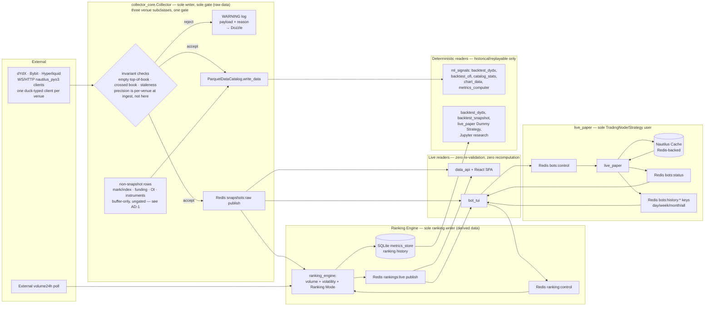

# Architecture Spine — Collector Core & ml_signals — Data-Integrity Spine

> `[amended 2026-09-21]` `troll/` was renamed `platform/` and the stores moved under `platform/data/` (companion DDD spine, AD-D13). Every `troll/...` citation below refers to the same file under `platform/`.

## Design Paradigm

**Gatekeeper: fail-closed single-writer ingestion — applied twice, one layer apart.**

`collector_core/collector.py`'s `Collector` — subclassed by `DydxCollector`, `BybitCollector` and `HyperliquidCollector`, and by nothing else `[amended 2026-09-20: Epic 22 — was "`dydx_collector/collector.py` is the only component"; three venue collectors now share the one gate class, so the single-writer claim is about the class, not the module]` — is the only component in `troll/` that writes *live* raw market data: to the `ParquetDataCatalog` and to the live Redis `snapshots:raw` channel. (Not the only component that writes the catalog *at all* — the offline rewriters AD-6 names as its accepted exception, `collector_core/{repair_catalog,consolidate_catalog,build_candles}.py` and `dydx_collector/normalize_snapshot_schema.py`, rewrite already-written partitions in place; the claim is about the ingest path `[amended 2026-09-20: Epic 22 story 22.8, review pass — the earlier absolute "writes *raw* market data anywhere" contradicted AD-1's own Binds and AD-6 in this same document]`.) It is also the only place the shared raw-data invariants (crossed book, staleness, empty top-of-book) are checked — precision is the exception, enforced per venue at ingest rather than at the gate (AD-2, AD-5) `[amended 2026-09-20: Epic 22 story 22.8, review pass]`. `ranking_engine` repeats the same pattern one layer up for *derived* data: it is the sole computer and sole publisher of Coin Ranking, over `rankings:live`. `live_paper` is the sole sanctioned `TradingNode`/`Strategy` runtime, exposed to the rest of `troll/` only through its own Redis control plane (`bots:status`/`bots:control`). Every other module — `data_api/` (the FastAPI service and React SPA that replaced `ml_signals/dashboard.py`) `[amended 2026-09-20: Epic 22 story 22.8 — `ml_signals/dashboard.py` was retired by Story 15.10; `data_api` is the reader that replaced it]`, `ml_signals/strategies/backtest_dydx.py`, `strategies/backtest_ofi.py`, `catalog_stats.py`, `metrics_computer.py`, `chart_data.py`, and `bot_tui` — is a trusting reader: it consumes what the relevant gate already approved and performs no defensive re-validation or recomputation of its own.

<!-- [amended 2026-09-20: Epic 22 story 22.8, review pass] the diagram was still the
     single-venue, dashboard-era system: one dYdX source, `precision` shown as a gate check,
     and `dashboard` as the live reader. AD-9/AD-10's own binds/rules below still name
     `ml_signals.dashboard` — that wider Epic 15 sweep stays deferred. -->



Namespace mapping: `collector_core/` = the gate for raw market data (ingest, validate, write), with `dydx_collector/`, `bybit_collector/` and `hyperliquid_collector/` as thin venue packages subclassing it and `common/` holding the venue registry `[amended 2026-09-20: Epic 22 — was "`dydx_collector/` = the gate"]`; `ranking_engine/` = a second, narrower gate one layer up — sole computer/publisher of derived Coin Ranking data; `live_paper/` = the sole sanctioned `TradingNode`/`Strategy` runtime, reachable only through its own Redis control plane; `ml_signals/`, `data_api/`, `bot_tui/` = readers (signals, backtests, web UI, TUI). No namespace imports another's internals — only shared data types and pure utilities cross a boundary.

## Invariants & Rules

### AD-1 — Single write gate, both sinks

- **Binds:** `collector_core.collector.Collector` and every subclass of it — `dydx_collector.collector.DydxCollector`, `bybit_collector.collector.BybitCollector`, `hyperliquid_collector.collector.HyperliquidCollector` — plus any writer script ever added inside `collector_core/` or a venue package (e.g. the existing `collector_core/repair_catalog.py`, a future backfill script) — not just the current modules `[amended 2026-09-20: Epic 22 — was `dydx_collector.collector` and any writer inside `dydx_collector`; stories 22.1–22.5 folded the three sibling collectors onto one shared core class]`
- **Prevents:** a second writer (or a new sink) bypassing invariant checks; the two existing sinks (Parquet, Redis) drifting to different validation logic; the two sinks disagreeing about which items were approved
- **Rule:** Both the `ParquetDataCatalog.write_data()` call and the `snapshots:raw` Redis publish for a given item happen from the same already-validated object, synchronously, before control returns to the ingestion loop — not fanned out to independent async consumers (a queue-plus-two-workers split can let one sink receive an item the other hasn't yet, or ever, persisted). `[ADOPTED]` — confirmed (re-verified 2026-09-20 against the merged core; citations re-grounded — the gate changed module in Epic 22, the earlier `collector.py:643/735/549` cites are dead): `Collector._sample_tick` (`troll/collector_core/collector.py:612`) validates each book and then appends the one approved `DydxSecondSnapshot` to both the catalog buffer (`:669`) and the returned batch (`:670`) inside the same per-instrument iteration; its only caller `_second_loop` (`:699`) publishes that same batch object via `_publish_snapshot_batch` (`:718`), and `_flush_once` (`:533`) writes the buffered objects through `self._catalog.write_data` (`:541`). Any new writer or new sink must route through this same gate before either sink sees it — never a parallel, independently-checked path. `[amended 2026-09-20: Epic 22 — the closing sentence was "it holds by there being exactly one writer today, not by structural enforcement"; that premise expired when a second and third venue collector arrived]` The invariant is now held structurally instead: all three venues write through the one core `Collector`, and a venue subclass extends only the per-venue hooks — `_instrument_ids`, `_clear_book_state` (`:337`), `_apply_deltas` (`:347`) and `_handle_crossed_book` (`:365`) are the only core methods any of the three override today — never the gate itself (`_sample_tick`, `_flush_once`, `_second_loop`), which no venue overrides. There is still no compiler/lint-level mechanism forcing that (see Deferred: shared validator extraction); the enforcement is the class hierarchy plus review, not tooling. (Every subclass also overrides `__init__` — that is how it supplies its client — so "overrides only these hooks" means only these *hooks*.) `[amended 2026-09-20: Epic 22 story 22.8]` **The residual paths are enumerated rather than glossed — there are four, and one of them is in the core itself:** (1) `Collector._process_data`'s final `else` branch (`troll/collector_core/collector.py:487`) appends every non-book, non-trade, non-quote item — mark price, index price, funding rate, and WS-delivered open interest — straight into `self._buffer`, for all three venues, always; (2) `run()` writes the instrument definitions with a direct `self._catalog.write_data(...)` at `:830`; (3) `dydx_collector/collector.py:305` buffers raw `OrderBookDeltas` for opted-in instruments; (4) `bybit_collector/collector.py:148` buffers its REST open-interest poll. None of the four passes `_sample_tick`. That is deliberate — all four are single-sink catalog rows, not the dual-sink snapshot AD-1's rule is about — but it means the *buffer* is a materially wider door than the *gate*, and the majority of catalog row types in fact arrive through it. Any new item type appended there inherits no invariant check, so it must either be genuinely check-free or gain its own. `[amended 2026-09-20: Epic 22 story 22.8, review pass — an earlier draft of this paragraph named only paths (3) and (4) and implied they were exhaustive.]` **One divergence between the two REST polls, stated because the core's own comment asserts the opposite:** `collector_core/collector.py:290-291` says REST-polled data "must therefore go straight to `_buffer`, never through `_on_data`/`_process_data`", so that it cannot count as WS feed liveness (`_last_feed_message_ns`, story 22.5). Bybit obeys it (`bybit_collector/collector.py:145-148`); dYdX does **not** — `dydx_collector/collector.py:361` calls `self._on_data(item)`, so every `open_interest_poll_seconds` tick stamps the dYdX feed alive whether or not the socket is. No bad data is written (both `_stale_reason` verdicts skip the sample), but the staleness *reason* can be misreported, which is a DATA-02 concern. Tracked in Deferred: "dYdX open-interest poll stamps WS feed liveness".

### AD-2 — Fail-closed, never fail-open

- **Binds:** `collector_core.collector.Collector`'s gate and therefore every venue collector subclassing it. The gate's own checks are, exhaustively: no book at all (`:623` → `_handle_missing_book`, `:689`), non-empty top-of-book (`:627`), crossed book (`:630`), staleness (`:633`) — plus any added later `[amended 2026-09-20: Epic 22 story 22.8, review pass — the missing-book path was omitted from an enumeration that called itself exhaustive]`. **Precision is not one of them and never has been:** there is no precision check anywhere in `collector_core/`; it is enforced at ingest, per venue, by `dydx_collector/client.py:50`'s `_at_fixed_precision`, which exists only because dYdX's mark/index feed labels precision inconsistently per tick (Bybit and Hyperliquid parse at the instrument's own constant precision, so neither has an equivalent — AD-5). A new venue must answer the precision question for itself in the step-1 investigation (`troll/CLAUDE.md`, "Adding a venue"), not assume the gate covers it. `[amended 2026-09-20: Epic 22 — was `dydx_collector.collector`; amended again in the same day's review pass, which found the binding had been widened to "every venue collector … precision" while no core precision check exists]`
- **Prevents:** wrongful/corrupt data reaching Parquet or the live stream; a validity-flag field spreading the "is this trustworthy?" decision downstream to every reader
- **Rule:** On any invariant violation, the offending item is dropped — not written, not published, not clamped, not averaged. A `logging.WARNING` line records the full offending payload and the specific reason (crossed price pair, staleness duration, precision mismatch, etc.). No schema carries a validity/flag field; the log stream (visible via the existing Dozzle container) is the sole audit trail for rejected data. `[ADOPTED]` — confirmed (re-verified 2026-09-20 against the merged core; citations re-grounded — the earlier `collector.py:660/662-671/288-302` cites are dead): in `Collector._sample_tick`, `troll/collector_core/collector.py:627` skips a snapshot when either `best_bid_price()` or `best_ask_price()` is `None` (empty top-of-book) — **silently: this one path has no log line, no ledger entry and no counter today, so the rule's "a `logging.WARNING` line records the full offending payload" is aspirational for it and a live DATA-07 gap** (the crossed and stale paths both comply). Tracked in Deferred: "Empty top-of-book skip is silent" `[amended 2026-09-20: Epic 22 story 22.8, review pass]`. The other three paths all log — the missing-book skip rate-limited to one line per minute per instrument (`:689-697`), the crossed path with a `collector.crossed_book` ledger entry as well, the stale path on every tick — but none of them carries the *full offending payload* the rule asks for (`:391-397` logs `iid`/`bid`/`ask`/duration; `:635` logs `iid` and the reason string), so the payload half of the rule is aspirational everywhere, not only on the silent path `[amended 2026-09-20: Epic 22 story 22.8, review pass — the earlier wording certified "the crossed and stale paths both comply"]`; `:630` delegates the crossed-book decision to `_handle_crossed_book` (`:365`) and skips the tick when it returns `True`; `:633-637` skips and logs on the verdict of `_stale_reason` (`:673`), which tells feed-wide silence apart from one silent instrument. The threshold constants moved with the gate: `_STALE_BOOK_NS`/`_STALE_TRADE_NS`/`_CROSSED_RESYNC_NS` no longer exist and are now the config fields `CoreConfig.stale_book_seconds` (`troll/collector_core/config.py:36`), `crossed_resync_seconds` (`:37`) and `stale_trade_seconds` (`:38`). `[amended 2026-09-20: Epic 22 — per-venue crossed-book semantics added; they were previously described as one dYdX behaviour]` **Crossed-book handling is per-venue, by evidence, not one policy:** dYdX overrides `_handle_crossed_book` (`troll/dydx_collector/collector.py:331`) to run its own active per-level uncross first (`dydx_collector/uncross.py`, AD-4 of DATA-04's research) with the escalation ladder after; Bybit takes the core default — skip the sample, ledger it once per episode (`collector.crossed_book`), and force a resync only past `crossed_resync_seconds` — plus its own `u` sequence gap/regress canary in `_apply_deltas` (`troll/bybit_collector/collector.py:116`); Hyperliquid takes the core default with no resync at all, because `HyperliquidClient` deliberately exposes no `resync_orderbook` (every `l2Book` message is a full snapshot, so the next message replaces the book). See research §A and §B1 (`_bmad-output/planning-artifacts/research/technical-multi-exchange-collector-core-and-orderbook-research-2026-09-20.md`). A book with fewer than `BOOK_DEPTH` (20) levels per side but a valid top-of-book is not a gate violation — see Consistency Conventions.

### AD-3 — Readers trust the gate completely

- **Binds:** all of `ml_signals` **and `data_api`** `[amended 2026-09-20: Epic 22 story 22.8]` (Story 15.10 retired `ml_signals/dashboard.py` and made `data_api` the reader that replaced it, so a rule binding only `ml_signals` no longer covers the project's main reader; AD-4 was extended the same way in this pass) — every current and future reader module (e.g. `data_api`'s routes, `strategies/backtest_dydx`, `strategies/backtest_ofi`, `strategies/backtest_snapshot`, `catalog_stats`, `metrics_computer`, `chart_data`, `watchlist`, `strategies/ofi_strategy`, and any module added later), not an enumerated subset — a module being unlisted is not license to re-validate `[amended 2026-07-24: was a 6-item enumerated list stale against `ml_signals`'s actual ~15 modules, confirmed by code check — closed to an open binding to prevent that gap recurring]`
- **Prevents:** duplicated, independently-drifting validation logic in readers (already occurred once — see Deferred)
- **Rule:** No reader may re-implement a data-quality check (crossed-book detection, staleness thresholds, precision guards) against catalog or stream data. If a reader appears to need one, that is a signal the check belongs in the collector's gate, not a reason to add reader-side validation. **Known deviation, stated rather than asserted away** `[amended 2026-09-20: Epic 22 story 22.8, review pass]`: `data_api/routes/snapshots.py:129-133` carries both an empty-top-of-book skip and a crossed-book skip (`if bp >= ap: continue`), inherited verbatim from `ml_signals/dashboard.py`'s `_price_series_rows` when Story 15.10 relocated it (that function's own module docstring says so). It is exactly the reader-side re-validation this AD bans, and it is live in the project's main reader — tracked in Deferred ("Reader-side crossed-book skip survived the `dashboard` → `data_api` move") rather than marked resolved. Same treatment as AD-4's deviation list, and for the same reason: an `[ADOPTED]` marker over a false clause is the failure this document exists to prevent.

### AD-4 — Module boundary: shared types and pure utilities only

- **Binds:** `collector_core`, `dydx_collector`, `bybit_collector`, `hyperliquid_collector`, `common`, `ml_signals`, `data_api`, `live_paper`, `ranking_engine`, `bot_tui` `[amended 2026-09-20: Epic 22 — added the core, the two new venue packages and `common`; `data_api` named because Story 15.10 made it the reader that replaced `dashboard`]`
- **Prevents:** a reader depending on collector internals (buffer shape, flush timing, subscription state) and breaking silently when the collector's implementation changes; readers reimplementing collector logic instead of importing it (the exact drift AD-7 exists to prevent for liquidity tiering)
- **Rule:** Cross-namespace imports are limited to (a) shared data types — `collector_core.second_snapshot.DydxSecondSnapshot` and `collector_core.open_interest.OpenInterest`, and similar `[amended 2026-09-20: Epic 22 — was "(`DydxMinuteBar`, `DydxSecondSnapshot`, and similar)"; `DydxMinuteBar` and its `dydx_collector/minute_bars.py` module no longer exist (minute rollups retired 2026-09-20, `docs/DATA_INTEGRITY_AUDIT.md` D-35), and both surviving shared types moved into `collector_core/` in story 22.3]` — and (b) pure, side-effect-free utility functions/classes with no I/O and no shared mutable state (e.g. `classify_liquidity`, `common.venues`'s `venue_kind`/`market_kind`, `collector_core.integrity.ohlc_outside_book`, and `ml_signals.indicators`'s Indicator classes — OFI/OBI/microprice). Stateful/ingestion logic — the buffer, the gate, subscription/connection state, `Portfolio`/`Trader`/`Strategy` state — may never be imported across namespaces; `dydx_collector` never imports from `ml_signals`. `bot_tui` imports `ml_signals.indicators` directly for its per-coin live-indicator view rather than reimplementing OFI/OBI/microprice, consistent with dashboard's existing usage. `[ADOPTED, with one known deviation — see below]` `[amended 2026-09-20: Epic 22 — the old evidence ("`ml_signals/backtest_snapshot.py` and `snapshot_strategy.py` import only `DydxSecondSnapshot` from `dydx_collector.second_snapshot`; no reverse imports exist") was stale on both halves: the module moved in 22.3, and the "no reverse imports" claim was already false when it was written]` Re-verified 2026-09-20 (`grep -rn "from collector_core" troll/ml_signals troll/data_api troll/ranking_engine`; `live_paper` and `bot_tui` were checked separately and import nothing from `collector_core`, so the conclusion covers the full binding even though the command does not `[amended 2026-09-20: Epic 22 story 22.8, review pass]`): the forward direction holds — `ml_signals/catalog_stats.py:28`, `ml_signals/chart_data.py:29`, `ml_signals/strategies/{backtest_snapshot.py:44,snapshot_strategy.py:35,snapshot_backtest.py:27,ofi_strategy.py:40}` and `data_api/{app.py:50,live_candles.py:43,routes/snapshots.py:44}` import only the shared type `DydxSecondSnapshot` from `collector_core.second_snapshot`, and `ranking_engine/engine.py:43-44` imports only the pure `common.venues` helpers. A second, separate pure-helper import runs the same way and belongs in the same inventory: `ml_signals.venue`'s `venue_of`/`MalformedInstrumentId` are imported by `ranking_engine/engine.py:53`, `live_paper/{node.py:57,config.py:62}` and `data_api/{app.py:54,routes/snapshots.py:50,routes/rankings.py:39,routes/indicators.py:55,routes/indicator_series.py:55,routes/candles.py:45}` — reader→reader, pure, and allowed, but it is `ml_signals.venue`, not `common.venues`, and the Module-dependencies convention row lists it accordingly `[amended 2026-09-20: Epic 22 story 22.8, review pass]`. **The reverse direction does not hold and the rule's "`dydx_collector` never imports from `ml_signals`" clause is currently violated:** `collector_core/collector.py:71-73` imports `ml_signals.candle_store`, `ml_signals.error_ledger` and `ml_signals.catalog_stats.query_second_ohlc`, and `collector_core/{build_candles,repair_catalog,consolidate_catalog}.py`, `dydx_collector/collector.py:79-80` (`ml_signals.candle_store`, `ml_signals.error_ledger` — the module the rule names by hand), `dydx_collector/open_interest.py:34` and `bybit_collector/collector.py:33` import `ml_signals` utilities too `[amended 2026-09-20: Epic 22 story 22.8, review pass — `dydx_collector/collector.py:79-80` was missing from an enumeration explicitly framed as complete]`. This is **not** an Epic 22 regression — the pre-22.1 dYdX collector already imported `ml_signals.error_ledger` (commit `d3ae27afaf`, Epic 21), so the `[ADOPTED]` marker has been carrying a false claim since then. The rule is left as written (changing what it requires is an architecture decision, not a docs update) and the deviation is tracked in Deferred: "Writer→reader imports contradict AD-4". `live_paper` was a pre-existing gap in this rule (built after the spine's original 2026-07-01 run, never folded in) — closed 2026-07-24 while touching this AD for the new modules anyway.

### AD-5 — Precision is re-stamped exactly, never inferred or float-tripped

- **Binds:** any code in `troll/` constructing or re-stamping a `Price`/`Quantity` — not only `dydx_collector`; the underlying `nautilus_trader` bug doesn't care which namespace calls the buggy constructor, and `ml_signals` (e.g. cross-instrument precision alignment in signal work) is equally exposed
- **Prevents:** silent value corruption from `Price(decimal, precision)`'s float64 round-trip bug, and precision-label mismatches from inferring precision off an incoming value's trailing-zero count (dYdX's mark/index feed strips zeros inconsistently per tick, which `ParquetDataCatalog` correctly refuses to merge)
- **Rule:** Never call `Price(decimal, precision)` / `Quantity(decimal, precision)` to change precision. Always `Decimal.scaleb(new_precision)` + `Price.from_raw()` / `Quantity.from_raw()`. Never derive precision from `Decimal.normalize()` on an incoming value. Never round-trip a market value through `float` before it is inside a `Price`/`Quantity`. `[ADOPTED]` — reference: `dydx_collector/client.py:_at_fixed_precision()`.

### AD-6 — Catalog access only through the official API

- **Binds:** all writers and readers
- **Prevents:** a hand-rolled Parquet schema/partitioning drifting from what `ParquetDataCatalog` expects, and unbounded in-memory catalog loads
- **Rule:** All writes go through `ParquetDataCatalog.write_data()`; no hand-rolled schema. All backtests use `BacktestNode` + `BacktestDataConfig` (time-bounded streaming); never a custom simulation loop or an unbounded `catalog.trade_ticks()` call. Strategies are referenced via `ImportableStrategyConfig` by string path. `[ADOPTED]` — confirmed (re-verified 2026-09-20; citations re-grounded — the earlier `collector.py:549,792` and `ml_signals/backtest_dydx.py` paths are dead) `[amended 2026-09-20: Epic 22 — citation-only correction, the rule is unchanged]`: the gate's two write sites are `troll/collector_core/collector.py:541` (`_flush_once`, the buffered data, off the event loop via `asyncio.to_thread`) and `:830` (`run()`, the instrument definitions at startup); the only other production `write_data()` calls in `troll/` are the repair tool `collector_core/repair_catalog.py:77` and `ml_signals/strategies/snapshot_backtest.py:69-70`, which writes derived quotes into a throwaway temporary catalog, never the archive (test fixtures also call it, expected). `ml_signals/strategies/backtest_dydx.py:67-72,99` uses `BacktestNode`/`BacktestDataConfig`/`ImportableStrategyConfig`. `[amended 2026-09-20: Epic 22 story 22.8]` **What a `write_data()` grep cannot see, stated rather than left implicit:** three maintenance tools rewrite catalog files in place with `pq.write_table` — `collector_core/consolidate_catalog.py:121`, `collector_core/migrate_open_interest.py:98` and `dydx_collector/normalize_snapshot_schema.py:77`. None of them authors a schema: each reads an existing catalog file, preserves or rewrites its Arrow metadata, and writes temp-then-rename. They are the accepted exception to "all writes go through `write_data()`" — the rule's target is a hand-rolled schema competing with the catalog's own, not an in-place rewrite of a file the catalog already wrote. A new tool doing this must follow the same shape or use the API.

### AD-7 — Liquidity classification is USD-denominated

- **Binds:** `dydx_collector.open_interest.classify_liquidity`
- **Prevents:** repeating the production incident where raw `openInterest` (base-token units) was compared against a USD threshold, misclassifying BTC as illiquid
- **Rule:** Liquidity tiering uses `volume24H` (already USD) or `openInterest × oraclePrice` — never raw `openInterest` alone. `[ADOPTED]` — reference: `troll/dydx_collector/open_interest.py:40` (`classify_liquidity`) `[amended 2026-09-20: Epic 22 — citation-only correction, was `:109`; the function is still dYdX-only, the Bybit and Hyperliquid collectors do no liquidity tiering]`.

### AD-8 — No live-runtime engine in the data-collection path; `TradingNode` is for trading, not collecting

- **Binds:** `collector_core`, `dydx_collector`, `bybit_collector`, `hyperliquid_collector`, `ml_signals` (data collection, storage, and read paths only), `data_api`, `ranking_engine`, `bot_tui` `[amended 2026-09-20: Epic 22 — added the core and the two new venue packages]`
- **Prevents:** repeating the OOM/shutdown-wedge failure of the earlier `Strategy`/`TradingNode`-based *recorder* (`gg` branch) — where `TradingNode`/`DataEngine` was misused as a data-capture mechanism
- **Rule:** `collector_core` and every venue collector, and `ml_signals`'s reader modules (`catalog_stats`, `chart_data`, `metrics_computer`, `strategies/backtest_dydx`, `strategies/backtest_ofi`), plus `data_api`, `ranking_engine` and `bot_tui`, use `nautilus_trader` as a library only — never instantiate `TradingNode`, `Strategy`, or `DataEngine`. The core collector owns its own asyncio loop, in-memory buffer, and flush timer, driving **one duck-typed venue client per venue** `[amended 2026-09-20: Epic 22 — was "driving `nautilus_pyo3.DydxHttpClient`/`DydxWebSocketClient` directly", true of dYdX only; `dydx_collector.client.DydxClient`, `bybit_collector.client.BybitClient` and `hyperliquid_collector.client.HyperliquidClient` each wrap that venue's own pyo3 HTTP/WS clients behind the contract in the core module docstring]` — the contract is a docstring, not a base class (`troll/collector_core/collector.py:15-48`: five required methods plus the optional `subscribe_global`/`fetch_book_levels`/`resync_orderbook`). `bot_tui`'s only path to the trading runtime is `live_paper`'s Redis control/status channels (see AD-10) — never a direct import of `live_paper` internals. `[ADOPTED]` — reference: `troll/collector_core/collector.py:15-48` (module docstring) and `run()`'s own loop tuple at `:848-861` (`_ingest_loop`, `_flush_loop`, `_candle_prune_loop`, `_second_loop`, `_watchdog_loop`, the optional `_crosscheck_loop`, plus each venue's `extra_loops`) — the collector's own loops, no `TradingNode` `[amended 2026-09-20: Epic 22 — citation-only correction, the earlier `collector.py:17-18`/`collector.py:369` cites are dead]`.
- **Explicitly not banned:** `TradingNode`/`Strategy` used for their intended purpose — running an actual (paper or live) trading strategy — is in scope for `live_paper`, the one sanctioned module for this outside the data path (see AD-10). The prior incident was `TradingNode` misused as a recorder, not `TradingNode` used to trade; this distinction is load-bearing and must not collapse back into a blanket ban.

### AD-9 — Ranking Engine: sole computer/publisher of derived Coin Ranking

- **Binds:** `ranking_engine` (writer); `ml_signals.dashboard`, `bot_tui` (live readers); `ml_signals.backtest_dydx`, `ml_signals.backtest_snapshot`, `live_paper`'s Dummy Strategy, Jupyter research (historical/deterministic readers)
- **Prevents:** Coin Ranking (volume + volatility) and Ranking Mode being computed independently in more than one surface (dashboard's inline `_volume_loop_task`/`_rankings_json`/`_watchlist_ids`/`_current_ranks` was the de facto engine with zero shared abstraction); a wire-format free-for-all on `rankings:live` where each implementer guesses field names/shape independently; a deterministic backtest/Jupyter run trying to depend on a live-only pub/sub channel it can't replay
- **Rule:** `troll/ranking_engine/` is the sole computer and sole publisher of Coin Ranking. Two distinct consumption paths, because live UI and deterministic research have different needs:
  - **Live path** — `ranking_engine` polls `volume24h`, computes volatility (stddev, configurable lookback, default 1h) from `snapshots:raw`, holds the single active Ranking Mode (volume vs. volatility) as shared state, and publishes on Redis channel `rankings:live`: a JSON message with `mode` (`"volume"` | `"volatility"`), `updated_at` (ns timestamp), and `ranks` — an ordered list of `{instrument_id, rank, volume24h, volatility_score}` objects (both score fields present regardless of active mode, so readers never need mode-specific parsing branches). `dashboard` and `bot_tui` are pure readers of `rankings:live`, never recomputing ranks/volatility/mode.
  - **Mode switching** is a publish to Redis channel `ranking:control` (from `dashboard` or `bot_tui` → `ranking_engine`); `ranking_engine` is the sole writer of the mode value and applies a switch atomically. Ranking Mode is GLOBAL shared state — switching from either surface changes what every `rankings:live` reader sees. Last-write-wins on a near-simultaneous double-switch is acceptable (a UI convenience toggle, not a financial value — not worth solving further here).
  - **Historical path** — `ml_signals.backtest_dydx`/`backtest_snapshot`, `live_paper`'s Dummy Strategy, and Jupyter research consume ranking history from `ranking_engine`'s relocated SQLite `metrics_store` (queryable by timestamp), never from `rankings:live` — a deterministic run cannot depend on a live-only pub/sub stream. This is how FR-13's "backtest accepts the Watchlist's current output" and FR-8's historical-ranking view are satisfied post-extraction.
  - **Staleness:** `ranking_engine` publishes on `rankings:live` on both rank-change and a fixed heartbeat interval — same discipline as AD-10's `bots:status`. `dashboard` and `bot_tui` treat absence of a heartbeat within a configurable timeout as `unknown/stale`, never as "last known ranking is still current" — a `ranking_engine` crash or restart must show up as visibly stale, not silently frozen.
  - This extends the Gatekeeper paradigm one layer up, from raw market data (AD-1/AD-2) to derived/computed ranking data. Relocates `dashboard.py:900-976` (inline ranking logic) plus the existing SQLite `metrics_store` history persistence into `ranking_engine`.

### AD-10 — `live_paper` control-plane isolation (status, control, and durable trade/PnL history)

- **Binds:** `live_paper` (writer/owner of `bots:status`, the `bots:history:*` keys, and its own Nautilus `Cache`; sole subscriber of `bots:control`); `bot_tui`, `ml_signals.dashboard` (readers/clients)
- **Prevents:** `bot_tui`/dashboard importing `live_paper`'s `Portfolio`/`Trader`/`Strategy` state directly, coupling a UI process to live-trading runtime internals; a second IPC mechanism growing up alongside the Redis bus already used for raw data and ranking; a `bots:control` message being able to select paper-vs-live mode and bypass FR-15's config gate; ambiguous addressing once more than one bot is running; `bot_tui` silently showing a frozen last-known status after `live_paper` crashes or restarts; `bot_tui`/dashboard reaching into Nautilus's internal Cache Redis encoding directly and coupling to an implementation detail that isn't a stable contract; a bespoke new trade-history store being built when Nautilus's own `Cache` already provides the query surface
- **Rule:**
  - `live_paper` (the sole sanctioned `TradingNode`/`Strategy` user, per AD-8) exposes bot PnL/status via Redis publish on `bots:status` and consumes start/stop commands via Redis subscribe on `bots:control` as its ONLY external interface for live state/control. `bot_tui`/dashboard are Redis clients of `live_paper` and never import `live_paper` internals directly — the same boundary discipline as AD-4, applied to this module pair.
  - **Addressing:** both channels are shared across all running bots (not one channel per bot); every message on either carries a `bot_id` field, matching FR-18's "list of running bots."
  - **`bots:control` messages carry ONLY `{bot_id, action: "start" | "stop"}`** — never a mode or paper/live parameter. Whether a "start" runs paper or real-money is determined solely by `live_paper`'s own local config gate (FR-15's existing separate-config-file mechanism), entirely independent of and unreachable from the control channel. This is the load-bearing rule that keeps `bot_tui`'s control surface from ever becoming a path to bypass FR-15/FR-23's isolation.
  - **Staleness (status):** `live_paper` publishes on `bots:status` on both state-change and a fixed heartbeat interval — a live bot keeps publishing even with unchanged PnL. `bot_tui` treats absence of a heartbeat within a configurable timeout as `unknown/stale`, never as "last known value is still current" — a `live_paper` crash or restart must show up as visibly stale in `bot_tui`, mirroring the project's existing never-show-stale-as-live discipline for market data (`CoreConfig.stale_book_seconds` `[amended 2026-09-20: Epic 22 — was the module constant `_STALE_BOOK_NS`, which no longer exists; it is now a config field, `troll/collector_core/config.py:36`]`).
  - **Durable trade/PnL history (FR27):** `live_paper`'s `TradingNodeConfig` enables `CacheConfig(database=DatabaseConfig(type="redis", ...))` against the existing Redis instance — Nautilus's own `Cache` becomes the durable store for orders/positions/fills, not a bespoke new one; `cache.orders_closed()`/`cache.positions_closed()` (returning closed `Position` objects, whose `.events`/`.realized_pnl` already carry full fill history — sufficient on their own, so `cache.position_snapshots()` is deliberately **not** used: it returns empty unless `ExecEngineConfig(snapshot_positions=True)` is also set and even then only fires on NETTING-mode reopen/flip, not the Dummy Strategy's simple open-close shape `[ADOPTED — verified against nautilus_trader 1.229.0 source: cache/cache.pyx, execution/config.py, execution/engine.pyx]`) are the query surface `live_paper` reads to build it.
  - `live_paper` computes and refreshes four well-known Redis keys per bot — `bots:history:{bot_id}:day`, `:week`, `:month`, `:all` — each a JSON blob `{bot_id, range, updated_at, trades: [...], pnl_series: [...]}`, refreshed on a timer (~30–60s) and on each fill. Wire contract, pinned to the same rigor as AD-9's `rankings:live`:
    - **Timestamps**: `trades[].ts` and `pnl_series[].period_start` are UNIX nanoseconds, matching `rankings:live`'s `updated_at` convention and the project's existing ns-timestamp discipline throughout — never ms or ISO8601.
    - **PnL semantics**: `trades[].realized_pnl` is that single fill's own realized PnL (not cumulative). `pnl_series[].pnl` is the net realized PnL for that bucket alone (not a running cumulative total) — summing every `pnl_series` entry in a range must equal that range's total realized PnL. Any reader that instead treats either field as cumulative renders a structurally wrong chart.
    - **Bucket windows**: rolling from "now" (UTC, ns-precision) — `day` = trailing 24h, `week` = trailing 7d, `month` = trailing 30d, `all` = full Cache-retained history — never calendar-aligned, avoiding timezone ambiguity entirely (consistent with this project's existing rolling-window convention, e.g. OFI's rolling stats).
    - **Bounded size**: `trades` is capped at the most recent 500 fills regardless of range (never unbounded, never re-serializing a bot's entire lifetime history into one Redis value); `all`'s `pnl_series` is daily-bucketed (one entry per day, not per fill) so it stays bounded regardless of a bot's total runtime. A bot needing deeper history than these caps provide is a web-dashboard concern (which can query the Cache/its own store more richly), not this read surface's job.
    - **Cross-key atomicity**: the four sibling keys for one `bot_id` are refreshed independently, not as one atomic transaction — a reader could observe `day` slightly fresher than `month` at the same instant. Accepted: each individual key is always internally consistent (a reader never sees a half-written blob), and a few seconds of cross-key skew during the refresh window is immaterial for a monitoring tool, not a financial value.
  - **`bot_id` uniqueness across paper/live is a hard requirement, not assumed.** FR-15/FR-23 already require a paper→live mode change to go through a distinct, separate config file — that new config **must** assign a distinct `bot_id` from its paper counterpart. A copied config file that keeps the same `bot_id` would silently merge that bot's `bots:status`/`bots:control`/`bots:history:*` between real-money and paper trading, reopening the exact isolation gap FR-15 exists to close, just via addressing instead of payload. No automated uniqueness check exists (same documentation-and-discipline posture as the Paired dependency versions convention) — this is an operator responsibility to get right when cloning a config.
  - `bot_tui`/dashboard are pure `GET` clients of the `bots:history:*` keys — never request/response, never a direct read of Nautilus's internal Cache encoding (that would cross this same AD's internals boundary, since the Cache's on-wire format is Nautilus-internal, not a stable external contract).
  - **Staleness (history):** each `bots:history:*` blob's `updated_at` follows the identical staleness discipline as `bots:status` and `rankings:live` — a reader treats a stale `updated_at` beyond a configurable timeout as `unknown/stale`, never as still-current.
  - **Chosen over** a request/response pub/sub pattern for history queries (rejected: correlation IDs and reply routing add protocol complexity — timeouts, in-flight request state — this single-user personal tool doesn't need; the four fixed time-range buckets already cover every range the UX design's day/week/month/all preset toggle ever requests, so no arbitrary-range query capability is needed).

### AD-11 — `live_paper`: one node, many bots (shared connection, shared balance pool, per-bot isolation via Cache filtering)

- **Binds:** `live_paper/node.py` (builds one `TradingNode` hosting every paper bot), `live_paper/strategy.py` (one `DummyStrategy` instance per bot, explicit identity), `live_paper/bot_status.py` (per-bot live status, must read Cache scoped by `strategy_id`), `live_paper/trade_history.py` (already scoped this way), `live_paper/config.py` (multi-bot paper config shape), `docker-compose.yml`'s `live-paper` service (collapses to one container)
- **Prevents:** N containers each opening an independent live dYdX WebSocket connection and an independent full instrument-provider REST load merely to run N paper bots (~450MB RAM and one redundant dYdX connection per bot — doesn't fit a 4GB VPS past 1–2 bots); a future implementer assuming multiple `SandboxExecutionClientConfig` accounts can coexist in one node (Nautilus's `ExecutionEngine` hard-errors registering two exec clients for the same venue); `bot_status.py` silently blending two bots' `net_exposure`/`realized_pnl`/`unrealized_pnl` together the moment they share an instrument; a bot's identity (and therefore its Cache/Redis history) silently shifting to another bot's data because of config-file reordering; real-money config inheriting the shared-pool multi-bot shape and diluting FR-15's single-subaccount isolation discipline
- **Rule:**
  - **One `TradingNode` per `live_paper` process, one data client and one Sandbox exec client **per venue in use** (one live WS connection + instrument-provider load per venue, one shared simulated balance pool per venue) — no matter how many bots are configured.** `[amended 2026-09-20: Epic 22 story 22.6 — was one `DydxDataClientConfig` / one `SandboxExecutionClientConfig` for the whole node; venues are dYdX/Bybit/Hyperliquid, table in `live_paper/venues.py`]` This is the load-bearing trade-off this AD exists to pin: full tick-level fill fidelity (real `QuoteTick`/`OrderBookDeltas`/internally-aggregated `Bar`s feeding the Sandbox matching engine, exactly as today) was chosen over reusing the collectors' already-open connections, because the shared `snapshots:raw` feed — now published by all three venue collectors through the one core `Collector`, not by `dydx_collector` alone `[amended 2026-09-20: Epic 22 — framing corrected: the feed and its schema are no longer dYdX-only]` — is 1-second-sampled top-of-book (`collector_core.second_snapshot.DydxSecondSnapshot`, a venue-neutral schema despite its name) — coarser than what `DummyStrategy` consumes today — and this project's paper bots need tick fidelity, not RAM savings, per explicit user choice.
  - **`[VERIFIED]` Per-bot simulated-balance isolation is structurally unavailable once bots share a node.** `nautilus_trader`'s `ExecutionEngine.register_client` raises if two exec clients claim the same venue (`nautilus_trader/execution/engine.pyx:455-462`) — one node can only ever run one `DYDX` exec client. Every bot in one `live_paper` process therefore draws from **one shared `starting_balances` pool**, not an isolated balance per bot. Accepted for paper-test bots at small `trade_size`s; never extended to real money (see below).
  - **Per-bot PnL/exposure is still exact — computed by filtering the Cache, never by re-deriving or approximating.** `bot_status.py` MUST NOT call `strategy.portfolio.net_exposure()/realized_pnl()/unrealized_pnl()/is_net_long()/is_net_short()` with only an `instrument_id` — `[VERIFIED]` these are account+instrument scoped in the Rust core (`crates/portfolio/src/portfolio.rs:1088`'s `net_exposure` calls `cache.positions_open(venue=None, instrument_id, strategy_id=None, account_id, side=None)` — `crates/common/src/cache/mod.rs:4694`), i.e. they aggregate across every strategy in the node trading that instrument, and would silently blend two bots' numbers the moment they share an `instrument_id`. Instead, `bot_status.py` computes each figure itself from `cache.positions_open(strategy_id=strategy.id)` / `cache.positions_closed(strategy_id=strategy.id)` filtered to the bot's own `instrument_id`, summing notional/realized/unrealized across just those positions — the identical `strategy_id`-filtering primitive `trade_history.py` already uses for AD-10's history feature, applied to the live-status path too. This fix is unconditional (applied regardless of whether any two configured bots actually share an instrument), since a config-time coincidence is not a safe thing to depend on for correctness.
  - **Each bot's `StrategyId` is pinned explicitly, never left to auto-assignment.** `DummyStrategyConfig(order_id_tag=bot_id, ...)` — never `Trader.add_strategy()`'s default auto-increment (`nautilus_trader/trading/trader.py:407-411`, which assigns `order_id_tag` by insertion-order position among currently-attached strategies). An auto-assigned tag makes a bot's identity — and therefore its Cache/Redis/`fills.db` history — depend on config list order; reordering or removing a bot between deploys would silently reassign another bot's history to a shifted `StrategyId`. Pinning `order_id_tag = bot_id` keeps identity stable across restarts and config edits, consistent with AD-10's existing `bot_id`-uniqueness discipline.
  - **Multi-bot config shape is paper-only.** `config.toml` (paper) gains a `[[bots]]` array of tables — `network`/`starting_balances`/`account_type`/`log_level` stay shared top-level fields (the one pool above); each `[[bots]]` entry carries `bot_id`/`instrument_id`/`trade_size`/`trend_buy_threshold`/`trend_sell_threshold`/`ofi_confirm_threshold`. `RealMoneyConfig`'s file format is **explicitly not** changed to this shape — real-money execution stays one-bot-per-file/subaccount (FR-15/FR-23's existing structural isolation), never sharing a pool with other bots the way paper mode now does. `load_paper_config`'s existing hard-error-on-a-`mode`-key check is unaffected by this reshape.
  - `node.py`'s `TraderId` represents the whole paper-fleet node, not a single bot (e.g. a fixed `LIVE-PAPER-001`) — it is bot-agnostic under this AD, since one node now hosts many bots by design; per-bot addressing lives entirely in `bot_id`/`StrategyId`, never in `TraderId`.
  - **Deployment collapses to one `live-paper` container** running every configured paper bot — not one container per bot. `bot_status.run()`/`trade_history.run()` are called once per configured bot (both already take `(strategy, bot_id, ...)`, so this is a call-site change, not a signature change), all scheduled on the same node's event loop per AD-10's existing "outside the Strategy's own component lifecycle" reasoning.
  - **Chosen over** (a) feeding strategies from the collectors' `snapshots:raw` feed instead of `TradingNode`'s own per-venue data client config — rejected for the fidelity loss above `[amended 2026-09-20: Epic 22 story 22.6 — was "`dydx_collector`'s `snapshots:raw` feed" and "`DydxDataClientConfig`"; the node now builds one data client per venue in use from the `VENUES` table in `live_paper/venues.py:90` (`DydxDataClientConfig`/`BybitDataClientConfig`/`HyperliquidDataClientConfig`)]`; (b) keeping bots on fully separate nodes/containers to preserve true balance isolation — rejected because it caps concurrent bots at roughly 1–2 on a 4GB VPS (~450MB + one dYdX connection per bot), which doesn't meet the goal of running several test bots at once.

## Consistency Conventions

| Concern | Convention |
| --- | --- |
| Rejected-data logging | `logging.WARNING`, one line per rejected item, includes the offending payload and the specific reason — no separate quarantine store or flag field. One known gap: the empty-top-of-book skip (`collector_core/collector.py:627`) logs nothing at all — see AD-2 and Deferred `[amended 2026-09-20: Epic 22 story 22.8, review pass]` |
| Data & formats | Prices/quantities as Nautilus `Price`/`Quantity` (never raw `float`/`Decimal` once inside the pipeline); precision changes only via `Decimal.scaleb()` + `*.from_raw()` |
| `DydxSecondSnapshot` level lists | `bid_prices`/`bid_sizes`/`ask_prices`/`ask_sizes` may have fewer than `BOOK_DEPTH` (20) entries per side on a thin book — this is a legitimate shape, not a gate violation (AD-2 only rejects zero-level top-of-book). Readers must index defensively for length, never assume exactly 20 |
| Module dependencies | `ml_signals`, `data_api`, `live_paper`, `ranking_engine`, `bot_tui` → `collector_core` (data types only — `DydxSecondSnapshot`, `OpenInterest`); any module → `common.venues` (pure helpers); each venue package → `collector_core` (the `Collector` base class and the shared types); `bot_tui` → `ml_signals.indicators` (pure Indicator classes only, e.g. OFI/OBI/microprice); `ranking_engine`, `live_paper`, `data_api` → `ml_signals.venue` (`venue_of`/`MalformedInstrumentId`, pure — a separate helper from `common.venues`) `[amended 2026-09-20: Epic 22 story 22.8, review pass — this was the one cross-namespace import class the row did not list]`; never the reverse; never internals either direction `[amended 2026-09-20: Epic 22 — was "→ `dydx_collector` (data types only)"; the shared types moved to `collector_core/` in story 22.3. One known deviation from "never the reverse" is recorded in AD-4 and Deferred]` |
| Redis channel conventions | `snapshots:raw` (collector → data_api/ranking_engine/bot_tui, raw per-second market data), `rankings:live` (ranking_engine → data_api/bot_tui, JSON `{mode, updated_at, ranks: [{instrument_id, rank, volume24h, volatility_score}]}`, published on change + heartbeat — see AD-9), `ranking:control` (bot_tui → ranking_engine, mode-switch requests — see AD-9; sole producer is `bot_tui/ranking_state.py:128` now that Story 15.10 retired `dashboard` `[amended 2026-09-20: Epic 22 story 22.8, review pass — the row named two producers for a channel that has one, while asserting the one-producer rule]`), `bots:status` (live_paper → bot_tui, JSON `{bot_id, ...PnL/status fields}`, published on change + heartbeat — see AD-10), `bots:control` (bot_tui → live_paper, JSON `{bot_id, action: "start"\|"stop"}` only — see AD-10), `bots:history:{bot_id}:{day\|week\|month\|all}` (live_paper → bot_tui `[amended 2026-09-20: Epic 22 story 22.8, review pass — was "bot_tui/dashboard"; `dashboard` was retired by Story 15.10]`, Redis **keys** not pub/sub channels — GET-only, JSON `{bot_id, range, updated_at, trades: [...], pnl_series: [...]}`, refreshed on a timer + on-fill — see AD-10) — **one producer per (channel, venue) for `snapshots:raw`** (all three venue collectors publish to it, each batch holding only its own venue's instruments, so the payload entries stay disjoint by `instrument_id`), **one producer per channel/key otherwise**; `bots:incidents:<bot_id>` (live_paper → bot_tui, Redis **key**, GET-only, JSON list of the bot's last 50 incidents — `live_paper/bot_status.py:33,78`, read by `bot_tui/bot_incidents_state.py:92` `[amended 2026-09-21: DDD spine review pass — a live key this row never listed]`); `collector:status`/`collector:control` are dYdX-only (`troll/dydx_collector/collector.py:110-111` — no other collector defines or subscribes to them) `[amended 2026-09-20: Epic 22 — was a flat "one producer per channel/key", which three collectors on `snapshots:raw` made false]`; a channel's other named party only ever subscribes or GETs; every published-plus-heartbeat channel/key treats a missed heartbeat/stale `updated_at` as stale, never as a frozen last-known value |
| Fork boundary | `nautilus_trader/` and `crates/` untouched; all `troll/` code additive |
| Memory | No unbounded catalog reads (`catalog.trade_ticks()` with no time bounds is banned); non-configured coins are rolling-window-in-memory only, no unbounded accumulation |
| Paired dependency versions | Any dependency pinned in two places that must speak the same protocol (currently: `redis` client in `troll-requirements.txt` vs. `redis` broker image tag in `docker-compose.yml`) carries a comment in both files cross-referencing the other. Bumping one without checking the other's compatibility is the failure mode that produced the `redis:7-alpine`/`redis-py>=8.0.1` RESP3 mismatch (caught by architecture review, fixed 2026-07-01 — broker bumped to `redis:8-alpine`). No automated check — this is a documentation/discipline convention, not enforced tooling |

## Stack

| Name | Version |
| --- | --- |
| Python | 3.12–3.14 |
| nautilus_trader | 1.229.0 (pinned — bump requires re-validating the PyO3 bindings for all three venue adapters, dYdX/Bybit/Hyperliquid; the precision incident was dYdX's, the pin now gates three `[amended 2026-09-20: Epic 22 story 22.8, review pass]`; note: this build is PyPI-tagged Beta and was 6 days old at time of pin — see Deferred) |
| plotly | 6.9.0 (bumped from 6.8.0, re-verified 2026-07-24) |
| pandas | 3.0.5 (bumped from 3.0.4, re-verified 2026-07-24) |
| redis (client) | >=8.0.1 |
| aiohttp | >=3.14.1 |
| redis (broker image) | redis:8-alpine |
| urwid | 4.0.6 (verified current on PyPI 2026-07-24, superseding an initially-cited 4.0.2 caught stale by version-verify review; native `AsyncioEventLoop`, actual floor Python 3.9+ — fits the 3.12–3.14 pin) |
| Dozzle | amir20/dozzle:latest |

## Structural Seed

```text
troll/
  # [amended 2026-09-20: Epic 22] the single dydx_collector/ gate below became a shared
  # collector_core/ plus three thin venue packages and common/; minute_bars.py is gone.
  collector_core/        # the gate — the one writer/validator class every venue subclasses (22.1)
    collector.py          # Collector: asyncio loop, ingest queue, buffer, flush timer;
                          #   _sample_tick (the gate), _second_loop (Redis), _flush_once (catalog);
                          #   drives a duck-typed venue client (contract = module docstring, no base class)
    config.py             # CoreConfig — stale_book_seconds / crossed_resync_seconds / stale_trade_seconds
    second_snapshot.py    # DydxSecondSnapshot schema (top-20 book levels + trade volume) — venue-neutral
    open_interest.py      # OpenInterest — the one shared OI type (22.3)
    integrity.py          # ohlc_outside_book canary (DATA-06)
    book_check.py         # REST-vs-live book cross-check helpers (22.5)
    build_candles.py, repair_catalog.py, consolidate_catalog.py, migrate_open_interest.py
  dydx_collector/        # venue package — DydxCollector(Collector)
    client.py             # DydxClient — precision re-stamping (_at_fixed_precision)
    collector.py          # overrides _instrument_ids/_clear_book_state/_apply_deltas/_handle_crossed_book,
                          #   [amended 2026-09-20: review pass — _instrument_ids was missing here but
                          #   listed in AD-1, one document disagreeing with itself], and adds
                          #   the dYdX-only control plane (collector:status/collector:control),
                          #   prune, open-interest and [WS_RAW] incident loops
    uncross.py            # dYdX's own per-level uncross (DATA-04)
    open_interest.py      # OI poll + classify_liquidity (USD-denominated)
    prune_catalog.py
    normalize_snapshot_schema.py  # in-place catalog rewriter (AD-6's named exception)
    config.py
  bybit_collector/       # venue package — BybitCollector(Collector): overrides _clear_book_state and
                         #   _apply_deltas for the
                         #   per-topic `u` gap/regress canary, plus a REST open-interest loop;
                         #   its client also implements the optional fetch_book_levels
                         #   (client.py:142), so Bybit runs the 22.5 REST-vs-live cross-check too
  hyperliquid_collector/ # venue package — HyperliquidCollector(Collector): overrides no core *hook*
                         #   (only __init__, to supply its client — see AD-1's carve-out);
                         #   every l2Book message is a full snapshot, OI arrives over the WS
                         #   book_snapshot.py — backs the optional fetch_book_levels cross-check
  common/                # venues.py — VENUE_KINDS / venue_kind / market_kind, importable by any module
  ml_signals/             # readers — zero re-validation
    # [amended 2026-09-20: Epic 22 story 22.8] dashboard.py was retired by Story 15.10; the live
    # ticker + historical charts are now data_api/ (FastAPI + React SPA), still a pure reader.
    indicators.py           # OFI/OBI/microprice computed on read from DydxSecondSnapshot
    backtest_dydx.py, backtest_ofi.py   # BacktestNode + BacktestDataConfig
    catalog_stats.py, chart_data.py, metrics_computer.py
  ranking_engine/         # (new) second gate, one layer up — sole ranking writer
                            # volume24h polling (relocated from dashboard.py), volatility calc,
                            # active Ranking Mode state (subscribes ranking:control), publishes
                            # rankings:live (live path) + relocated SQLite metrics_store (historical path)
  live_paper/             # sole sanctioned TradingNode/Strategy user; control plane + durable history
                            # (node.py, strategy.py, config.py); ONE TradingNode hosts EVERY paper bot
                            # [amended 2026-09-20: Epic 22 story 22.6 — was "one DydxDataClientConfig
                            # connection, one shared SandboxExecutionClientConfig balance pool"]
                            # (one data client + one Sandbox exec client PER VENUE in use, one shared
                            # balance pool per venue; venue table in live_paper/venues.py, per AD-11) — config.toml's [[bots]] array drives N DummyStrategy
                            # instances (order_id_tag = bot_id, never auto-assigned), each with its own
                            # bot_status.run()/trade_history.run() task on the same event loop;
                            # publishes bots:status (change + heartbeat) per bot_id, subscribes bots:control
                            # ({bot_id, action} only — never a mode parameter);
                            # TradingNodeConfig's CacheConfig(database=DatabaseConfig(type="redis", ...))
                            # persists orders/positions/fills; refreshes bots:history:{bot_id}:{day,week,month,all}
                            # Redis keys from cache.orders_closed()/positions_closed() filtered by strategy_id
                            # (GET-only for readers). RealMoneyConfig stays one-bot-per-file (AD-11).
  bot_tui/                # (new) urwid TUI app — pure reader/client
                            # reads snapshots:raw directly via ml_signals.indicators for per-coin live indicators;
                            # reads rankings:live for the coin-list pane, publishes ranking:control to switch mode;
                            # talks to live_paper only via bots:status/bots:control, never imports live_paper internals
  docker-compose.yml       # [amended 2026-09-20: Epic 22] collector/bybit_collector/hyperliquid_collector
                           #   (catalog rw, one shared root), data_api + ranking_engine (catalog :ro),
                           #   redis, bot_tui (profile "tui"), live-paper (profile "live-paper"), dozzle
  collector.dockerfile      # thin layer on nautilus-trader-base:1.229.0 — bakes all three venue
                           #   packages plus collector_core/ and common/
```

### Deployment & Environments

One durable base image plus three thin layers, not a two-image split: `nautilus-trader-base:1.229.0` (rare rebuild, core/deps only) carries `troll/collector.dockerfile` (every collector service), `troll/data_api.dockerfile` (the FastAPI service — it also runs a Node frontend-build stage and bakes its own package set, which is why it is separate) and `troll/live_paper.dockerfile`. All three rebuild in seconds. `[amended 2026-09-20: Epic 22 story 22.8, review pass — this paragraph said "two-image Docker split" and named only `collector.dockerfile`, although `troll/data_api.dockerfile:1-3` points back at this very section as the place that records why it is separate.]` `[amended 2026-09-20: Epic 22 — the thin layer was described as baking `dydx_collector/` + `ml_signals/`; it now `COPY`s nine directories (`troll/collector.dockerfile:13-21`): `collector_core`, `dydx_collector`, `bybit_collector`, `hyperliquid_collector`, `common`, `ml_signals`, `ranking_engine`, `bot_tui`, `data_api`. The same image serves every collector service; only the `command:` differs. The service list below was also still naming the retired `dashboard` service (Story 15.10 replaced it with `data_api`)]` Rebuild order matters — the base must be rebuilt before the thin image whenever `nautilus_trader` core/deps change, or the thin image silently layers onto a stale base. Nine services live in `docker-compose.yml` (re-read 2026-09-20): **three collector writers sharing one catalog root** — `collector` (dYdX; `./dydx_collector/catalog` and the candle-store directory mounted read-write, plus its own `config.toml` `rw` for the control plane), `bybit_collector` and `hyperliquid_collector` (same `./dydx_collector/catalog` and candles mounts read-write, their own `config.toml` `:ro`, separate `candles_<venue>.db` files) — then `ranking_engine` (reader; `catalog` `:ro`, `metrics/` rw) and `data_api` (reader; `catalog`/`metrics`/`candles` all `:ro` — a structural, not just logical, enforcement of AD-3), `redis:8-alpine` (pub/sub broker), `bot_tui` (profile-gated `profiles: ["tui"]`, run interactively, never `up -d`), `live-paper` (the sole `TradingNode`/`Strategy` runtime, per AD-8/AD-10 — profile-gated (`profiles: ["live-paper"]`), not started by plain `docker compose up`, `restart: on-failure:5` rather than `always` since a bad config must not crash-loop against a venue's live API), `dozzle` (log viewer — the audit trail for AD-2's rejection logging).

**New components' deployment shape (2026-07-24 update — historical; both services now exist and are enumerated in the paragraph above, so this records the reasoning, not an open question `[amended 2026-09-20: Epic 22 story 22.8]`):** `ranking_engine` needs its own service — read access to `snapshots:raw` (Redis) and outbound internet for the `volume24h` poll, read-write access to its relocated `metrics_store` SQLite file, publish access to `rankings:live`/`ranking:control`. `bot_tui` is not a long-running background service like the others — it's an interactive urwid app meant to be launched directly over SSH (e.g. via `docker compose exec` into a running container, or run on the host against the same Redis instance), not a `restart: always` daemon. Exact `docker-compose.yml` service definitions for both are implementation-owned, not fixed here — flagged in Deferred rather than left silent.

**`live-paper`'s Redis usage extended (2026-07-24 update):** previously Redis-only for `bots:status`/`bots:control` pub/sub; now also uses Redis as its Nautilus `Cache` backend (`CacheConfig(database=DatabaseConfig(type="redis", ...))`) and to hold the `bots:history:*` keys — no new service/container needed, same Redis instance, no compose changes beyond what already exists.

**`live-paper` collapses to one container for every paper bot (2026-09-11 update, AD-11):** driven by a 4GB-RAM VPS deployment target — running N bots as N separate containers each opening its own dYdX connection doesn't fit. `docker-compose.yml`'s `live-paper` service is unchanged in shape (still one profile-gated, `restart: on-failure:5` service); `config.toml` now drives however many bots that one container runs via its `[[bots]]` array (AD-11). Real-money mode is unaffected — it stays a separate, single-bot config/process per FR-15's existing gate, never folded into the shared paper pool.

## Deferred

- ~~**Shared validator extraction.** Crossed-book/staleness/empty-book checks stay inline in `collector._second_loop` rather than becoming a standalone validator module — YAGNI while there's exactly one writer. This is also the natural home for structural (not just conventional) enforcement of AD-1 once a second writer path is introduced — revisit then, not before.~~ **Resolved by Epic 22 story 22.1** `[amended 2026-09-20: Epic 22]`: the second and third writer path arrived, and the answer was extraction of the whole gate rather than of a validator module. The checks are still inline — in `Collector._sample_tick` (`troll/collector_core/collector.py:612`), not `_second_loop` — but they now live in exactly one class that all three venue collectors subclass and none of them overrides, which is the structural enforcement of AD-1 this entry was reserving. A standalone validator module was not built and is not needed.
- **Writer→reader imports contradict AD-4's "`dydx_collector` never imports from `ml_signals`" clause — open boundary question, not a new rule.** `collector_core/collector.py:71-73` imports `ml_signals.candle_store`, `ml_signals.error_ledger` and `ml_signals.catalog_stats.query_second_ohlc`; `collector_core/{build_candles,repair_catalog,consolidate_catalog}.py`, `dydx_collector/open_interest.py:34` and `bybit_collector/collector.py:33` import `ml_signals` utilities too. **This pre-dates Epic 22** — the pre-22.1 dYdX collector already imported `ml_signals.error_ledger` at commit `d3ae27afaf` (Epic 21, the DATA-07 error-ledger work) — so Epic 22 inherited it rather than introducing it; what Epic 22 changed is only that the import now sits in the shared core. It is recorded here (2026-09-20, story 22.8) because AD-4 carried an `[ADOPTED]` marker asserting "no reverse imports exist", which was false. Two of them also reach a **private** symbol — `collector_core/build_candles.py:39` and `collector_core/consolidate_catalog.py:47` import `ml_signals.catalog_stats._stamp_to_ns` — which breaks the stricter "never internals either direction" half of the rule, not just the namespace half. The imported modules are utility-shaped (an error ledger, a SQLite candle store, a catalog OHLC query), so the open question is whether they belong in `ml_signals` at all or in `common/`/`collector_core/` — deciding that changes what AD-4 requires and is an architecture decision, not a docs update. No fix attempted in 22.8; revisit when the boundary is next worth moving.
- ~~**dYdX open-interest poll stamps WS feed liveness (contradicts the core's own contract).**~~ **Resolved by story 22.14** `[amended 2026-09-21: DDD spine review pass — `dydx_collector/collector.py:356-366` now appends REST open-interest rows straight to `_buffer`, never through `_on_data`, so the poll no longer stamps `_last_feed_message_ns`]`. Original entry kept for the record: `collector_core/collector.py:290-291` states that REST-polled data must reach `_buffer` directly, never `_on_data`/`_process_data`, so it cannot set `_last_feed_message_ns` (story 22.5's feed-liveness gate). `bybit_collector/collector.py:145-148` obeys it; `dydx_collector/collector.py:361` does not — its `_open_interest_loop` calls `self._on_data(item)`, so each poll tick (default `open_interest_poll_seconds` = 300) marks the dYdX feed alive regardless of socket state. Consequence is a misreported staleness *reason*, not bad data: `_stale_reason` can say "instrument silent, feed alive" where "feed dead" is true, and both verdicts skip the sample either way. Registered 2026-09-20 (story 22.8 review pass); the fix is a two-line change in `dydx_collector`, out of scope for a docs-only story. DATA-02 applies — this is a diagnosis-quality gap, not a cosmetic one.
- **Empty top-of-book skip is silent (DATA-07 gap).** `Collector._sample_tick`'s first check (`collector_core/collector.py:627`) discards the second's accumulators and `continue`s with no log, no `error_ledger` entry and no counter, while the crossed (`:630`) and stale (`:633`) paths both log and the crossed path also ledgers. An instrument whose book never presents both sides therefore produces a permanent, unexplained catalog gap that nothing surfaces. Registered 2026-09-20 (story 22.8 review pass) because AD-2 and the Consistency Conventions both assert a WARNING line per rejected item. The fix is a rate-limited warning plus an `error_ledger.record` site; out of scope for a docs-only story.
- ~~**`data_api`'s image does not ship the packages its code imports.**~~ **Resolved** `[amended 2026-09-21: Story 23.1 — the two `COPY` lines (`collector_core`, `common`) landed in commit `8316dc728d`, and `platform/tests/test_images.py` now makes the gap impossible to reintroduce: it computes every compose/Makefile/nightly entrypoint's `ast` import closure and fails `make test` when that service's dockerfile does not `COPY` a package the closure needs (it also found and closed `observability` missing from all three images)]`. Original entry kept for the record: `troll/data_api.dockerfile:27-30` copies `dydx_collector`, `ml_signals`, `ranking_engine` and `data_api` only — not `collector_core` or `common` — while `data_api/{app.py:50,live_candles.py:43,routes/snapshots.py:44}` import `collector_core.second_snapshot` and `data_api/routes/{snapshots.py:45,indicators.py:50,indicator_series.py:47,candles.py:35}` import `common.venues`. The compose service (`troll/docker-compose.yml:143`) mounts no source and sets no `PYTHONPATH`. This dates from story 22.3 (which moved `second_snapshot` into `collector_core`), not from 22.8; registered 2026-09-20 during the 22.8 review pass because that pass re-grounded these exact import citations. Two `COPY` lines fix it; it is a code change, out of scope here.
- **`troll/scripts/capture_hl_ws.py` cannot capture a venue it does not already know.** `--venue` is `choices=("hyperliquid", "bybit")` and the subscribe payload is a hard two-way branch (`:41`), so a new venue's `--url` receives Hyperliquid's subscribe JSON. The "Adding a venue" recipe's step 1 (`troll/CLAUDE.md`) makes a raw-frame capture mandatory and DATA-08's rule depends on it, so the harness needs a third branch before the fourth venue is investigated. Secondary: `_BYBIT_URL` is `/public/linear` only, so the tool also cannot close the Bybit-**spot** `u` gap DATA-08 itself flags as an open DATA-02 question. Registered 2026-09-20 (story 22.8 review pass).
- **Reader-side crossed-book skip survived the `dashboard` → `data_api` move (open, not moot).** Originally filed as "`dashboard._coin_chart_json`'s crossed-book skip is redundant under AD-3 — safe to remove as a follow-up cleanup story." `ml_signals/dashboard.py` was deleted by Story 15.10, but the skip moved with the function rather than dying with it: `data_api/routes/snapshots.py:132` is `if bp >= ap:  # crossed/touched snapshot -- skip`, preceded at `:129` by an empty-top-of-book skip, inside `_price_series_rows` — which its own module docstring (`:30-34`) describes as a verbatim relocation of the `dashboard` function, crossed-book skip included. So the AD-3 deviation is live under a new path, in the reader AD-3's binding was widened to cover in this same pass. Removing it is still a code change and still out of scope for a docs-only story `[amended 2026-09-20: Epic 22 story 22.8, review pass — this entry had been struck as "Moot" on the false premise that `data_api` did not port the skip]`.
- **Dashboard staleness-gap rendering is NOT deferred cleanup — it is a permanent reader responsibility, not covered by AD-3.** The constant lives on as `data_api/routes/snapshots.py:75`'s `_SNAPSHOT_GAP_THRESHOLD_MS` (2500 ms), ported when Story 15.10 replaced `dashboard`'s `_CHART_GAP_THRESHOLD_MS` `[amended 2026-09-20: Epic 22 story 22.8]`. It solves a different problem than the gate: it detects time-range gaps between rows the reader queried and inserts a `None` so the chart draws a break instead of interpolating a straight line across a window the gate legitimately skipped writing (per `CoreConfig.stale_book_seconds` `[amended 2026-09-20: Epic 22 — was the module constant `_STALE_BOOK_NS`, now a config field]`). This is read-time handling of the *fact* of a gap, not re-validation of data quality, and must not be removed alongside the crossed-book skip above — doing so would silently reintroduce the flatline-interpolation failure this logic exists to prevent.
- **Buffer durability.** `_flush_once()` runs on `flush_interval_seconds` and on graceful shutdown (SIGTERM), but an unclean crash (OOM-kill, host failure) loses up to one flush interval of buffered-but-unwritten data. This is data *loss*, not corruption — explicitly out of scope for this run. Revisit only if silent catalog gaps become a real problem.
- **Gate-logic version skew.** AD-2 bans a validity-flag field and AD-3 bans reader-side re-checking, by explicit user decision — but this means a row written under a since-fixed buggy gate check stays silently uninspectable after the fact, with no re-audit or reprocessing mechanism. Accepted trade-off given the "log only, no flag field" decision; revisit only if forensic reprocessing of a specific historical incident becomes necessary (e.g. record the gate/validator version alongside written rows for a future targeted backfill, without adding a per-row validity semantic).
- **Rejection-rate observability for research use.** The WARNING-log audit trail (Dozzle) is not queryable, so `catalog_stats`/backtests cannot distinguish "quiet market" from "gate rejected data here" over a given window. Acceptable at current project scale; revisit if backtest research integrity over reconnect-storm windows becomes a real concern.
- **`ranking_engine`/`bot_tui` exact `docker-compose.yml` service definitions.** This run fixes the conceptual deployment shape (see Deployment & Environments) — `ranking_engine` as a service, `bot_tui` as an interactive/exec'd process, not a daemon — but not the concrete YAML (image, volumes, restart policy, resource limits). Implementation-owned; revisit isn't needed unless the conceptual shape itself proves wrong.
- **Ranking history retention vs. collector catalog retention.** FR-8 expects ranking history queryable "within the collector's retention window," but `ranking_engine`'s relocated SQLite `metrics_store` has no retention/pruning policy tied to the collector's catalog retention — the two could silently drift out of sync (ranking history outliving or expiring before the raw data it was computed from). Not fixed structurally here; keep them aligned by config discipline (same spirit as the Paired dependency versions convention below), revisit if they visibly diverge.
- **`bots:history:*` key retention/TTL.** No expiry policy is fixed for the four `bots:history:{bot_id}:{range}` Redis keys — they're overwritten on each refresh, but a stopped/removed bot's keys have no defined cleanup (unlike the ranking history retention concern below, this is Redis key hygiene, not a data-integrity question). Acceptable at current single-user scale; revisit if stale bots' keys start accumulating noticeably.
- **`open_interest` vs. `volume24h` polling live in different namespaces.** `open_interest` polling lives in `dydx_collector/open_interest.py` (Gatekeeper-adjacent, writer-side), while `volume24h` polling now lives in the new reader-side `ranking_engine` — both are external-indexer polls but sit in different namespaces. Acceptable: `volume24h` isn't a data-integrity/invariant concern like OI's liquidity classification, it's ranking input, not gate input. Revisit only if consolidating all external polling into one place becomes worth it.
- ~~`redis:7-alpine` broker vs. `redis>=8.0.1` client — unreconciled version mismatch, flagged by architecture review.~~ **Resolved 2026-07-01**: broker bumped to `redis:8-alpine` in `docker-compose.yml` to match the already-pinned `redis>=8.0.1` client (RESP3-default) — kept the client pin rather than downgrading it, consistent with the rest of the Stack table's deliberately current versions.
- **`nautilus_trader` Beta-pin risk.** Pinned at 1.229.0, which was PyPI-tagged Beta and only 6 days old at time of pin (2026-07-01) — a dangling "see Deferred" cross-reference from the Stack table note is resolved by this entry existing. Not upgraded proactively; bumping requires re-validating the PyO3 dYdX client precision bindings per the existing version-pin discipline (see `project-context.md`). Revisit once a stable (non-Beta) release lands, or if a specific bug traced to this pin surfaces.
