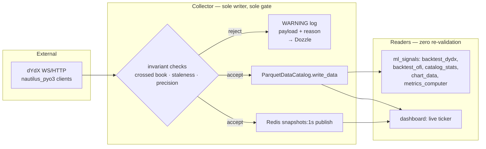

# Architecture Spine — dYdX Collector & ml_signals — Data-Integrity Spine

## Design Paradigm

**Gatekeeper: fail-closed single-writer ingestion.**

`dydx_collector/collector.py` is the only component in `troll/` that writes market data anywhere — to the `ParquetDataCatalog` and to the live Redis `snapshots:1s` channel. It is also the only place invariants (crossed book, staleness, precision) are checked. Every other module in `troll/` — `ml_signals/dashboard.py`, `backtest_dydx.py`, `backtest_ofi.py`, `catalog_stats.py`, `metrics_computer.py`, `chart_data.py` — is a trusting reader: it consumes what the gate already approved and performs no defensive re-validation of its own.



Namespace mapping: `dydx_collector/` = the gate (ingest, validate, write); `ml_signals/` = readers (signals, backtests, dashboard). Neither namespace imports the other's internals — only shared data types cross the boundary.

## Invariants & Rules

### AD-1 — Single write gate, both sinks

- **Binds:** `dydx_collector.collector`, and any writer ever added inside `dydx_collector` (e.g. a future backfill script) — not just the current module
- **Prevents:** a second writer (or a new sink) bypassing invariant checks; the two existing sinks (Parquet, Redis) drifting to different validation logic; the two sinks disagreeing about which items were approved
- **Rule:** Both the `ParquetDataCatalog.write_data()` call and the `snapshots:1s` Redis publish for a given item happen from the same already-validated object, synchronously, before control returns to the ingestion loop — not fanned out to independent async consumers (a queue-plus-two-workers split can let one sink receive an item the other hasn't yet, or ever, persisted). `[ADOPTED]` — confirmed: `collector._second_loop` calls `self._on_data(snapshot)` (→ Parquet buffer) and appends to `batch` (→ `_publish_snapshot_batch`, Redis) within the same synchronous per-instrument iteration (`collector.py:296-319`). Any new writer or new sink must route through this same gate before either sink sees it — never a parallel, independently-checked path. There is currently no compiler/lint-level mechanism forcing this (see Deferred: shared validator extraction) — it holds by there being exactly one writer today, not by structural enforcement.

### AD-2 — Fail-closed, never fail-open

- **Binds:** `dydx_collector.collector` (all invariant checks: non-empty top-of-book, crossed book, staleness, precision, and any added later)
- **Prevents:** wrongful/corrupt data reaching Parquet or the live stream; a validity-flag field spreading the "is this trustworthy?" decision downstream to every reader
- **Rule:** On any invariant violation, the offending item is dropped — not written, not published, not clamped, not averaged. A `logging.WARNING` line records the full offending payload and the specific reason (crossed price pair, staleness duration, precision mismatch, etc.). No schema carries a validity/flag field; the log stream (visible via the existing Dozzle container) is the sole audit trail for rejected data. `[ADOPTED]` — confirmed: `collector.py:271` skips a snapshot when either `best_bid_price()` or `best_ask_price()` is `None` (empty top-of-book); `collector.py:274-281` skips + `logger.warning`s a crossed book; `collector.py:288-294` skips + `logger.warning`s a stale book. A book with fewer than `BOOK_DEPTH` (20) levels per side but a valid top-of-book is not a gate violation — see Consistency Conventions.

### AD-3 — Readers trust the gate completely

- **Binds:** `ml_signals.dashboard`, `ml_signals.backtest_dydx`, `ml_signals.backtest_ofi`, `ml_signals.catalog_stats`, `ml_signals.metrics_computer`, `ml_signals.chart_data`
- **Prevents:** duplicated, independently-drifting validation logic in readers (already occurred once — see Deferred)
- **Rule:** No reader may re-implement a data-quality check (crossed-book detection, staleness thresholds, precision guards) against catalog or stream data. If a reader appears to need one, that is a signal the check belongs in the collector's gate, not a reason to add reader-side validation.

### AD-4 — Module boundary: shared types and pure utilities only

- **Binds:** `dydx_collector`, `ml_signals`
- **Prevents:** a reader depending on collector internals (buffer shape, flush timing, subscription state) and breaking silently when the collector's implementation changes; readers reimplementing collector logic instead of importing it (the exact drift AD-7 exists to prevent for liquidity tiering)
- **Rule:** Cross-namespace imports are limited to (a) shared data types (`DydxMinuteBar`, `DydxSecondSnapshot`, and similar) and (b) pure, side-effect-free utility functions with no I/O and no shared mutable state (e.g. `classify_liquidity`). Stateful/ingestion logic — the buffer, the gate, subscription/connection state — may never be imported by `ml_signals`, and `dydx_collector` never imports from `ml_signals`. `[ADOPTED]` — confirmed: `ml_signals/catalog_stats.py` and `chart_data.py` import only `DydxMinuteBar`; no reverse imports exist.

### AD-5 — Precision is re-stamped exactly, never inferred or float-tripped

- **Binds:** any code in `troll/` constructing or re-stamping a `Price`/`Quantity` — not only `dydx_collector`; the underlying `nautilus_trader` bug doesn't care which namespace calls the buggy constructor, and `ml_signals` (e.g. cross-instrument precision alignment in signal work) is equally exposed
- **Prevents:** silent value corruption from `Price(decimal, precision)`'s float64 round-trip bug, and precision-label mismatches from inferring precision off an incoming value's trailing-zero count (dYdX's mark/index feed strips zeros inconsistently per tick, which `ParquetDataCatalog` correctly refuses to merge)
- **Rule:** Never call `Price(decimal, precision)` / `Quantity(decimal, precision)` to change precision. Always `Decimal.scaleb(new_precision)` + `Price.from_raw()` / `Quantity.from_raw()`. Never derive precision from `Decimal.normalize()` on an incoming value. Never round-trip a market value through `float` before it is inside a `Price`/`Quantity`. `[ADOPTED]` — reference: `dydx_collector/client.py:_at_fixed_precision()`.

### AD-6 — Catalog access only through the official API

- **Binds:** all writers and readers
- **Prevents:** a hand-rolled Parquet schema/partitioning drifting from what `ParquetDataCatalog` expects, and unbounded in-memory catalog loads
- **Rule:** All writes go through `ParquetDataCatalog.write_data()`; no hand-rolled schema. All backtests use `BacktestNode` + `BacktestDataConfig` (time-bounded streaming); never a custom simulation loop or an unbounded `catalog.trade_ticks()` call. Strategies are referenced via `ImportableStrategyConfig` by string path. `[ADOPTED]` — confirmed: `collector.py:172,190,343` are the only `write_data()` call sites in `troll/`; `ml_signals/backtest_dydx.py:48-57` uses `BacktestNode`/`BacktestDataConfig`/`ImportableStrategyConfig`.

### AD-7 — Liquidity classification is USD-denominated

- **Binds:** `dydx_collector.open_interest.classify_liquidity`
- **Prevents:** repeating the production incident where raw `openInterest` (base-token units) was compared against a USD threshold, misclassifying BTC as illiquid
- **Rule:** Liquidity tiering uses `volume24H` (already USD) or `openInterest × oraclePrice` — never raw `openInterest` alone. `[ADOPTED]` — reference: `dydx_collector/open_interest.py:109` (`classify_liquidity`).

### AD-8 — No live-runtime engine in `troll/`

- **Binds:** `dydx_collector`, `ml_signals`
- **Prevents:** repeating the OOM/shutdown-wedge failure of the earlier `Strategy`/`TradingNode`-based recorder (`gg` branch)
- **Rule:** `nautilus_trader` is used as a library only. Never instantiate `TradingNode`, `Strategy`, or `DataEngine` inside `troll/`. The collector owns its own asyncio loop, in-memory buffer, and flush timer, driving `nautilus_pyo3.DydxHttpClient`/`DydxWebSocketClient` directly. `[ADOPTED]` — reference: `collector.py:17-18` (module docstring), `collector.py:369` (`asyncio.create_task(self._flush_loop())`, the collector's own loop, no `TradingNode`).

## Consistency Conventions

| Concern | Convention |
| --- | --- |
| Rejected-data logging | `logging.WARNING`, one line per rejected item, includes the offending payload and the specific reason — no separate quarantine store or flag field |
| Data & formats | Prices/quantities as Nautilus `Price`/`Quantity` (never raw `float`/`Decimal` once inside the pipeline); precision changes only via `Decimal.scaleb()` + `*.from_raw()` |
| `DydxSecondSnapshot` level lists | `bid_prices`/`bid_sizes`/`ask_prices`/`ask_sizes` may have fewer than `BOOK_DEPTH` (20) entries per side on a thin book — this is a legitimate shape, not a gate violation (AD-2 only rejects zero-level top-of-book). Readers must index defensively for length, never assume exactly 20 |
| Module dependencies | `ml_signals` → `dydx_collector` (data types only); never the reverse; never internals either direction |
| Fork boundary | `nautilus_trader/` and `crates/` untouched; all `troll/` code additive |
| Memory | No unbounded catalog reads (`catalog.trade_ticks()` with no time bounds is banned); non-configured coins are rolling-window-in-memory only, no unbounded accumulation |
| Paired dependency versions | Any dependency pinned in two places that must speak the same protocol (currently: `redis` client in `troll-requirements.txt` vs. `redis` broker image tag in `docker-compose.yml`) carries a comment in both files cross-referencing the other. Bumping one without checking the other's compatibility is the failure mode that produced the `redis:7-alpine`/`redis-py>=8.0.1` RESP3 mismatch (caught by architecture review, fixed 2026-07-01 — broker bumped to `redis:8-alpine`). No automated check — this is a documentation/discipline convention, not enforced tooling |

## Stack

| Name | Version |
| --- | --- |
| Python | 3.12–3.14 |
| nautilus_trader | 1.229.0 (pinned — bump requires re-validating PyO3 dYdX precision bindings; note: this build is PyPI-tagged Beta and was 6 days old at time of pin — see Deferred) |
| plotly | 6.8.0 |
| pandas | 3.0.4 |
| redis (client) | >=8.0.1 |
| aiohttp | >=3.14.1 |
| redis (broker image) | redis:8-alpine |
| Dozzle | amir20/dozzle:latest |

## Structural Seed

```text
troll/
  dydx_collector/        # the gate — writer, sole validator
    collector.py          # asyncio loop, buffer, flush timer, _second_loop (crossed-book/staleness gate, both sinks)
    client.py              # DydxClient — precision re-stamping (_at_fixed_precision)
    second_snapshot.py     # DydxSecondSnapshot schema (top-20 book levels + trade volume)
    minute_bars.py         # DydxMinuteBar — shared type consumed by ml_signals
    open_interest.py       # OI poll + classify_liquidity (USD-denominated)
    prune_catalog.py
    config.py
  ml_signals/             # readers — zero re-validation
    dashboard.py            # live ticker (Redis) + historical charts (catalog, read-only)
    indicators.py           # OFI/OBI/microprice computed on read from DydxSecondSnapshot
    backtest_dydx.py, backtest_ofi.py   # BacktestNode + BacktestDataConfig
    catalog_stats.py, chart_data.py, metrics_computer.py
  docker-compose.yml       # collector (rw), dashboard (catalog :ro), redis, dozzle
  collector.dockerfile      # thin layer on nautilus-trader-base:1.229.0
```

### Deployment & Environments

Two-image Docker split: `nautilus-trader-base:1.229.0` (rare rebuild, core/deps only) + `troll/collector.dockerfile` thin layer (bakes in `dydx_collector/` + `ml_signals/`, rebuilds in seconds). Rebuild order matters — the base must be rebuilt before the thin image whenever `nautilus_trader` core/deps change, or the thin image silently layers onto a stale base. Four services: `collector` (writer; `catalog` + `metrics.db` mounted read-write), `dashboard` (reader; `catalog` mounted `:ro` — a structural, not just logical, enforcement of AD-3), `redis:8-alpine` (pub/sub broker), `dozzle` (log viewer — the audit trail for AD-2's rejection logging).

## Deferred

- **Shared validator extraction.** Crossed-book/staleness/empty-book checks stay inline in `collector._second_loop` rather than becoming a standalone validator module — YAGNI while there's exactly one writer. This is also the natural home for structural (not just conventional) enforcement of AD-1 once a second writer path is introduced — revisit then, not before.
- **Dashboard cleanup — crossed-book skip only.** `dashboard._coin_chart_json`'s crossed-book skip is genuinely redundant under AD-3 (the collector never writes a crossed book, so a reader can never encounter one) — safe to remove as a follow-up cleanup story.
- **Dashboard staleness-gap rendering is NOT deferred cleanup — it is a permanent reader responsibility, not covered by AD-3.** `_CHART_GAP_THRESHOLD_MS` solves a different problem than the gate: it detects time-range gaps between rows the reader queried and inserts a `None` so Plotly draws a break instead of interpolating a straight line across a window the gate legitimately skipped writing (per `_STALE_BOOK_NS`). This is read-time handling of the *fact* of a gap, not re-validation of data quality, and must not be removed alongside the crossed-book skip above — doing so would silently reintroduce the flatline-interpolation failure this logic exists to prevent.
- **Buffer durability.** `_flush_once()` runs on `flush_interval_seconds` and on graceful shutdown (SIGTERM), but an unclean crash (OOM-kill, host failure) loses up to one flush interval of buffered-but-unwritten data. This is data *loss*, not corruption — explicitly out of scope for this run. Revisit only if silent catalog gaps become a real problem.
- **Gate-logic version skew.** AD-2 bans a validity-flag field and AD-3 bans reader-side re-checking, by explicit user decision — but this means a row written under a since-fixed buggy gate check stays silently uninspectable after the fact, with no re-audit or reprocessing mechanism. Accepted trade-off given the "log only, no flag field" decision; revisit only if forensic reprocessing of a specific historical incident becomes necessary (e.g. record the gate/validator version alongside written rows for a future targeted backfill, without adding a per-row validity semantic).
- **Rejection-rate observability for research use.** The WARNING-log audit trail (Dozzle) is not queryable, so `catalog_stats`/backtests cannot distinguish "quiet market" from "gate rejected data here" over a given window. Acceptable at current project scale; revisit if backtest research integrity over reconnect-storm windows becomes a real concern.
- ~~`redis:7-alpine` broker vs. `redis>=8.0.1` client — unreconciled version mismatch, flagged by architecture review.~~ **Resolved 2026-07-01**: broker bumped to `redis:8-alpine` in `docker-compose.yml` to match the already-pinned `redis>=8.0.1` client (RESP3-default) — kept the client pin rather than downgrading it, consistent with the rest of the Stack table's deliberately current versions.
