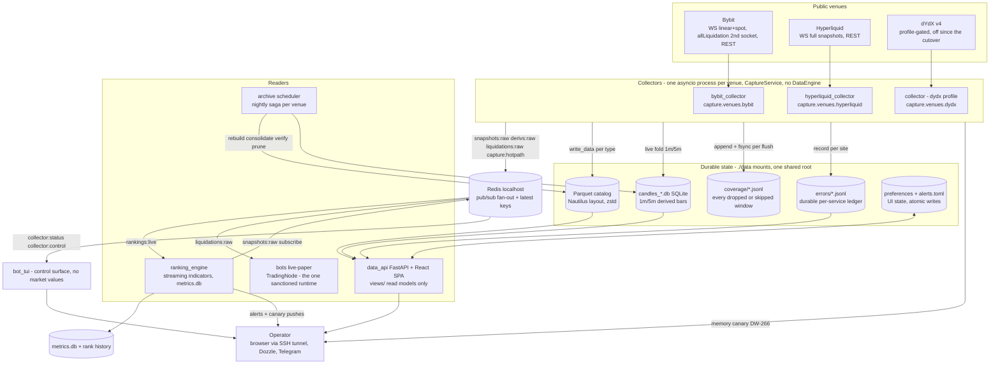
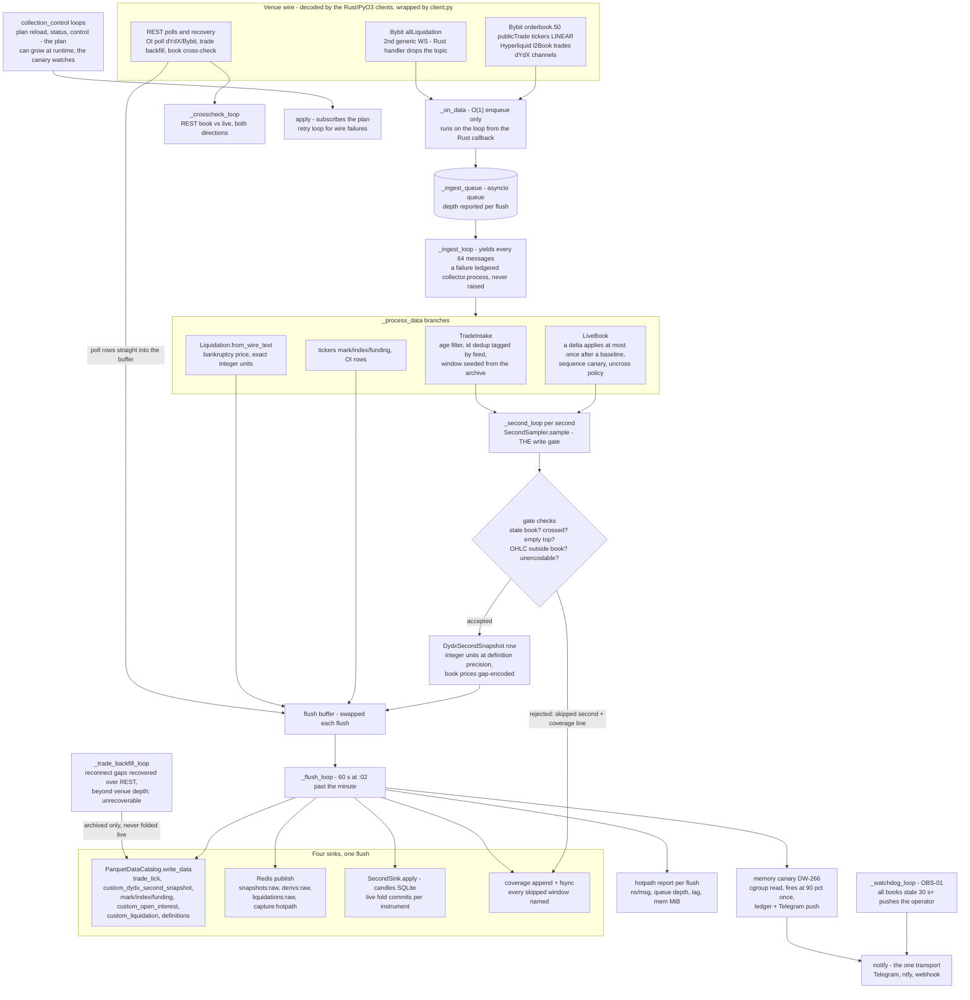
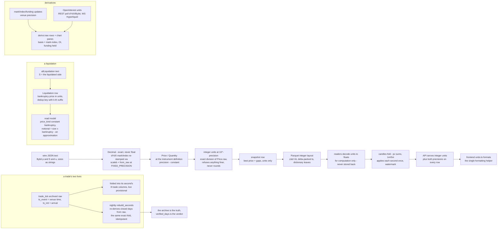
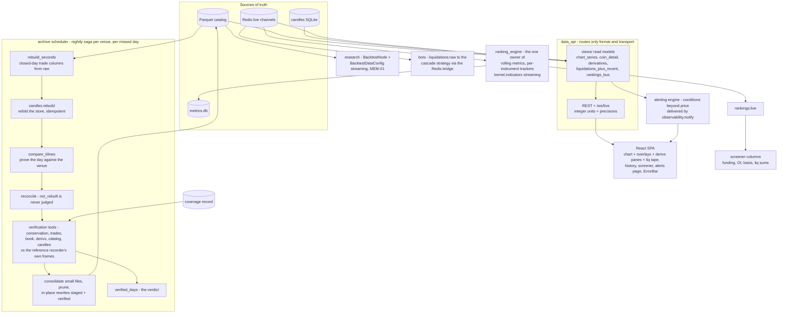

# Architecture Diagrams

The visual companion to `CLAUDE.md` (binding rules), `docs/DATA_DICTIONARY.md` (every channel,
file and payload) and the DDD spine (`_bmad-output/planning-artifacts/architecture/`, the
authoritative text). Nothing here is a new decision: every node, edge and risk is the existing
system, drawn. Five diagrams: the deployed system, the capture hot path, how a value changes
form end-to-end, the readers plus the nightly correction loop, and the full risk/guard map.

## 1. The deployed system (context)

One VPS (`nifelheim`, 2 vCPU / 3.7 GB / 0 swap), Docker Compose, every port localhost-only
(SEC-01; remote access via SSH tunnel). Three collector processes (one per venue, the same
image, different `command:`), the shared catalog, and the readers. The verification stack
lives on the dev box only and shares no code with capture (DATA-02).

Host risks carried by this whole diagram: the box is oversubscribed on a bad day
(2026-09-12: load 10.85 on 2 cores, the *global* OOM killer cycling the uncapped
`ranking_engine`); collectors have hard caps, several readers have none; there is no swap, so
pressure kills instead of thrashing.

## 2. The capture hot path (one collector)

The write gate is `CaptureService`'s alone (never subclassed; venue variance is policy values
and extra loops). One second of truth flows venue socket to Parquet in ~60 s flushes.

The one deliberate unbounded structure is `_ingest_queue`: it is safe exactly while the
ingest loop keeps up, so its depth is sampled into every hotpath report, and a sustained
backlog shows as tick-late lines long before it becomes memory.

## 3. How a value changes form (the integrity chain)

Wire to browser, every transformation named. The invariant: **integers all the way down**
(DATA-04, Story 30.2); floats exist only inside a reader's own computation, and the browser
formats integers in one helper.

The risks this chain exists to kill: `Price(decimal, precision)` silently returning wrong
values (NAUT-01 - `from_raw` everywhere a precision changes); float noise in stored prices
(20.7% of pre-30.2 files carried it; `archive.tools.migrate_snapshot_ints` rewrote them); a
derived value drifting from its stored inputs (the rebuild re-derives from raw, never patches
at read time); and schema drift inside one catalog directory (`register_arrow` binds one
schema per class, the catalog refuses disagreeing files - why the Liquidation columns never
landed, DW-294).

## 4. Readers and the nightly correction loop

Live is provisional; the nightly saga is what makes a day true. Everything a human sees comes
from a read model, never a second implementation of a formula (SSOT-01/02).

The loop's meaning: a live second is provisional until its day is rebuilt from raw trades,
reconciled against the venue's own klines, and verified against the reference recorder. A
live-fold error is *filled by the rebuild*; nothing is ever patched at read time (DATA-07).

## 5. The risk and guard map

Every risk class with its guard (what catches it), its canary (what warns) and its repair
(what fixes the data). A guard without a repair is a loud canary by design; a silent guard is
a bug in itself (DATA-07).

```mermaid
flowchart TB
    classDef risk fill:#fdd,stroke:#c00
    classDef guard fill:#ffd,stroke:#b80
    classDef repair fill:#dfd,stroke:#080

    subgraph INGESTR["ingest risks"]
        R1["message loss on the socket" ]:::risk
        R2["subscribe-time replayed history" ]:::risk
        R3["duplicates across feeds" ]:::risk
        R4["ingest loop starvation" ]:::risk
        R5["a value finer than its precision" ]:::risk
        G1["sequence canary - Bybit u exact +1<br/>gap = real loss, book dropped"]:::guard
        G2["age filter on arrival + id dedup,<br/>window seeded from the archive"]:::guard
        G3["dedup map tags the delivering feed:<br/>replay vs duplicate_feed"]:::guard
        G4["yield every 64 + queue depth in every<br/>hotpath report + tick-late canary"]:::guard
        G5["SnapshotEncodingError - refused,<br/>ledgered, never rounded"]:::guard
        P1["REST trade backfill<br/>beyond depth: unrecoverable,<br/>counted in coverage"]:::repair
        R1 --> G1 --> P1
        R2 --> G2
        R3 --> G3
        R4 --> G4
        R5 --> G5
    end

    subgraph BOOKR["book risks"]
        R6["crossed book<br/>architectural on dYdX" ]:::risk
        R7["stale or frozen feed" ]:::risk
        R8["book desynced from the venue" ]:::risk
        R9["one-sided book after an uncross" ]:::risk
        G6["level-tagged uncross ladder<br/>delete only the older level"]:::guard
        G7["stale_book_seconds gate - no row,<br/>a rendered gap, never a flatline"]:::guard
        G8["REST cross-check, both directions,<br/>per-direction tolerance"]:::guard
        G9["empty top = skipped second + ledger,<br/>never a fake row"]:::guard
        P6["forced resync - the fallback,<br/>ledgered, never the first answer"]:::repair
        P8["resync from a fresh snapshot"]:::repair
        R6 --> G6 --> P6
        R7 --> G7
        R8 --> G8 --> P8
        R9 --> G9
    end

    subgraph GATER["second and archive risks"]
        R10["OHLC outside the book" ]:::risk
        R11["missing seconds" ]:::risk
        R12["flush or store write failure" ]:::risk
        R13["crash window - queued messages" ]:::risk
        R14["corrupt or torn files" ]:::risk
        G10["ohlc_outside_book canary -<br/>live, and the repair detector"]:::guard
        G11["coverage record: every second accounted,<br/>conservation nightly reconciles 86400"]:::guard
        G12["flush_write + candle_store ledgered,<br/>store partial state tracked per instrument"]:::guard
        G13["shutdown drain budget + DW-290<br/>startup-failure unwind"]:::guard
        G14["quarantine + CatalogFiles staged,<br/>verified temp-then-rename rewrites"]:::guard
        P12["candles.rebuild - idempotent<br/>recompute from raw 1s"]:::repair
        P13["restart gap markers + REST backfill<br/>+ the nightly rebuild placing late trades"]:::repair
        P14["repair_catalog - refuses rows the<br/>trade archive covers"]:::repair
        R10 --> G10 --> P14
        R11 --> G11
        R12 --> G12 --> P12
        R13 --> G13 --> P13
        R14 --> G14 --> P14
    end

    subgraph HOSTR["host and process risks"]
        R15["collector OOM - a plan outgrew mem_limit" ]:::risk
        R16["swap thrash instead of a visible kill" ]:::risk
        R17["CPU oversubscription, the box stalls" ]:::risk
        R18["global OOM killer picks uncapped services" ]:::risk
        G15["mem_limit = measured peak x 1.5,<br/>restart: always + coverage explains the gap"]:::guard
        C15["DW-266 memory canary - 90 pct once per crossing,<br/>ledger + Telegram before the kill"]:::guard
        G16["memswap_limit = mem_limit - die visibly"]:::guard
        G17["cpu_shares 1024 collectors vs 256 batch,<br/>load-average acceptance check"]:::guard
        G18["known gap - several readers uncapped<br/>resize the VM or cap them"]:::guard
        P15["backfill repairs the window,<br/>re-measure and raise before growing"]:::repair
        R15 --> G15 --> P15
        R15 --> C15
        R16 --> G16
        R17 --> G17
        R18 --> G18
    end

    subgraph READR["read and verification risks"]
        R19["stale data shown as live" ]:::risk
        R20["derived store drifts from raw" ]:::risk
        R21["two implementations of one formula" ]:::risk
        R22["silent data rot - nobody notices" ]:::risk
        G19["gap rendering rule - a hole renders<br/>as a hole, whitespace rows capped"]:::guard
        G20["nightly rebuild re-derives,<br/>verified_days is the verdict,<br/>backtests replay on ts_init"]:::guard
        G21["SSOT - one views function per value,<br/>one ranking owner per rolling metric,<br/>boundary tests fail the second copy"]:::guard
        G22["the oracle: verification shares no code<br/>with capture, the reference recorder<br/>records raw frames independently"]:::guard
        R19 --> G19
        R20 --> G20
        R21 --> G21
        R22 --> G22
    end
```

## How to read the risk map

- A **risk** node is a failure class with a documented incident or a reasoned mechanism, not
  a hypothetical.
- A **guard** either prevents the failure (a gate, a check, a cap) or makes it loud (a canary:
  ledger + counter + ErrorBar + push). A guard that *filters* a failure away silently is
  itself a violation (DATA-07).
- A **repair** restores the data's truth from the raw archive (backfill, rebuild,
  `repair_catalog`). Repairs that genuinely cannot exist (Bybit has no liquidation history)
  are named `unrecoverable` in the coverage record instead - never silence.
- The audit register of every known wrong-data danger, with status, is
  `docs/DATA_INTEGRITY_AUDIT.md`; the deferred-work ledger (`_bmad-output/implementation-
  artifacts/deferred-work.md`) tracks every known gap in these guards.
